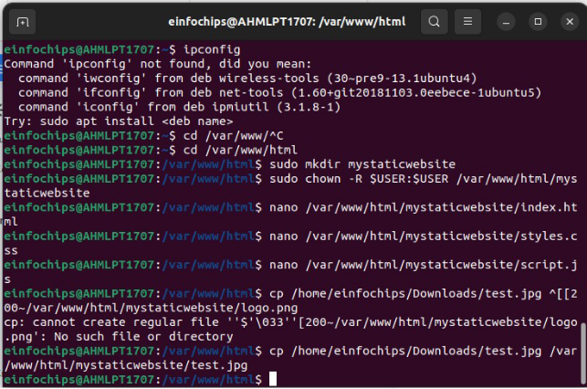

Task 1:**Creating and Editing Text Files:documented the configurations and settings for a new server. Used different text editors to create and update these documents.**

Task 2: **User & Group Management: Set up user accounts and groups for a new team joining the project**

Task 3: File Permission Management:  Ensuring that only the appropriate users have access to specific files and directories.

Task 4: Controlling Services and Daemons: Managed the web server service to ensure it is running correctly and starts on boot.

Task 5: Process Handling: Monitored and managed processes to ensure the server is performing optimally

Part 2: Creating a website

1\.Creating HTML file and using nano to edit the file

2\.Created CSS file and  using nano to edit the file

3\. Created JS file and  using nano to edit the file

4\.Adding and image

Part 3: Configuring Apache2 to Serve the Website 1: Created  and edited a Virtual Host File

2\.Enabled the New Virtual Host

3. Disabled the New Virtual Host

4. Tested the configuration

