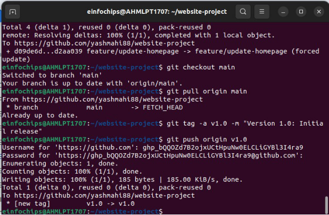

10 July 2024- Wednesday

1. Configured my Git username and email:

2. Created a git repo

3. Commited and pushed the initial project structure

4. Created a New Branch

5. Created about.html

6\.Commited the changes.

7\.Exercise 2: Merge conflict

1. Update Homepage

2. Merge conflict

3. Merge and resolved conflict:

Exercise 3:

1. Rebase a branch

`     `Resolved the conflict.

2. Pushed the rebased file.

Exercise 4:  Pulling and collab

Exercise 5:

1. Versioning and rollback

2. Made changes that need revision

c.Revert to a previous version

Collab Blogging Platform  

Created a github repo and initialized the project

Ex 1: Branching and Adding features 1. Added a Blog Post Page.

Ex 2: Collaborating with Merging and Handling Merge Conflicts 1. Created another branch

2\.Add author to blog page

3\.Create a merge conflict

4\. Merge and resolve conflict:

Exercise 3:  **Rebasing and Feature Enhancement** 1.**Rebase a Branch for Comment Feature**:

exercise 4: Pull changes from remote.

` `exercise 5: Version and rollback 1. Tagging a version

2\.Made chnages that need revision

3\.Revert to previous version

