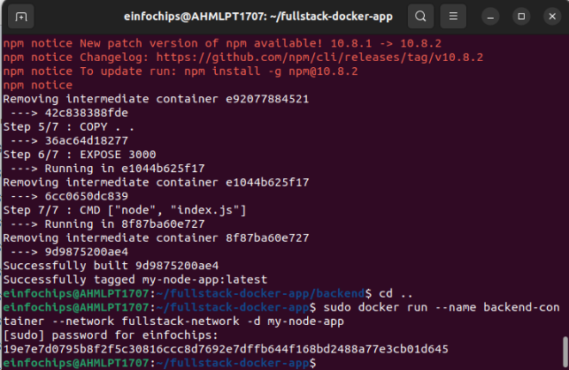
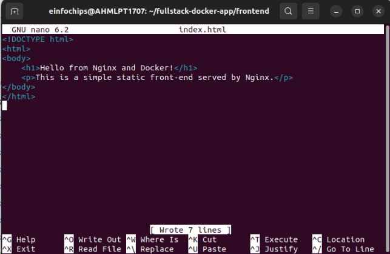
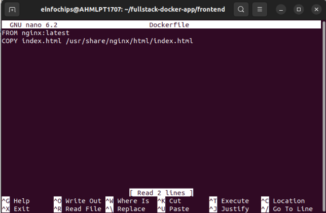

Docker Project 01

**Part 1: Creating a Container from a Pulled Image** Pulled the nginx image and run the nginx container

Verified the docker is running.

Part 2: **Modifying the Container and Creating a New Image** Access the running container

Commit change to create a new image:

Part 3: Creating a dockerfile to build and deploy a web app  Created an index.html file

Writing to the dockerfile

Build the docker image

Running the conatiner 

Verifying the web app at http://localhost:8082

Cleaning up, stopped and removed all the containers.

Project 02:

Part 1: Setting project structure

Created subdirectories for each services  and created a shared network 

Part 2: Setting Up the database Created a Dockerfile for PostgreSQL

Build the postgreSQL Image:

Running the PostgreSQL Container:

Part 3: Setting up backend (node.js with express)

**Initialize the Node.js Application and Install Express and pg (PostgreSQL client for Node.js)**

**Creating the application code**

Creaing a docker file for backend:

Running the backend container:

Part 4: Setting up Nginx Creating HTML page

Create docker file for frontend

Building the frontend cointainer

Running the frontend cointainer

**Part 5: Connecting the Backend and Database**

Part 6: Final Integration and Testing

Rebuild and run the updated frontend container:

Part 7 cleaning up:

Removing the images:

Remove the network and volume

