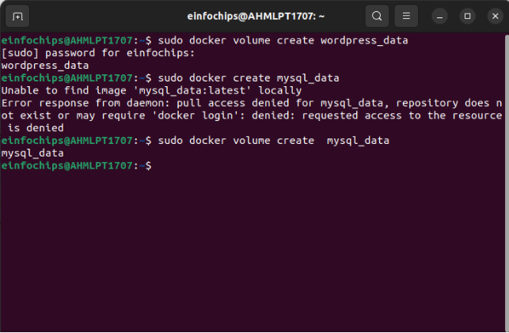
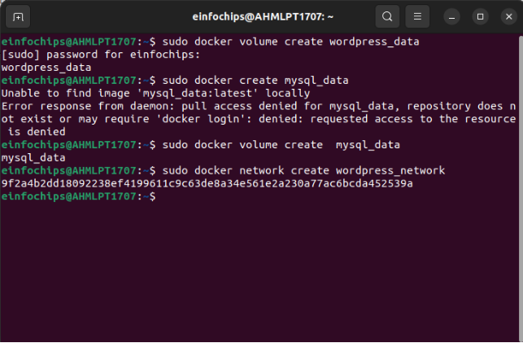
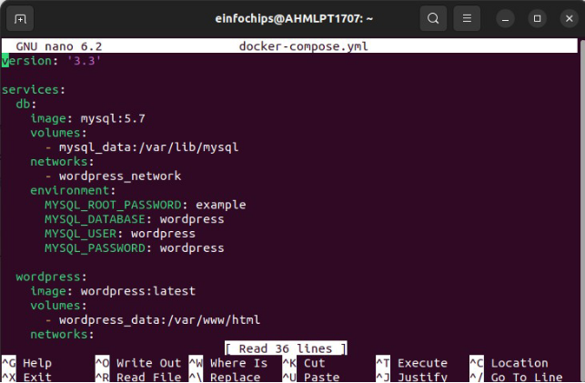
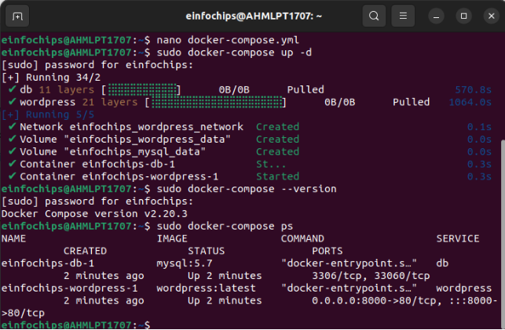
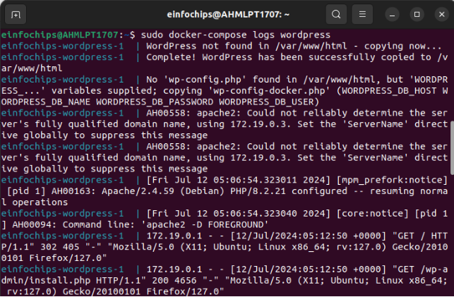
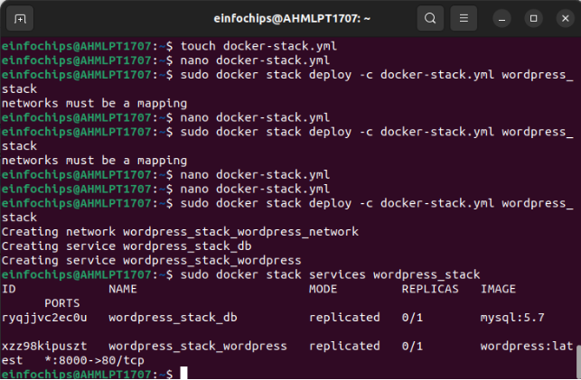

Day 04 Project 01

Create Docker Volumes

Create a docker network

docker network create wordpress\_network

`  `Writing a docker compose file using .yml

Deploy the application with docker compose

Viewing logs for specific services

Deploy and verifying the application using docker swarm

