Day 05 -Pr-1                                                                                                                      15 July 2024 Create a docker swarm service

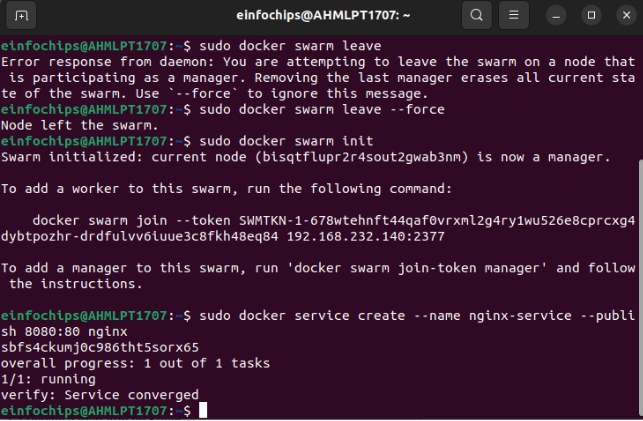

Setup kubernetes using minikube Starting minikube.

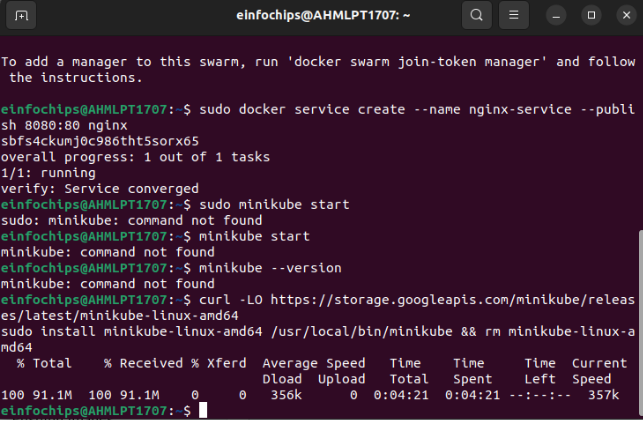

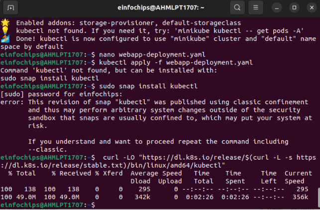

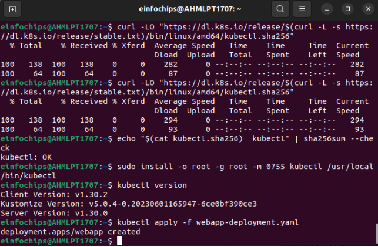

**Expose the Deployment**

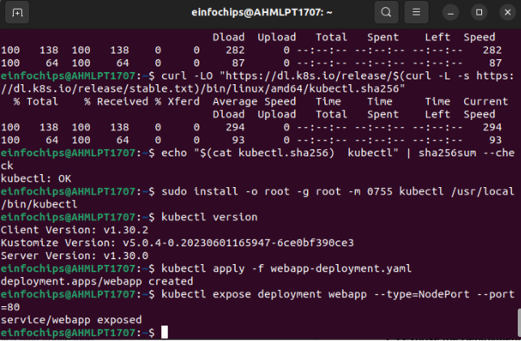

**Deploy a Web Application Using Docker Compose**

**Create a docker-compose.yml File**

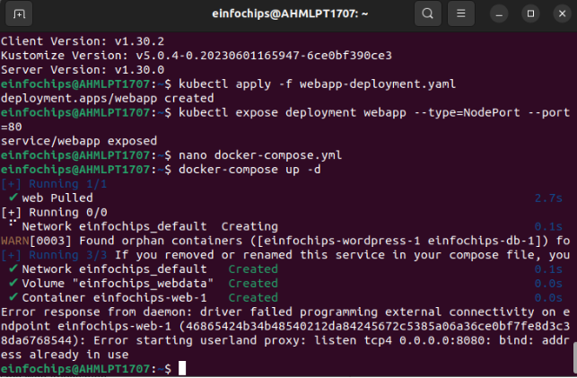

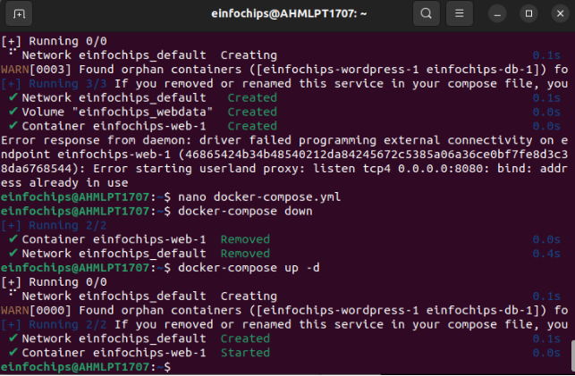

**Use a Single Shared Volume Across Multiple Containers 4.1 Update docker-compose.yml to Use a Shared Volume**

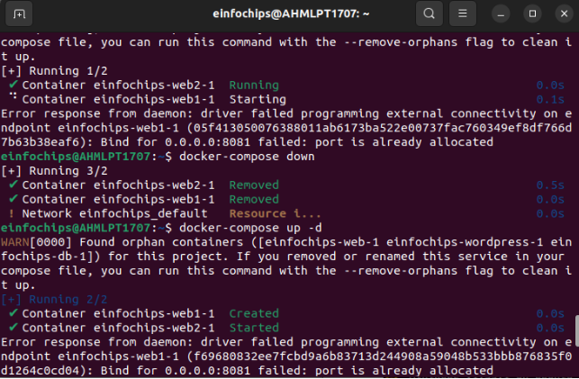

**Automate the Entire Process Using Advanced Shell Scripting**

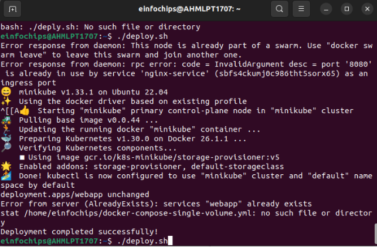

**Project 2:**

**Swarm initialization**

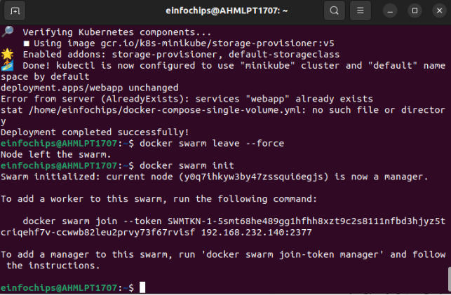

**backend-deployment.yml**

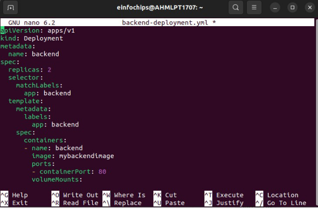

Create db-deployment.yaml :

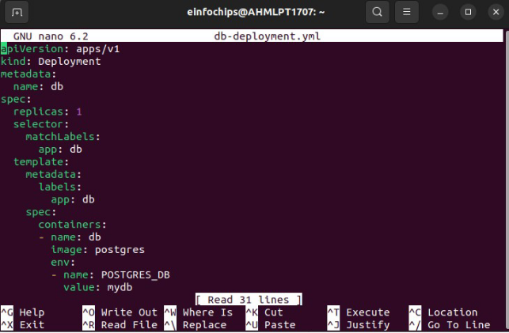

Apply the deployments

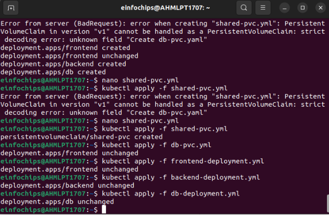
