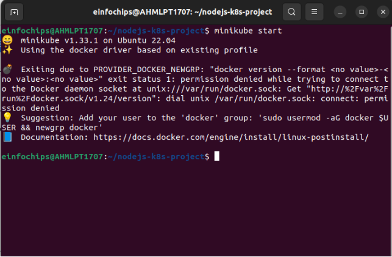

Project 01  

**Deploying a Node.js App Using Minikube Kubernetes**

Installing Node.js

**1. Set Up Git Version Control**

**Initialize a Git Repository**

**Create a Node.js Application  Install express.js** 

**Commit the Initial Code**

**Commit the changes**

**Branching and Fast-Forward Merge Creating  a new branch**

**Implement a new route and commit new changes.**

**Merge the Branch Using Fast-Forward**

Merge the feature/add-route** branch using fast-forward

**Delete the feature branch:**

**Containerize the Node.js Application   Create a dockerfile**

**Build and Test the Docker Image Building the image**

**Run the Docker container to test:**

**Deploying to Minikube Kubernetes  Start minikube**

**created service.yaml**

**Create service-nodeport.yaml**

**Apply Manifests to Minikube**

**Applied deployment, ClusterIP, NodePort**

**Making Changes to the Node.js Application  Create a New Branch for Changes**

**Modify index.js**

**Commit the changes**

**Merge the Changes and Rebuild the Docker Image Merge the feature branch**

` `**Delete the feature branch**

` `**Rebuild the Docker Image**

**Update the Kubernetes Deployment   updating the deployment manifest**

**Apply the update manifest**

` `**Project 2**

Create a new directory for the project:

` `**Create a Python Flask Application**

**Install flask**

**Git add and commit**

**Branching and Fast-Forward Merge**

**Modify in app.py**

**commiting the changes**

**Merge the Branch Using Fast-Forward**

**Containerize the Flask Application**

**Build and Test the Docker Image**

**Testing** 

**Deploying to Minikube Kubernetes**

`    `**minikube start**

**Create Kubernetes Deployment and Service Manifests**

**service.yaml**

0

Create a service-nodeport.yaml** file for NodePort:

**Apply Manifests to Minikube**

**Access the Application**

**Clean up**

**Making Changes to the Flask Application**

**Update the Application**

` `**Commit the Changes**

**Merge the Changes and Rebuild the Docker Image**

**Rebuild the docker image**

**Update Kubernetes Deployment**

