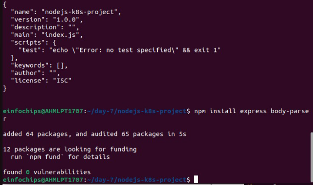
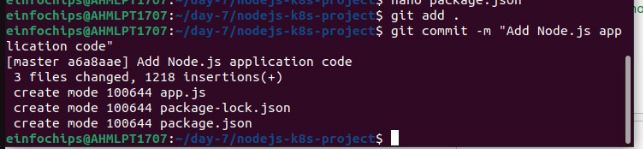

In this project, you will develop a simple Node.js application, deploy it on a local Kubernetes cluster using Minikube, and configure various Kubernetes features. The project includes Git version control practices, creating and managing branches, and performing rebases. Additionally, you will work with ConfigMaps, Secrets, environment variables, and set up vertical and horizontal pod autoscaling.

**Setup Minikube and Git Repository**

**Develop a Node.js Application**

**Create the Node.js App Initialize the Node.js project**:

**Install necessary packages**:

create app.js

Update package.json

` `**Commit the Node.js Application Add and commit changes**:

Create Dockerfile and Docker Compose

**Create docker-compose.yml** **(optional for local testing)**

**Add and commit changes**:

Build and Push Docker Image

` `**FACED ISSUE IN THIS AND THE PROCESS IS STILL STUCK HERE**

Solved the issue which was in package.json under start: node-app.js previously it was node app.js

**Push Docker Image to Docker Hub**

**Add and commit changes**

**Create Kubernetes Configurations**

`  `**Create kubernetes/deployment.yaml** :

**kubernetes/config.yaml**   

**kubernetes/secret.yaml**

**Add and commit Kubernetes configurations**:

Apply Kubernetes Configurations **Apply the ConfigMap and Secret**:

Implement Autoscaling

Create Horizontal Pod Autoscaler **Create kubernetes/hpa.yaml** :

here we need to change v2beta2 to v2

**Apply the VPA**:

kubectl apply -f kubernetes/vpa.yaml

Test the Deployment

**7.1 Check the Status of Pods, Services, and HPA Verify the Pods and service**:

Access the Application **Expose the Service**:

**Get the Minikube IP and Service Port**:

