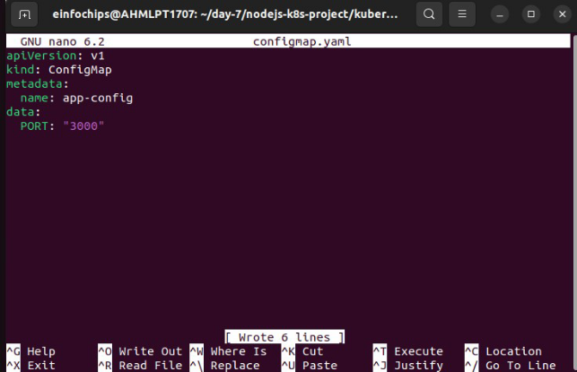
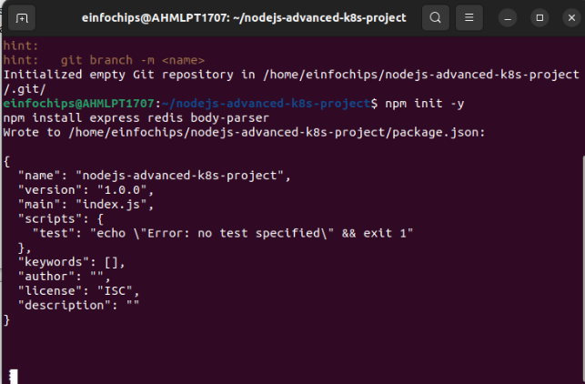

In this project, you will develop a simple Node.js application, deploy it on a local Kubernetes cluster using Minikube, and configure various Kubernetes features. The project includes Git version control practices, creating and managing branches, and performing rebases. Additionally, you will work with ConfigMaps, Secrets, environment variables, and set up vertical and horizontal pod autoscaling.

**Setup Minikube and Git Repository**


**Develop a Node.js Application**

**Create the Node.js App Initialize the Node.js project**:


**Install necessary packages**:


create app.js


Update package.json


` `**Commit the Node.js Application Add and commit changes**:


Create Dockerfile and Docker Compose


**Create docker-compose.yml** **(optional for local testing)**


**Add and commit changes**:


Build and Push Docker Image

` `**FACED ISSUE IN THIS AND THE PROCESS IS STILL STUCK HERE**


Solved the issue which was in package.json under start: node-app.js previously it was node app.js


**Push Docker Image to Docker Hub**


**Add and commit changes**

**Create Kubernetes Configurations**

`  `**Create kubernetes/deployment.yaml**:


**kubernetes/config.yaml**   



**kubernetes/secret.yaml**


**Add and commit Kubernetes configurations**:


Apply Kubernetes Configurations **Apply the ConfigMap and Secret**:


Implement Autoscaling

Create Horizontal Pod Autoscaler **Create kubernetes/hpa.yaml**:


here we need to change v2beta2 to v2

**Apply the VPA**:

kubectl apply -f kubernetes/vpa.yaml


Test the Deployment

**7.1 Check the Status of Pods, Services, and HPA Verify the Pods and service**:


Access the Application **Expose the Service**:


**Get the Minikube IP and Service Port**:


**Project 02**

Deploy a Node.js application to Kubernetes with advanced usage of ConfigMaps and Secrets. Implement Horizontal Pod Autoscaler (HPA) with both scale-up and scale-down policies. The project will include a multi-environment configuration strategy, integrating a Redis cache, and monitoring application metrics.

**Project Setup**

1. **Initialize a Git Repository**

Create a new directory for your project and initialize Git:

mkdir nodejs-advanced-k8s-project cd nodejs-advanced-k8s-project

git init

2. **Create Initial Files**

Create the initial Node.js application and Docker-related files:

npm init -y

npm install express redis body-parser



create app.js 

const express = require('express');

const bodyParser = require('body-parser'); const redis = require('redis');

const app = express();

const PORT = process.env.PORT || 3000;

// Connect to Redis

const redisClient = redis.createClient({

url: `redis://${process.env.REDIS\_HOST}:${process.env.REDIS\_PORT}` });

redisClient.on('error', (err) => console.error('Redis Client Error', err));

app.use(bodyParser.json());

app.get('/', async (req, res) => {

const visits = await redisClient.get('visits');

if (visits) {

await redisClient.set('visits', parseInt(visits) + 1);

} else {

await redisClient.set('visits', 1);

}

res.send(`Hello, World! You are visitor number ${visits || 1}`);

});

app.listen(PORT, () => {

console.log(`Server is running on port ${PORT}`); });

create dockerfile FROM node:18

WORKDIR /usr/src/app COPY package\*.json ./ RUN npm install COPY . .

EXPOSE 3000

CMD ["npm", "start"]


create .dockerignore node\_modules

.npm

1. **Build and push Docker image:**

docker build -t yashmai04/nodejs-advanced-app:latest . docker push yashmahi04/nodejs-advanced-app:latest


2. **Advanced Kubernetes Configuration**
1. **Deployment Configuration**

Create `kubernetes/deployment.yaml` to deploy the Node.js application with Redis dependency:

\```yaml

apiVersion: apps/v1

kind: Deployment

metadata:

name: nodejs-advanced-app-deployment spec:

replicas: 2

selector:

matchLabels:

app: nodejs-advanced-app

template:

metadata:

labels:

app: nodejs-advanced-app

spec:

containers:

- name: nodejs-advanced-app image: your-dockerhub-username/nodejs-advanced-app:latest ports:
  - containerPort: 3000

env:

- name: PORT

  valueFrom:

configMapKeyRef:

name: app-config

key: PORT

- name: REDIS\_HOST

  valueFrom:

configMapKeyRef:

name: redis-config

key: REDIS\_HOST

- name: REDIS\_PORT

  valueFrom:

configMapKeyRef:

name: redis-config

key: REDIS\_PORT

- name: NODE\_ENV

  valueFrom:

secretKeyRef:

name: app-secrets

key: NODE\_ENV

- name: redis

  image: redis:latest

  ports:

- containerPort: 6379
2. **ConfigMap for Application and Redis**

Create kubernetes/configmap.yaml to manage application and Redis configurations:

apiVersion: v1 kind: ConfigMap metadata:

name: app-config data:

PORT: "3000"

\---

apiVersion: v1

kind: ConfigMap metadata:

name: redis-config data:

REDIS\_HOST: "redis" REDIS\_PORT: "6379"

3. **Secret for Sensitive Data**

Create kubernetes/secret.yaml to manage sensitive environment variables:

apiVersion: v1

kind: Secret

metadata:

name: app-secrets

type: Opaque

data:

NODE\_ENV: cHJvZHVjdGlvbg== # Base64 encoded value for "production"

4. **Service Configuration**

Create kubernetes/service.yaml to expose the Node.js application:

apiVersion: v1

kind: Service

metadata:

name: nodejs-advanced-app-service

spec:

selector:

app: nodejs-advanced-app ports:

- protocol: TCP

  port: 80

  targetPort: 3000

type: LoadBalancer

5. **Horizontal Pod Autoscaler with Scale-Up and Scale-Down Policies**

Create kubernetes/hpa.yaml to manage autoscaling:

apiVersion: autoscaling/v2

kind: HorizontalPodAutoscaler

metadata:

name: nodejs-advanced-app-hpa

spec:

scaleTargetRef:

apiVersion: apps/v1

kind: Deployment

name: nodejs-advanced-app-deployment minReplicas: 2

maxReplicas: 5

metrics:

- type: Resource

  resource:

name: cpu

target:

type: Utilization

averageUtilization: 50

- type: Resource

  resource:

name: memory

target:

type: Utilization

averageUtilization: 70


behavior:

scaleUp:

stabilizationWindowSeconds: 30 selectPolicy: Max

policies:

- type: Pods

  value: 2

  periodSeconds: 30

- type: Resource

  resource: cpu

  value: 2

  periodSeconds: 30

scaleDown:

stabilizationWindowSeconds: 30 selectPolicy: Min

policies:

- type: Pods

  value: 1

  periodSeconds: 30

- type: Resource

  resource: memory

  value: 1

  periodSeconds: 30

6. **Vertical Pod Autoscaler Configuration**

Create kubernetes/vpa.yaml to manage vertical scaling:

apiVersion: autoscaling.k8s.io/v1beta2 kind: VerticalPodAutoscaler

metadata:

name: nodejs-advanced-app-vpa

spec:

targetRef:

apiVersion: apps/v1

kind: Deployment

name: nodejs-advanced-app-deployment

updatePolicy:

updateMode: "Auto"

7. **Redis Deployment**

Add a Redis deployment configuration to kubernetes/redis-deployment.yaml:

apiVersion: apps/v1 kind: Deployment metadata:

name: redis-deployment spec:

replicas: 1

selector:

matchLabels:

app: redis

template:

metadata:

labels:

app: redis

spec:

containers:

- name: redis

  image: redis:latest ports:

- containerPort: 6379

Add Redis service configuration to kubernetes/redis-service.yaml:

apiVersion: v1

kind: Service metadata:

name: redis-service spec:

selector:

app: redis ports:

- protocol: TCP port: 6379 targetPort: 6379 type: ClusterIP
8. **Apply Kubernetes Configurations**
- Apply all configurations to your Minikube cluster: 

kubectl apply -f kubernetes/redis-deployment.yaml kubectl apply -f kubernetes/redis-service.yaml kubectl apply -f kubernetes/configmap.yaml

kubectl apply -f kubernetes/secret.yaml

kubectl apply -f kubernetes/deployment.yaml

kubectl apply -f kubernetes/service.yaml

kubectl apply -f kubernetes/hpa.yaml

kubectl apply -f kubernetes/vpa.yaml

9. **Verify Deployments and Services**
- Check the status of your deployments and services: 

kubectl get all


Access the application via Minikube: minikube service nodejs-advanced-app-service --url

10. **Testing Scaling**
- Simulate load on the application to test the HPA: 

kubectl run -i --tty --rm load-generator --image=busybox --restart=Never -- /bin/sh

\# Inside the pod, run the following command to generate load while true; do wget -q -O- http://nodejs-advanced-app-service; done

11. **Validate Autoscaling Behavior**
- Observe the HPA behavior: 

kubectl get hpa


3. Project Wrap-Up

**3.1 Review and Clean Up**

- After completing the project, review the configurations and clean up the Minikube environment if needed: 

minikube delete
