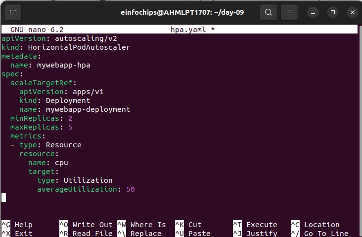

Day 09- Kubernetes ingress, URL rewriting, sticky sessions, and
autoscaling.

**1:** **Setting** **Up**
**the** **Kubernetes** **Cluster** **and** **Static** **Web** **App**

Creating a basic html file

creating docker file

Building the dockerhub image

Pushing the image to the docker hub

**Kubernetes**
**Deployment:** creating deployment.yaml

creating service.yaml

Applying the deployment.yaml
and service.yaml

> **2:** **Configuring** **Ingress** **Networking**

**Tried** **to** **install** **the** **ingress** **using** **the**
**command** **minikube** **start** **–addons=ingress**

**Error** **occurred**

**In** **order** **to**
**solve** **this** **we** **have** **to** **enable** **the** **ingress**
**minikube** **addons** **enable** **ingress**

**Verify** **whether**
**the** **ingress** **is** **running** **and** **accessible**

**Create** **Ingress** **Resource:**

**Created**
**frontend-deployment.yaml**

>  style="width:6.69305in;height:4.39792in" />**created**
> **backend-deployment.yaml**

**Applying** **the**
**changes**

**Create** **an** **ingress**
**resource**

**Apply** **the** **ingress**
**resource**

**Configure** **URL** **rewriting** **in** **the** **ingress**
**resource** **to** **modify** **incoming** **URLs** **before** **they**
**reach** **the** **backend** **services.**

Enable sticky sessions to
ensure that requests from the same client are directed to the same
backend pod.

**3:** **Implementing** **Horizontal** **Pod** **Autoscaling**
**Configure** **Horizontal** **Pod** **Autoscaler:**

**Write** **a**
**horizontal** **pod** **autoscaler** **(HPA)** **manifest** **to**
**automatically** **scale** **the** **static** **web** **application**
**pods** **based** **on** **CPU** **utilization.**

**Applying** **hpa.yaml**

**Stres** **testing**

Perform stress testing to simulate traffic and validate the HPA
configuration.

Monitor the scaling behavior
and ensure the application scales up and down based on the load.

Adding TLS Secret to the
ingress-resource.yaml

Creating SSL certificate

openssl req -x509 -nodes -days 365 -newkey rsa:2048 -keyout tls.key -out
tls.crt -subj "/CN=myapp.ingress/O=ingressapp-tls"

kubectl create secret tls my-tls-secret --cert=tls.crt –key=tls.key

When using https://myapp.local/backend

>  style="width:6.69305in;height:2.48472in" />when using
> [<u>https://myapp.local/frontend</u>](https://myapp.local/frontend)

