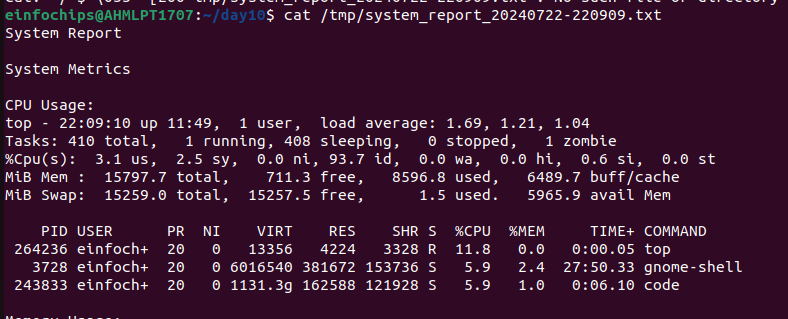
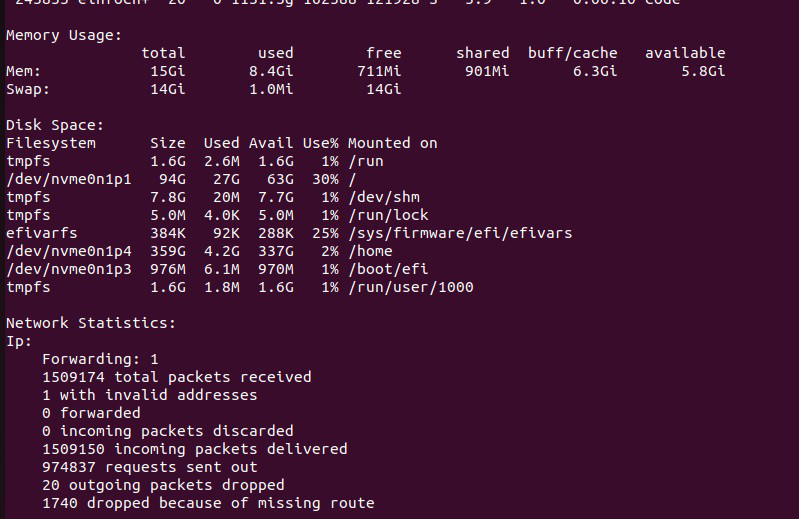
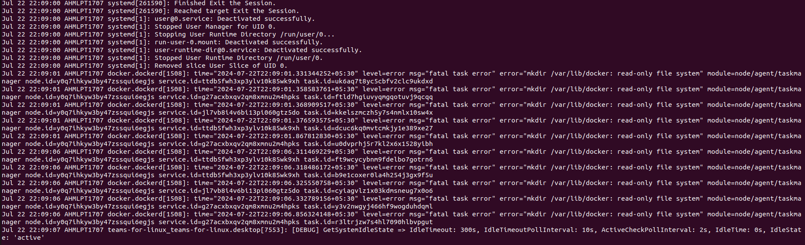
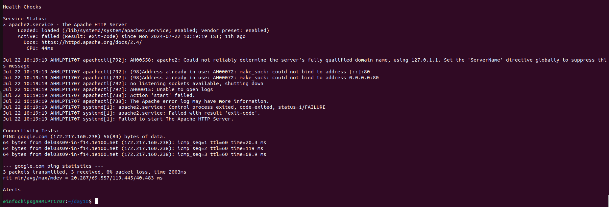

This shell script automates system monitoring tasks on a Linux system
and generates detailed

reports for system administrators. It collects various system metrics,
analyzes logs, performs health

checks, implements alerting mechanisms, and generates comprehensive
reports.

**Prerequisites**

> • Linux operating system (tested on Ubuntu 20.04 LTS)
>
> • Bash shell (version 4.x or higher)
>
> • Required utilities: top, free, df, netstat, systemctl, ping, mail

Ensure all necessary commands are installed and accessible from the
script environment.

**Configuration**

> • **Log and Report Files:**
>
> • Logs are stored in /var/log/system_monitor.log.
>
> • Reports are generated in /tmp/system_report\_\<timestamp\>.txt
> format.
>
> • **Thresholds:**
>
> • Adjust thresholds for CPU (THRESHOLD_CPU) and memory (THRESHOLD_MEM)
>
> usage in percentage to trigger alerts.
>
> • Default thresholds are set to 90%.
>
> • **Email Notifications:**
>
> • Specify ADMIN_EMAIL to receive alerts. Example:
>
> ADMIN_EMAIL=\"admin@example.com\"

**Usage**

> 1\. **Interactive Mode:**
>
> • Run the script interactively to trigger checks manually and view
> specific metrics.

**Outputs**

> • **System Report:**
>
> • The script generates a detailed report in text format
>
> (system_report\_\<timestamp\>.txt) with sections on:
>
> •System Metrics (CPU, memory, disk space, network)

{width="5.4125in"
height="2.1902766841644796in"}

{width="6.6930555555555555in"
height="4.347221128608924in"}

> •Log Analysis (recent syslog entries)

{width="6.6930555555555555in"
height="2.0416666666666665in"}

> •Health Checks (service statuses, connectivity tests)

{width="6.6930555555555555in"
height="2.283332239720035in"}

> •Alerts (if thresholds are exceeded)
>
> **Customization**
>
> • **Adding Services:**
>
> • Extend the script to check the status of additional services by
> adding more
>
> systemctl commands under perform_health_checks().
>
> • **Enhancing Alerts:**
>
> • Customize email subjects and content in check_alerts() to include
> more
>
> detailed information.
