Jenkins

Day 11

1. We created a job named dev compile and test.

The purpose of the creation of the job dev compile was to invoke maven targets as the reffered github repository had a pom.xml file. 

Here maven was created beforehand in the previous day (day\_10) which was used here.

Fetching the code from github repo can be done with the help of SCM(Source Code Management)

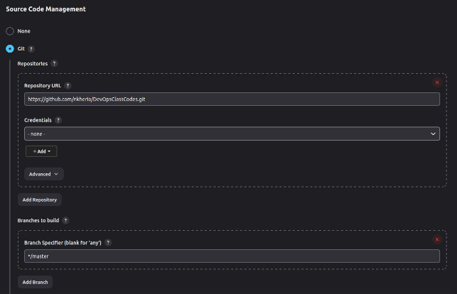

In the build steps we have to choose Invoke top-level maven targets and give the version of the maven. 

Under goals we have to write compile which is fetched from the dependencies mentioned under pom.xml file in the github repo mentioned.

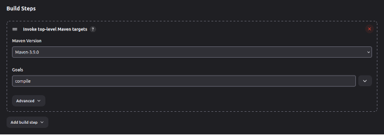Under post-build actions we have to choose build other projects for this we need to have a project named test created which can be done following the same steps and mentioning the same github repo link.

In Test job we won’t mention any Post-build actions.

By clicking the Trigger only if build is stable it will make sure that the Test job is build only when the Dev Compile has been succesfully build and is stable.

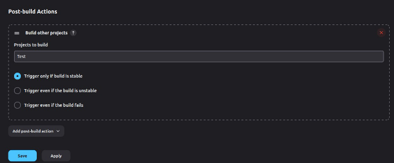

Save the changes.

2. Install a new plugin called Build Pipeline.

Navigate to manage jenkins ---> System Configurations-----> Plugins

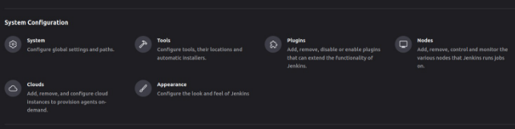

Go to available plugins and search for Build Pipeline. Select the install checkbox and install the plugin. Restart Jenkins as directed.

Now under dashboard select the + sign to use the plugin.

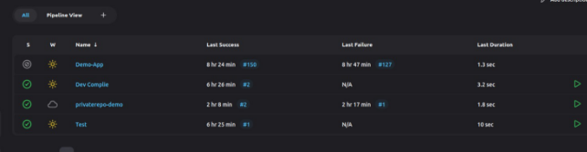

There a New View tab will open 

There give a name for the view and select Type as  Build Pipeline View.

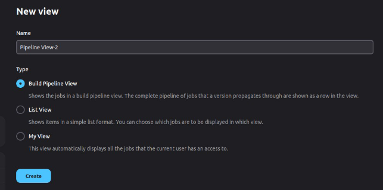

Under Pipeline Flow keep the layout as it is and under initial job set the job as Dev Compile

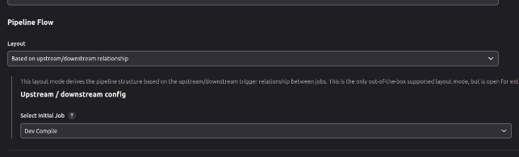

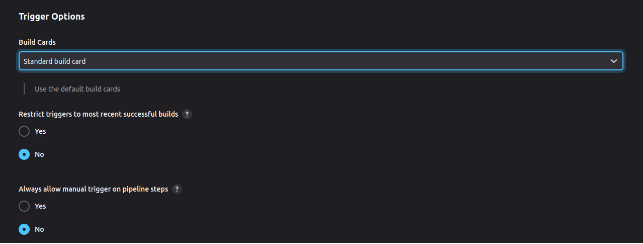

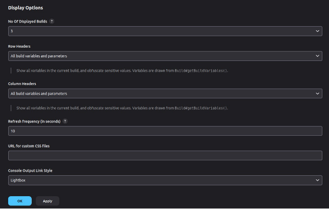

Click OK to create the view.

To view the pipeline go to the dashboard and name of the pipeline view given will be visible

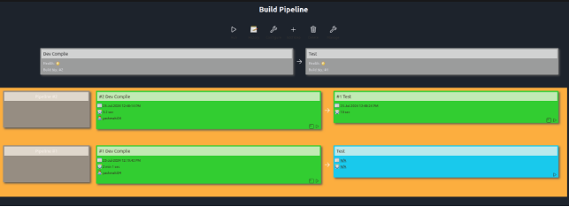

3. Private repo in SCM.

Create a new job named it as privaterepo-demo.

Created a github repo whose visibilty status has been kept to private and that has to be accessed through the credentials.

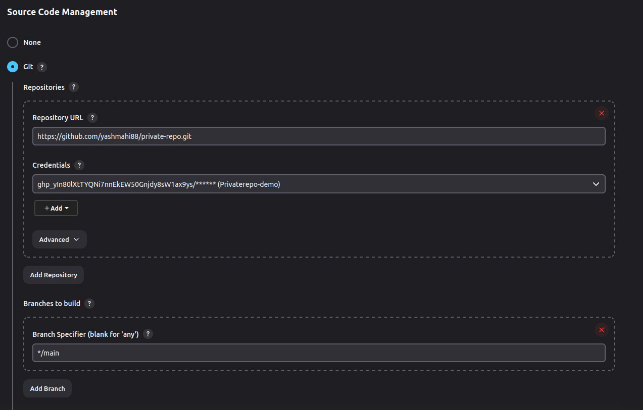

In order to add new credentials, generate a token using github token generation service. Use the add button.

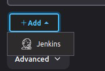

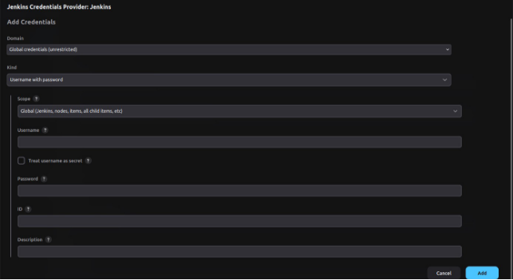

`  `Under username and password copy the token that has been created through github.

As I have used a simple shell script code I selected execute shell and given the command as sh script.sh

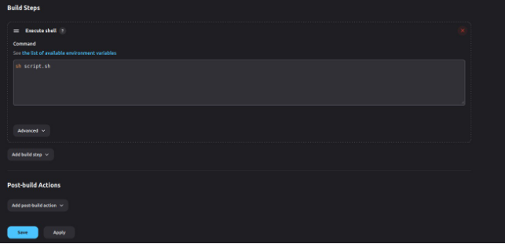

After building and tapping on the console output we can see the output as   \*\*\* This is done with a private repo \*\*\*

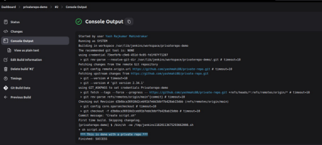
