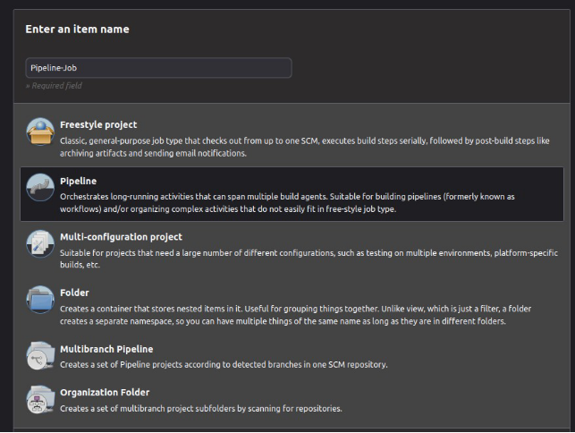
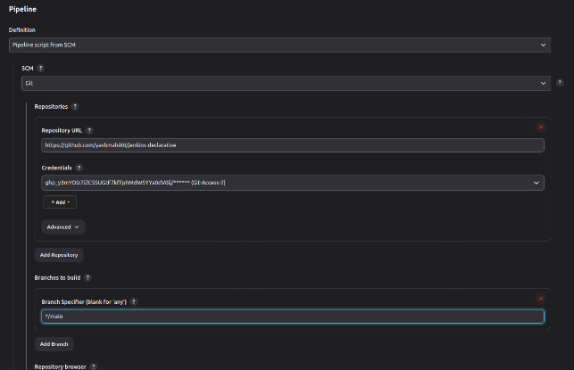
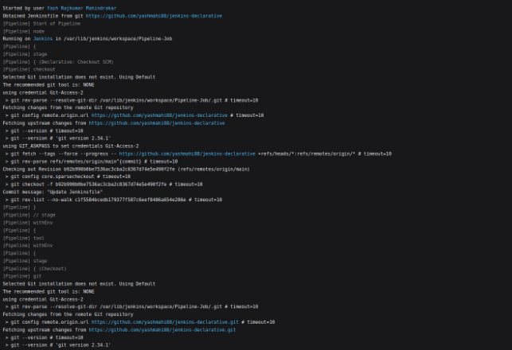
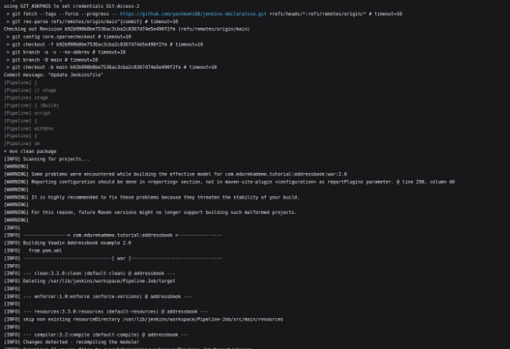
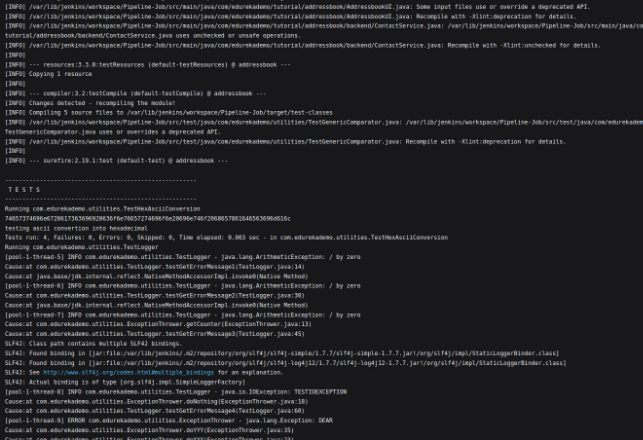
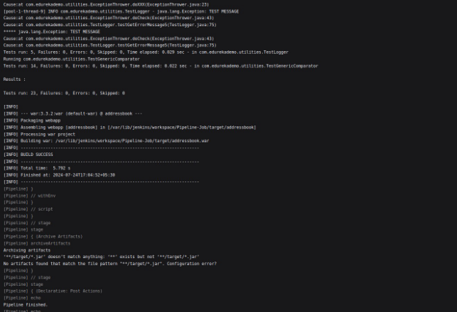
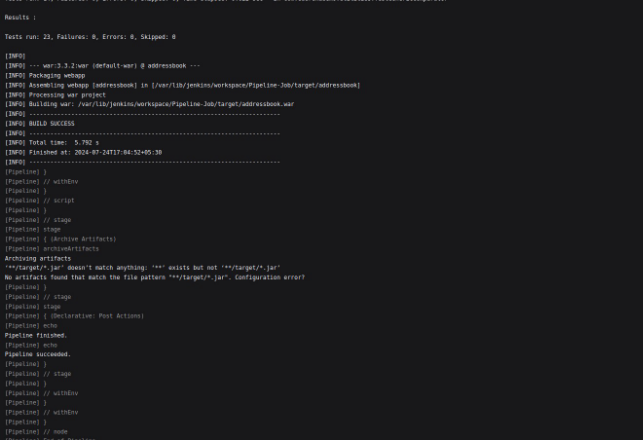
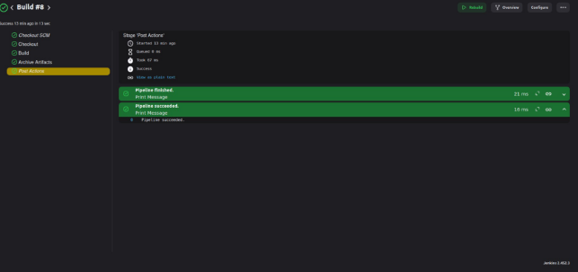

Day 12 Pipeline Job

Creating a pipeline job under creating the item, enter the item name as pipeline job. Create a Jenkinsfile for the same.

pipeline {

`    `agent any

`    `environment {

`        `MAVEN\_HOME = tool 'Maven-3.9.0' // Ensure this matches your Maven tool name     }

`    `stages {

`        `stage('Checkout') {

`            `steps {

`                `// Checkout code from GitHub repository

`                `git url: 'https://github.com/yashmahi88/jenkins-declarative.git', branch: 'main', credentialsId: 'Git-Access-2'

`            `}

`        `}

`        `stage('Build') {

`            `steps {

`                `// Build the project using Maven

`                `script {

`                    `withEnv(["PATH+MAVEN=${MAVEN\_HOME}/bin"]) {                         sh 'mvn clean package'

`                    `}

`                `}

`            `}

`        `}

`        `stage('Archive Artifacts') {

`            `steps {

`                `// Archive the built artifacts

`                `archiveArtifacts artifacts: '\*\*/target/\*.jar', allowEmptyArchive: true             }

`        `}

`    `}

`    `post {

`        `always {

`            `echo 'Pipeline finished.'

`        `}

`        `success {

`            `echo 'Pipeline succeeded.'         }

`        `failure {

`            `echo 'Pipeline failed.'

`        `}

`    `}

}

The above code should be the part of the jenkinsfile.

Create a new github repository where the jenkinsfiles should be there along with the pom.xml, build.xm and build.properties. 

Clone the repository <https://github.com/nkheria/DevOpsClassCodes> into your own repo.

The above image refers to the pipeline creation, where we have to select definition as pipeline script from SCM

SCM should be Git.

Under Repository mention your private repository URL and provide the credentials that have been generated .

Specifiy the branch as main.

And save the changes.

Build the Pipeline-Job and navigate through the build history to check the console output. Images for the same are attached below.

