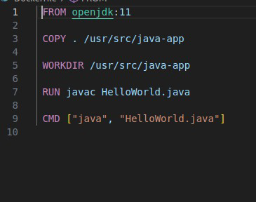
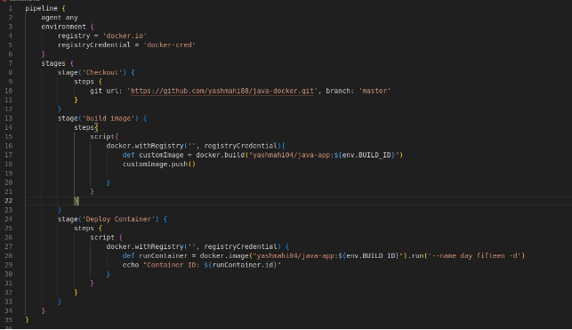
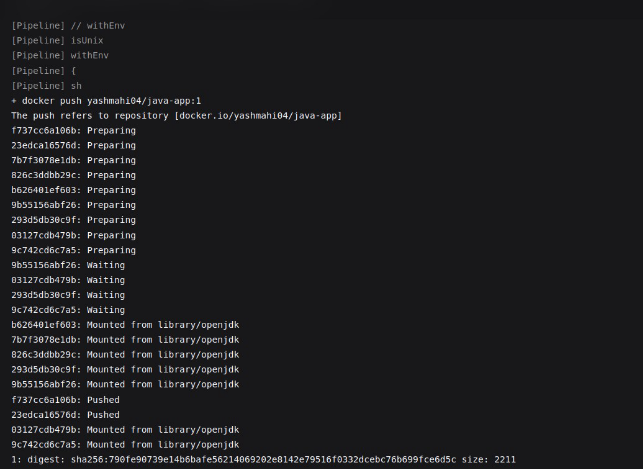
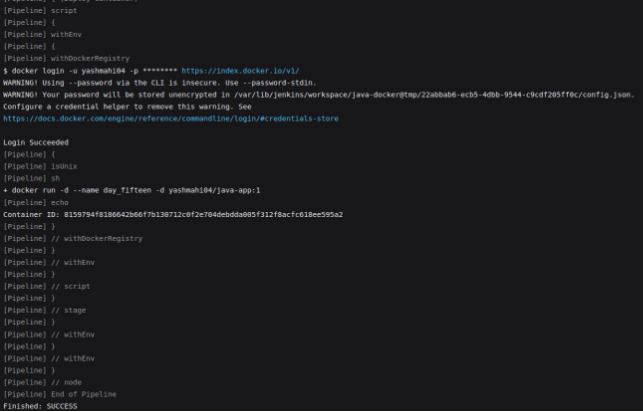

Day 14

**Project 01**

**Problem Statement:**

You are tasked with setting up a CI/CD pipeline using Jenkins to streamline the deployment process of a simple Java application. The pipeline should accomplish the following tasks:

1. **Fetch the Dockerfile**: The pipeline should clone a GitHub repository containing the source code of the Java application and a Dockerfile.
1. **Create a Docker Image**: The pipeline should build a Docker image from the fetched Dockerfile.
1. **Push the Docker Image**: The pipeline should push the created Docker image to a specified DockerHub repository.
1. **Deploy the Container**: The pipeline should deploy a container using the pushed Docker image.

Dockerfile

Jenkinsfile

Successfully build.

