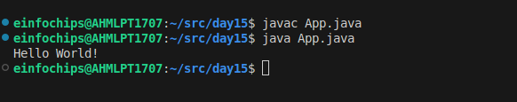
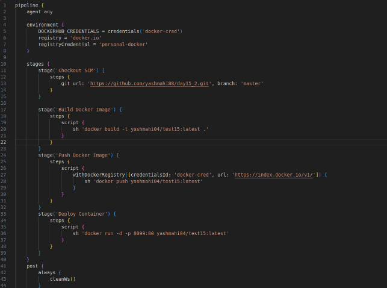
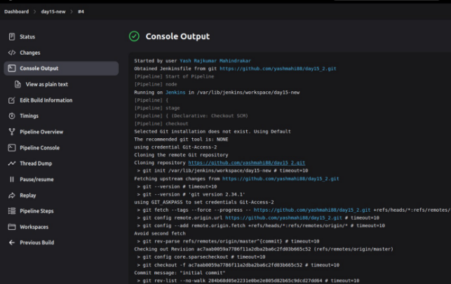
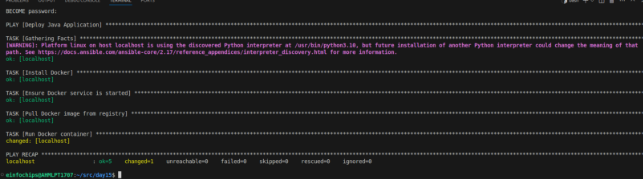

**Day 15: In this task, I have used Github, Docker, Jenkins CI/CD and ansible to deploy a docker container on the target machine.**

**First of all, I created a simple application in Java as App.java which is given below:**

package com.example;

public class App {

`    `public static void main(String[] args) {         System.out.println("Hello World!");     }

}

**I tried running this app in local first using below commands, which was running succesffully.**

javac App.java java App.java

**Secondly, I created a Dockerfile which will create an image for this app.**

FROM openjdk:11-slim WORKDIR /app COPY . /app

RUN javac App.java CMD ["java", "App"]

**Next, I created a Jenkinsfile which uses my GitHub repo to build the image from the Dockerfile, will push that docker image to my docker repository and make a container out of that image.**

pipeline {

`    `agent any

`    `environment {

`        `DOCKERHUB\_CREDENTIALS = credentials('docker-cred')         registry = 'docker.io'  

`        `registryCredential = 'personal-docker'

`    `}

`    `stages {

`        `stage('Checkout SCM') {

`            `steps {

`                `git url: 'https://github.com/yashmahi88/day15\_2.git', branch: 'master'             }

`        `}

`        `stage('Build Docker Image') {

`            `steps {

`                `script {

`                    `sh 'docker build -t yashmahi04/test15:latest .'

`                `}

`            `}

`        `}

`        `stage('Push Docker Image') {

`            `steps {

`                `script {

`                    `withDockerRegistry([credentialsId: 'docker-cred', url: 'https://index.docker.io/v1/']) {                         sh 'docker push yashmahi04/test15:latest'

`                    `}

`                `}

`            `}

`        `}

`        `stage('Deploy Container') {

`            `steps {

`                `script {

`                    `sh 'docker run -d -p 8099:80 yashmahi04/test15:latest'

`                `}

`            `}

`        `}

`    `}

`    `post {

`        `always {

`            `cleanWs()

`        `}

`    `}

}

Created a jenkins pipeline through this and this made a successful pipeline.

created an inventory.ini file on local host

[local]

localhost ansible\_connection=local

writing deploy.yaml playbook 

\---

- name: Deploy Java Application   hosts: local

  `  `become: yes

  `  `tasks:

- name: Install Docker

`      `apt:

`        `name: docker.io

`        `state: present

`        `update\_cache: yes

- name: Ensure Docker service is started

`      `service:

`        `name: docker

`        `state: started

`        `enabled: yes

- name: Pull Docker image from registry

`      `docker\_image:

`        `name: yashmahi04/test15

`        `tag: latest

`        `source: pull

- name: Run Docker container

`      `docker\_container:

`        `name: java-app

`        `image: yashmahi04/test15:latest         state: started

`        `restart\_policy: always

`        `ports:

- "8099:80"

Used the following command to execute the ansible file ansible-playbook -i inventory.ini deploy.yaml –ask-become-pass

