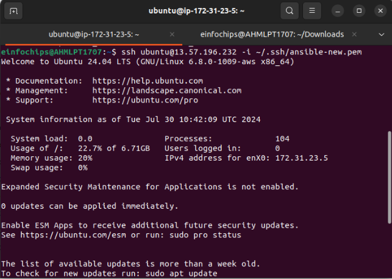
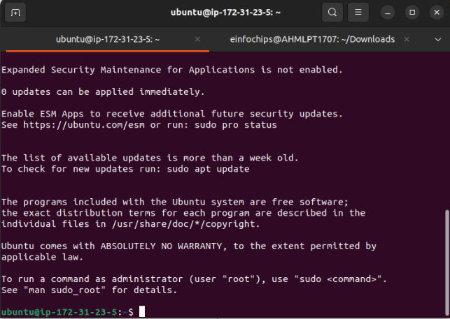
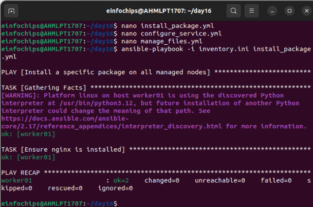

Day 16

**Control Node Setup:**

- Install Ansible on the control node.

`    `sudo apt update

`    `sudo apt install software-properties-common

`    `sudo add-apt-repository --yes --update ppa:ansible/ansible     sudo apt install ansible

Configure SSH key-based authentication between the control node and managed nodes.

**Managed Nodes Configuration:**

- Ensure all managed nodes are properly configured to be controlled by Ansible.

**Configure Ansible on the Control Node**

**3.1. Set Up the Ansible Inventory File**

The inventory file lists all managed nodes and their groups. By default, it is located at /etc/ansible/hosts. You can edit it or create a new inventory file in your project directory.

Creating a new inventory file nano inventory.ini

Verify connectivity and proper setup between the control node and managed nodes. ansible -i ~/day16/inventory.ini web -m ping

This command should return pong from each managed node if everything is set up correctly.

**Ad-Hoc Ansible Commands**

**Problem Statement:** Your organization needs to perform frequent, one-off administrative tasks across a fleet of servers. These tasks include checking disk usage, restarting services, and updating packages. You are required to use Ansible ad-hoc commands to accomplish these tasks efficiently.

Execute commands to check disk usage across all managed nodes.  ansible all -i /path/to/your/inventory.ini -m command -a "df -h"

Restart a specific service on all managed nodes.

ansible all -i inventory.ini -m apt -a "name=nginx state=present" –become

Update all packages on a subset of managed nodes.

**Playbook Creation:**

- Write a playbook to install a specific package on all managed nodes.
- Create a playbook to configure a service with specific parameters.
- Develop a playbook to manage files, such as creating, deleting, and modifying files on managed nodes.

**2. Testing and Verification:**

- Test the playbooks to ensure they run successfully and perform the intended tasks.
- Validate the changes made by the playbooks on the managed nodes.

**Playbook with Error Handling:**

- Write a playbook that includes tasks likely to fail, such as starting a non-existent service or accessing a non-existent file.

Implement error handling strategies using modules like block, rescue, and always.

