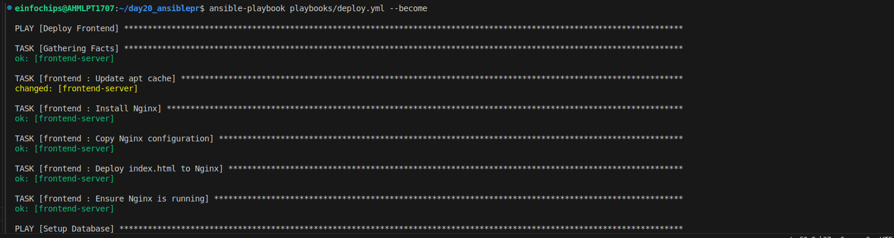
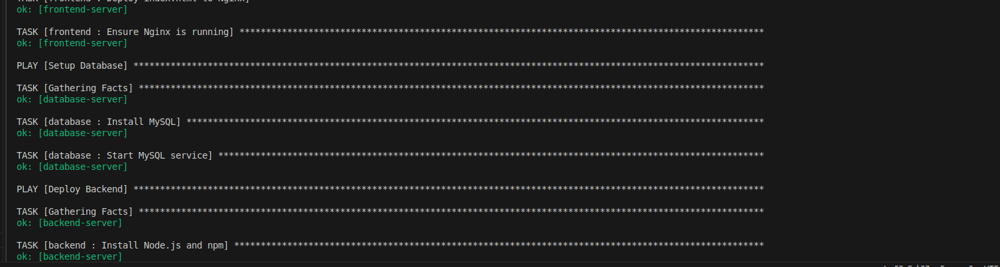
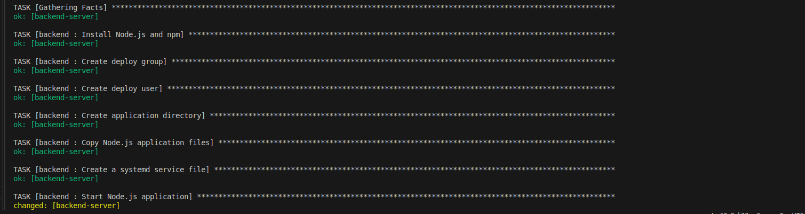
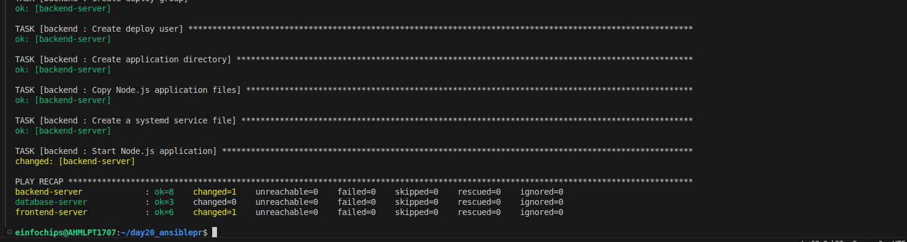
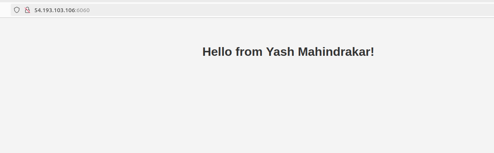
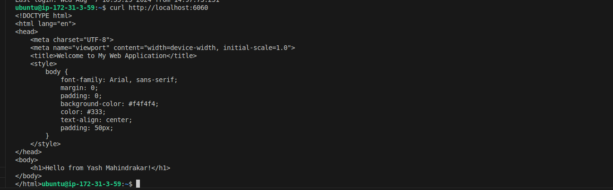

Certainly! Here’s a complete setup for your Ansible project that deploys a three-tier web application (frontend with Nginx, backend with Node.js, and MySQL database) using a single inventory file. The `index.html` file for the frontend will display a simple "Hello from frontend" message. No Git repository will be used for the backend.

### Project Structure

my_ansible_project/
├── roles/
│   ├── frontend/
│   │   ├── tasks/
│   │   │   └── main.yml
│   │   ├── templates/
│   │   │   └── nginx.conf.j2
│   │   ├── files/
│   │   │   └── index.html
│   ├── backend/
│   │   ├── tasks/
│   │   │   ├── main.yml
│   │   │   └── files/
│   │   │       └── app.js
│   │   ├── templates/
│   │       └── systemd.service.j2
│   ├── database/
│   │   └── tasks/
│   │       └── main.yml
│   ├── common/
│   │   └── tasks/
│   │       └── main.yml
├── inventory/
│   └── hosts.ini
├── playbooks/
│   ├── deploy.yml
│   └── test.yml
├── group_vars/
│   ├── frontend.yml
│   ├── backend.yml
│   └── database.yml
├── host_vars/
│   ├── localhost.yml
├── requirements.yml
├── README.md
└── ansible.cfg
```

### 1. Install Ansible and Ansible Galaxy Roles

**Install Ansible:**

```bash
pip install ansible
```

**Create a `requirements.yml` file for Galaxy roles:**

```yaml
- src: geerlingguy.nginx
  version: 3.0.0
- src: geerlingguy.nodejs
  version: 2.0.0
- src: geerlingguy.mysql
  version: 3.0.0
```

**Install the roles:**

```bash
ansible-galaxy install -r requirements.yml
```

### 2. Ansible Configuration

**`ansible.cfg`**

```ini
[defaults]
roles_path = ./roles
inventory = ./inventory/hosts.ini
```

### 3. Define Roles

#### Frontend Role (`roles/frontend/tasks/main.yml`)

```yaml
---
- name: Install Nginx
  ansible.builtin.yum:
    name: nginx
    state: present

- name: Copy Nginx configuration
  ansible.builtin.template:
    src: nginx.conf.j2
    dest: /etc/nginx/nginx.conf

- name: Deploy index.html to Nginx
  ansible.builtin.copy:
    src: index.html
    dest: /usr/share/nginx/html/index.html

- name: Ensure Nginx is running
  ansible.builtin.systemd:
    name: nginx
    state: started
    enabled: yes
```

#### Frontend Nginx Configuration Template (`roles/frontend/templates/nginx.conf.j2`)

```nginx
server {
    listen 80;
    server_name _;

    location / {
        root /usr/share/nginx/html;
        index index.html;
    }
}
```

#### Backend Role (`roles/backend/tasks/main.yml`)

```yaml
---
- name: Install Node.js
  ansible.builtin.yum:
    name: nodejs
    state: present

- name: Create application directory
  ansible.builtin.file:
    path: /opt/nodejs-app
    state: directory

- name: Copy Node.js application files
  ansible.builtin.copy:
    src: app.js
    dest: /opt/nodejs-app/app.js

- name: Create a systemd service file
  ansible.builtin.template:
    src: systemd.service.j2
    dest: /etc/systemd/system/nodejs-app.service

- name: Install Node.js dependencies
  ansible.builtin.command:
    cmd: npm install
    chdir: /opt/nodejs-app
  when: ansible_facts['distribution'] == 'Amazon'

- name: Start Node.js application
  ansible.builtin.systemd:
    name: nodejs-app
    state: started
    enabled: yes
```

#### Backend Node.js Application File (`roles/backend/files/app.js`)

```javascript
const http = require('http');

const hostname = '0.0.0.0';
const port = 3000;

const server = http.createServer((req, res) => {
  res.statusCode = 200;
  res.setHeader('Content-Type', 'text/plain');
  res.end('Backend service is up\n');
});

server.listen(port, hostname, () => {
  console.log(`Server running at http://${hostname}:${port}/`);
});
```

#### Backend Systemd Service Template (`roles/backend/templates/systemd.service.j2`)

```ini
[Unit]
Description=Node.js Application
After=network.target

[Service]
ExecStart=/usr/bin/node /opt/nodejs-app/app.js
Restart=always
User=nobody
Group=nogroup

[Install]
WantedBy=multi-user.target
```

#### Database Role (`roles/database/tasks/main.yml`)

```yaml
---
- name: Install MySQL server
  ansible.builtin.yum:
    name: mysql-server
    state: present

- name: Start MySQL service
  ansible.builtin.systemd:
    name: mysqld
    state: started
    enabled: yes

- name: Create MySQL database
  mysql_db:
    name: my_database
    state: present

- name: Create MySQL user
  mysql_user:
    name: my_user
    password: "{{ mysql_user_password }}"
    priv: "my_database.*:ALL"
    state: present
```

### 4. Inventory Configuration

**`inventory/hosts.ini`**

```ini
[frontend]
frontend-server ansible_host=192.168.1.10

[backend]
backend-server ansible_host=192.168.1.20

[database]
database-server ansible_host=192.168.1.30

[all:vars]
ansible_python_interpreter=/usr/bin/python3
```

### 5. Playbooks

#### Deploy Playbook (`playbooks/deploy.yml`)

```yaml
---
- name: Deploy Frontend
  hosts: frontend
  roles:
    - frontend

- name: Setup Database
  hosts: database
  roles:
    - database

- name: Deploy Backend
  hosts: backend
  roles:
    - backend
```

#### Test Playbook (`playbooks/test.yml`)

```yaml
---
- name: Test Deployment
  hosts: localhost
  gather_facts: no
  tasks:
    - name: Check Nginx is running
      ansible.builtin.uri:
        url: http://frontend-server
        method: GET
        return_content: yes
      register: result

    - name: Assert Nginx is accessible
      ansible.builtin.assert:
        that:
          - "'Hello from frontend' in result.content"

    - name: Check Backend Service
      ansible.builtin.uri:
        url: http://backend-server:3000
        method: GET
        return_content: yes
      register: backend_result

    - name: Assert Backend is accessible
      ansible.builtin.assert:
        that:
          - "'Backend service is up' in backend_result.content"
```

### 6. `index.html` File for Frontend

**`roles/frontend/files/index.html`**

```html
<!DOCTYPE html>
<html lang="en">
<head>
    <meta charset="UTF-8">
    <meta name="viewport" content="width=device-width, initial-scale=1.0">
    <title>Welcome to My Web Application</title>
    <style>
        body {
            font-family: Arial, sans-serif;
            margin: 0;
            padding: 0;
            background-color: #f4f4f4;
            color: #333;
            text-align: center;
            padding: 50px;
        }
    </style>
</head>
<body>
    <h1>Hello from Frontend</h1>
</body>
</html>
```

### 7. Documentation

**README.md**

```markdown
# My Ansible Project

## Overview

This project deploys a three-tier web application consisting of a frontend (Nginx), backend (Node.js), and database (MySQL) using Ansible.

## Prerequisites

- Ansible 2.9 or higher
- Ansible Galaxy roles (geerlingguy.nginx, geerlingguy.nodejs, geerlingguy.mysql)

## Project Structure

- `roles/`: Contains roles for each tier.
- `inventory/`: Contains a single inventory file for all hosts.
- `playbooks/`: Contains deployment and testing playbooks.
- `group_vars/` and `host_vars/`: Contains variables for configuration.

## Setup

1. Install dependencies:
    ```bash
    ansible-galaxy install -r requirements.yml
    ```

2. Configure your inventory file with the appropriate host IPs.

3. Run the deployment playbook:
    ```bash
    ansible-playbook playbooks/deploy.yml
    ```

4. Test the deployment:
    ```bash
   ansible-playbook playbooks/deploy.yml 


``` 







