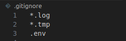

---

### **Milestone 1: Environment Setup**

**Objective: Configure your development environment and AWS infrastructure.**

1. **Launch an AWS EC2 Instance Running Ubuntu:**
   - Log in to your AWS Management Console.
   - Navigate to EC2 Dashboard.
   - Click "Launch Instance".
   - Choose "Ubuntu" as the Amazon Machine Image (AMI).
   - Select an instance type (e.g., t2.micro).
   - Configure instance details, add storage, and configure security groups (ensure SSH access is enabled).
   - Review and launch the instance. Download the key pair if prompted.

2. **Install Ansible and Git on Your Local Machine:**
   - Open a terminal and run the following commands:

     ```bash
     # Update package index
     sudo apt update

     # Install Ansible
     sudo apt install -y ansible

     # Install Git
     sudo apt install -y git
     ```

**Deliverables:**
- AWS EC2 instance running Ubuntu.
- Local or remote control node with Ansible and Git installed.

---

### **Milestone 2: Create Ansible Role Structure**

**Objective: Organize your Ansible project using best practices for playbooks and roles.**

1. **Create Directory Structure and Initialize Roles:**

   ```bash
   mkdir my_ansible_project
   cd my_ansible_project
   ansible-galaxy init roles/webserver
   ansible-galaxy init roles/database
   ansible-galaxy init roles/application
   ```

**Deliverables:**
- Ansible role directories for `webserver`, `database`, and `application`.

---

### **Milestone 3: Version Control with Git**

**Objective: Implement version control for your Ansible project.**

1. **Initialize a Git Repository:**

   ```bash
   cd my_ansible_project
   git init
   ```

2. **Create a `.gitignore` File:**
   - Create a `.gitignore` file in the root directory with:

     ```
     *.log
     *.tmp
     .env
     ```

3. **Commit and Push Initial Codebase:**

   ```bash
   git add .
   git commit -m "Initial commit with Ansible roles"
   ```

   - Create a remote repository on GitHub or another service.
   - Push the code:

     ```bash
     git remote add origin <REMOTE_REPOSITORY_URL>
     git push -u origin master
     ```

**Deliverables:**
- Git repository with initial Ansible codebase.
- Remote repository link (e.g., GitHub).

---

### **Milestone 4: Develop Ansible Roles**

**Objective: Write Ansible roles for web server, database, and application deployment.**

1. **Develop the `webserver` Role:**

   - **Create `roles/webserver/files/index.html`:**

     ```html
     <!DOCTYPE html>
     <html lang="en">
     <head>
         <meta charset="UTF-8">
         <meta name="viewport" content="width=device-width, initial-scale=1.0">
         <title>Welcome to My Web Application</title>
         <style>
             body {
                 font-family: Arial, sans-serif;
                 text-align: center;
                 padding: 50px;
                 background-color: #f4f4f4;
             }
             h1 {
                 color: #333;
             }
             p {
                 color: #666;
             }
         </style>
     </head>
     <body>
         <h1>Welcome to My Web Application</h1>
         <p>This is a basic HTML page served by Apache.</p>
     </body>
     </html>
     ```


   - **Update `roles/webserver/tasks/main.yml`:**

     ```yaml
     ---
     - name: Install Apache
       apt:
         name: apache2
         state: present
       become: yes

     - name: Start Apache service
       service:
         name: apache2
         state: started
         enabled: yes
       become: yes

     - name: Deploy the index.html file
       copy:
         src: index.html
         dest: /var/www/html/index.html
         owner: www-data
         group: www-data
         mode: '0644'
       become: yes
     ```

2. **Develop the `database` Role:**
Verify MySQL Credentials Manually

Before addressing Ansible-specific issues, ensure that you can manually connect to MySQL with the credentials you intend to use.

    Manually Log In to MySQL:
```
  mysql -u root -p
```
Enter the root password when prompted. If you cannot log in, the password might be incorrect, or there might be another issue with MySQL.

Set or Reset the Root Password Manually:

```
sudo mysql
```
Then, in the MySQL shell, execute:

```
ALTER USER 'root'@'localhost' IDENTIFIED WITH mysql_native_password BY 'your_new_password';
FLUSH PRIVILEGES;
```
Replace 'your_new_password' with a strong password.

Exit MySQL:

```
EXIT;
```

Verify File-Based Credentials

If you are using /root/.my.cnf for MySQL credentials:

    Check File Exists:

```
sudo cat /root/.my.cnf
```
File Content Should Look Like:

```
[client]
user=root
password=your_new_password
```
Check File Permissions:
```

sudo chown root:root /root/.my.cnf
sudo chmod 600 /root/.my.cnf
```
   - **Update `roles/database/tasks/main.yml`:**

     ```yaml
    ---
    - name: Install MySQL Server
      apt:
        name: mysql-server
        state: present
      become: yes

    - name: Start MySQL service
      service:
        name: mysql
        state: started
        enabled: yes
      become: yes

    - name: Ensure MySQL is running
      service:
        name: mysql
        state: started
        enabled: yes
      become: yes

    - name: Create a MySQL Database
      mysql_db:
        name: mydatabase
        state: present
        login_user: root
        login_password: "{{ mysql_root_password }}"
      become: yes

    - name: Create a MySQL User
      mysql_user:
        name: myuser
        password: mypassword
        priv: '*.*:ALL'
        host: '%'
        login_user: root
        login_password: "{{ mysql_root_password }}"
        state: present
      become: yes
              
     ```

3. **Develop the `application` Role:**

   - **Create a Simple Flask Application:**

     - **Create a directory for the application files:**

       ```bash
       mkdir -p my_ansible_project/roles/application/files
       ```

     - **Create a basic Flask application (`my_ansible_project/roles/application/files/app.py`):**

       ```python
       from flask import Flask

       app = Flask(__name__)

       @app.route('/')
       def hello_world():
           return 'Hello, World!'

       if __name__ == '__main__':
           app.run(host='0.0.0.0', port=5000)
       ```

     - **Create a `requirements.txt` file for dependencies (`my_ansible_project/roles/application/files/requirements.txt`):**

       ```
       Flask==2.2.2
       ```

   - **Update `roles/application/tasks/main.yml`:**

     ```yaml
       ---
        - name: Install Python and Pip
          apt:
            name:
            - python3
            - python3-pip
            - python3-venv
            state: present
          become: yes

        - name: Create application directory
          file:
            path: /var/www/myapp
            state: directory
            owner: www-data
            group: www-data
            mode: '0755'
          become: yes

        - name: Create a Python virtual environment
        command: python3 -m venv /var/www/myapp/venv
        become: yes

        - name: Deploy Flask Application Files
        synchronize:
            src: /home/einfochips/my_ansible_project/roles/application/files/
            dest: /var/www/myapp/
            recursive: yes
        become: yes

        - name: Install Flask and other dependencies
        pip:
            name:
            - Flask==2.0.1
            - requests==2.25.1
            virtualenv: /var/www/myapp/venv
        become: yes

        - name: Start Flask Application
        shell: |
            /var/www/myapp/venv/bin/python /var/www/myapp/app.py > /var/log/myapp.log 2>&1 &
        become: yes

     ```

**Deliverables:**
- Completed Ansible roles for `webserver`, `database`, and `application`.

---

### **Milestone 5: Documentation and Maintenance**

**Objective: Document your Ansible roles and playbooks for future maintenance.**

1. **Create `README.md` Files for Each Role:**

   **Example `roles/webserver/README.md`:**

   ```markdown
   # Webserver Role

   ## Description
   Installs and configures Apache web server.

   ## Variables
   - `apache_port`: Port for Apache to listen on (default: 80)

   ## Tasks
   - Install Apache
   - Start Apache service
   - Deploy index.html
   ```

   **Example `roles/database/README.md`:**

   ```markdown
   # Database Role

   ## Description
   Installs and configures MySQL database.

   ## Variables
   - `db_user`: MySQL user (default: myuser)
   - `db_password`: MySQL user password (default: mypassword)

   ## Tasks
   - Install MySQL Server
   - Start MySQL service
   - Create a MySQL database
   - Create a MySQL user
   ```

   **Example `roles/application/README.md`:**

   ```markdown
   # Application Role

   ## Description
   Deploys a simple Flask application.

   ## Variables
   - `app_requirements`: Path to the requirements file

   ## Tasks
   - Install Python and Pip
   - Deploy Flask Application Files
   - Install Application Dependencies
   - Start Flask Application
   ```

2. **Add Comments within Playbooks and Roles:**
   - Add comments in `main.yml` files to explain complex logic.

**Deliverables:**
- `README.md` files for `webserver`, `database`, and `application` roles.
- Well-documented playbooks and roles.

---

### **Milestone 6: Dynamic Inventory Script**
To install aws cli use 
```
sudo apt install awscli
```

```
    aws configure
```
Enter the key_id and access_key


**Objective: Use dynamic inventory scripts to manage AWS EC2 instances.**

1. **Create a Python Script to Query AWS:**

   **Example `dynamic_inventory.py`:**

   ```python
   #!/usr/bin/env python3
   import boto3
   import json

   ec2 = boto3.client('ec2')

   def main():
       response = ec2.describe_instances()
       inventory = {'_meta': {'hostvars': {}}}
       for reservation in response['Reservations']:
           for instance in reservation['Instances']:
               inventory.setdefault('all', {'hosts': []})
               inventory['all']['hosts'].append(instance['PublicDnsName'])
               inventory['_meta']['hostvars'][

instance['PublicDnsName']] = {
                   'instance_id': instance['InstanceId'],
                   'private_ip': instance.get('PrivateIpAddress', 'N/A'),
                   'public_ip': instance.get('PublicIpAddress', 'N/A')
               }
       print(json.dumps(inventory, indent=2))

   if __name__ == '__main__':
       main()
   ```

**Deliverables:**
- Dynamic inventory script to fetch EC2 instance details.

---

### **Milestone 7: Playbook Development and Deployment**

**Objective: Create and execute an Ansible playbook to deploy the web application.**

1. **Develop a Master Playbook:**

   **Example `playbook.yml`:**

   ```yaml
   ---
   - name: Deploy Web Application
     hosts: all
     become: yes
     roles:
       - webserver
       - database
       - application
   ```


Make the Script Executable: Ensure your script is executable:
```chmod +x /path/to/ec2_inventory.py```

2. **Define Inventory and Variable Files:**


3. **Execute the Playbook:**

   ```bash
   ansible-playbook -i /home/einfochips/my_ansible_project/dynamic_inv.py playbook.yml --become
   ```


**Deliverables:**
- Ansible playbook for web application deployment.
- Successfully deployed web application on the EC2 instance.

---

This updated guide provides a complete solution, including a basic Flask application for the `application` role. This setup allows you to deploy a simple web application on your EC2 instance using Ansible.