# E-Commerce Microservices Deployment

## Overview

This repository contains the configurations and code necessary to deploy a microservices-based e-commerce application. It includes static front-end files served by Nginx, a product catalog service implemented in Node.js, and an order processing service implemented in Flask.

## Project Structure

- `Dockerfile` - Docker configurations for each microservice.
- `k8s` - Kubernetes manifests for deploying microservices.
- `app.py` - Flask application for order processing.
- `index.html` - Static front-end served by Nginx.
- `product-catalog.js` - Node.js application for product catalog.
- `requirements.txt` - Python dependencies for Flask application.
- `package.json` - Node.js dependencies for product catalog.
- `README.md` - This file.

## Tasks

### Task 1: Git Repository Setup

1. **Create a Git Repository**:
   - Initialize a new Git repository and push the project files.
   - Example:
     ```bash
     git init
     git add .
     git commit -m "Initial commit"
     git remote add origin <repository_url>
     git push -u origin master
     ```
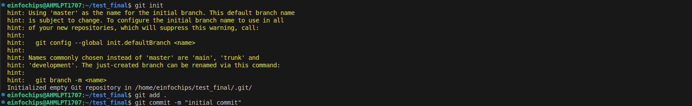
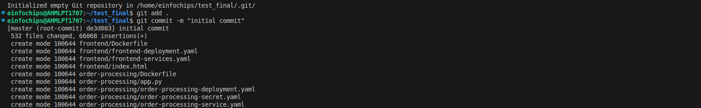
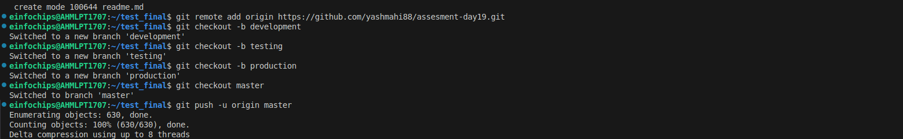

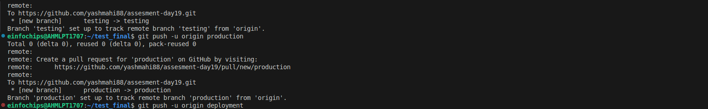
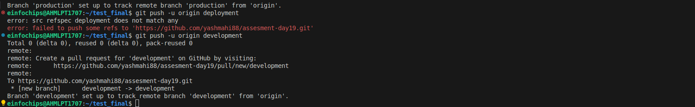


2. **Branching Strategy**:
   - **Development**: Create a branch for ongoing development work.
   - **Testing**: Create a branch to test changes before merging.
   - **Production**: Create a branch for stable production-ready code.
   - Example:
     ```bash
     git checkout -b development
     git checkout -b testing
     git checkout -b production
     ```

### Task 2: Dockerize Microservices

1. **Dockerfiles**:
   - **Front-End**: `Dockerfile` for serving static files with Nginx.
   - **Order Processing**: `Dockerfile` for Flask application.
   - **Product Catalog**: `Dockerfile` for Node.js application.

2. **Build Docker Images**:
   - Build and push Docker images to a container registry.
   - Example:
     ```bash
     docker build -t yashmahi04/frontend-11:latest -f Dockerfile.frontend .
     docker push yashmahi04/frontend-11:latest

     docker build -t yashmahi04/order-processing1:latest -f Dockerfile.order .
     docker push yashmahi04/order-processing1:latest

     docker build -t yashmahi04/product-catalog1:latest -f Dockerfile.catalog .
     docker push yashmahi04/product-catalog1:latest
     ```

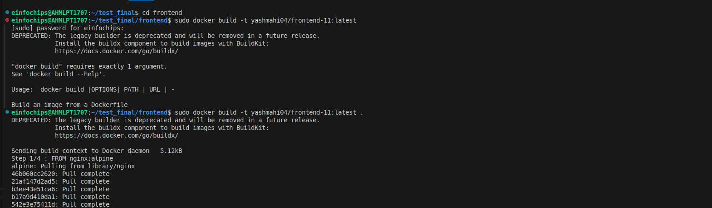
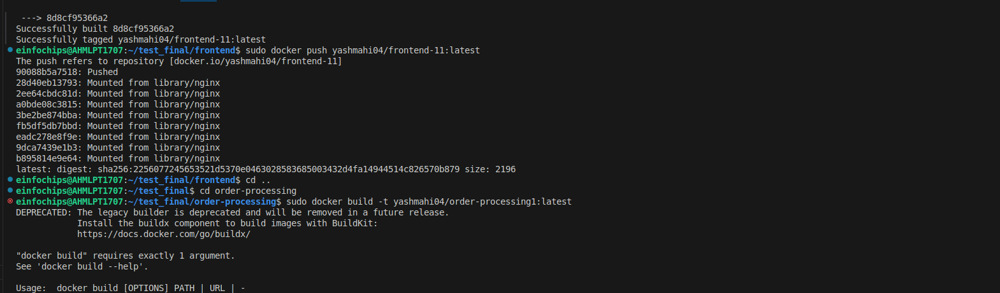
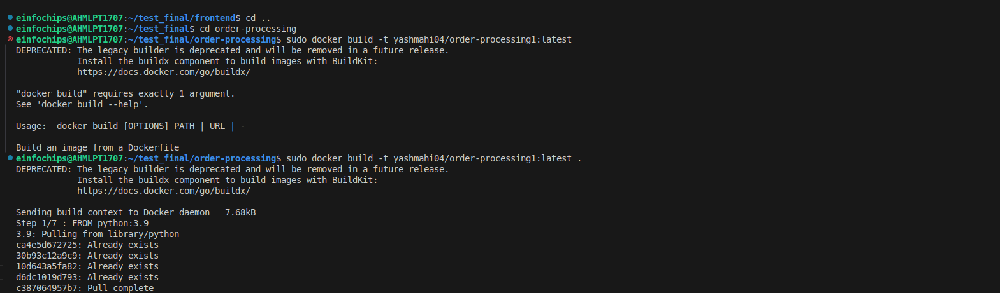
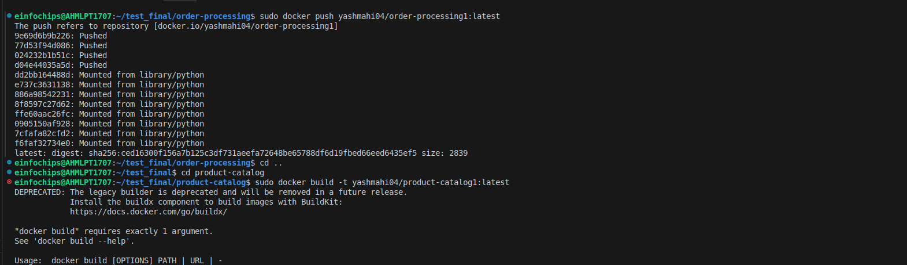
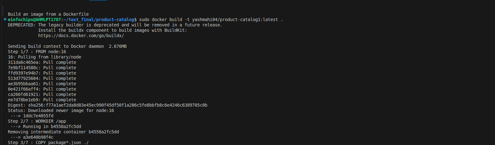
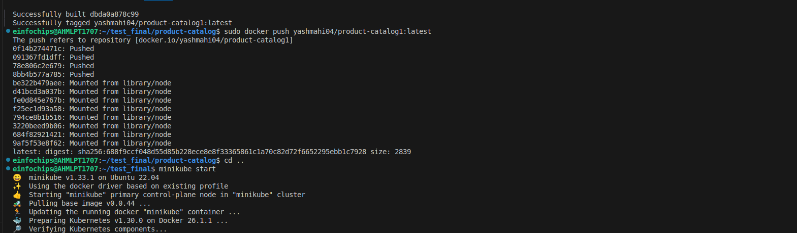


### Task 3: Kubernetes Deployment

1. **Kubernetes Manifests**:
   - Define and apply Kubernetes manifests for each microservice.
   - Manifests are located in the `k8s` directory and include:
     - `frontend-deployment.yaml`
     - `frontend-service.yaml`
     - `order-processing-deployment.yaml`
     - `order-processing-service.yaml`
     - `product-catalog-deployment.yaml`
     - `product-catalog-service.yaml`
     - `order-processing-secret.yaml`
     - `product-catalog-config.yaml`

   - Example commands to deploy:
     ```bash
     kubectl apply -f frontend-deployment.yaml
     kubectl apply -f frontend-service.yaml

     kubectl apply -f order-processing-deployment.yaml
     kubectl apply -f order-processing-service.yaml
     kubectl apply -f order-processing-secret.yaml

     kubectl apply -f product-catalog-deployment.yaml
     kubectl apply -f product-catalog-service.yaml
     kubectl apply -f product-catalog-config.yaml
     ```
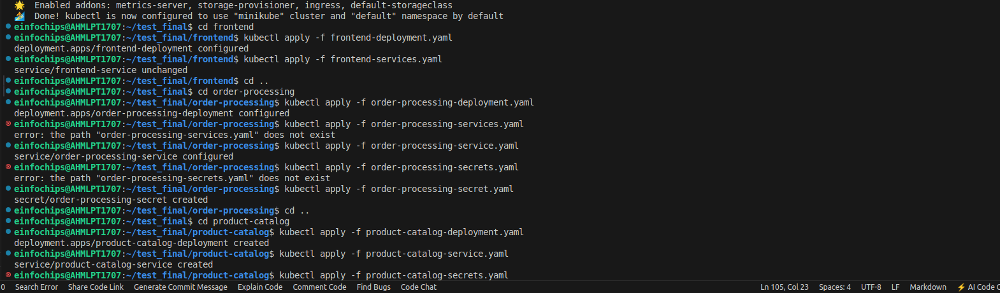
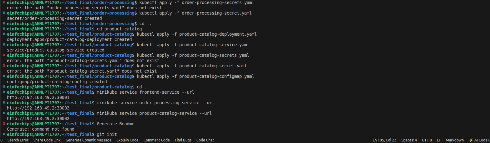

2. **Configuration Management**:
   - Use `ConfigMaps` and `Secrets` for managing configurations and sensitive data.

## Files and Their Purpose

- **Dockerfiles**:
  - `Dockerfile.frontend` - Builds the Nginx image for the front-end.
  - `Dockerfile.order` - Builds the Flask image for order processing.
  - `Dockerfile.catalog` - Builds the Node.js image for the product catalog.
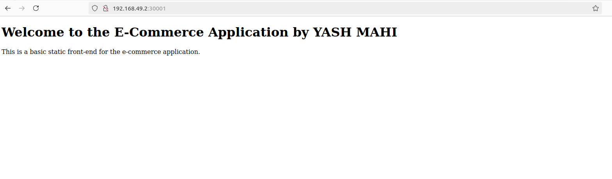

- **Kubernetes Manifests**:
  - `frontend-deployment.yaml` - Deployment configuration for the front-end service.
  - `frontend-service.yaml` - Service configuration for the front-end service.
  - `order-processing-deployment.yaml` - Deployment configuration for the order processing service.
  - `order-processing-service.yaml` - Service configuration for the order processing service.
  - `product-catalog-deployment.yaml` - Deployment configuration for the product catalog service.
  - `product-catalog-service.yaml` - Service configuration for the product catalog service.
  - `order-processing-secret.yaml` - Secret configuration for sensitive data.
  - `product-catalog-config.yaml` - ConfigMap for database URL.

- **Application Code**:
  - `app.py` - Flask application handling orders.
  - `product-catalog.js` - Node.js application serving product data.
  - `index.html` - Static HTML served by Nginx.

