### 1. Shell Scripts for Basic Operations

**Task:** Write shell scripts to monitor basic system metrics.

**Deliverable:**
- **Scripts:**
  - **`check_disk_usage.sh`:** Reports disk usage with thresholds for alerting.
  - **`check_memory_usage.sh`:** Displays current memory usage and available memory.
  - **`check_cpu_load.sh`:** Monitors CPU load and provides usage statistics.

- **Features:**
  - Output system performance metrics.
  - Include error handling for common issues like missing tools or command failures.
  - Log outputs to a file with timestamps for later analysis.

**Sample Script:**
```bash
#!/bin/bash

# Define log file
LOGFILE="/var/log/system_performance.log"

# Function to log messages with timestamp
log_message() {
    local message="$1"
    echo "$(date +'%Y-%m-%d %H:%M:%S') - ${message}" >> "${LOGFILE}"
}

# Function to check disk usage
check_disk_usage() {
    local disk_usage
    disk_usage=$(df -h 2>> "${LOGFILE}")
    if [ $? -ne 0 ]; then
        log_message "Error checking disk usage."
        return 1
    fi
    echo "Disk Usage:"
    echo "${disk_usage}"
    log_message "Disk usage checked."
}

# Function to check memory usage
check_memory_usage() {
    local mem_usage
    mem_usage=$(free -h 2>> "${LOGFILE}")
    if [ $? -ne 0 ]; then
        log_message "Error checking memory usage."
        return 1
    fi
    echo "Memory Usage:"
    echo "${mem_usage}"
    log_message "Memory usage checked."
}

# Function to check CPU load
check_cpu_load() {
    local cpu_load
    cpu_load=$(top -bn1 | grep "Cpu(s)" 2>> "${LOGFILE}")
    if [ $? -ne 0 ]; then
        log_message "Error checking CPU load."
        return 1
    fi
    echo "CPU Load:"
    echo "${cpu_load}"
    log_message "CPU load checked."
}

log_message "System performance check started."

check_disk_usage
check_memory_usage
check_cpu_load

log_message "System performance check completed."
```

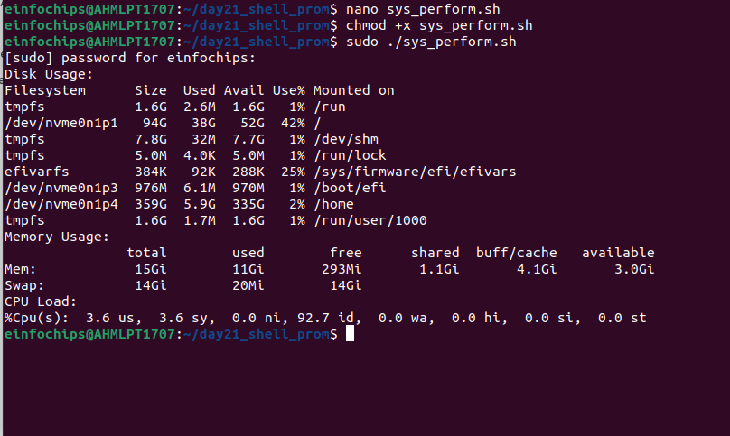

### 2. Log Management Script

**Task:** Automate log rotation, compression, and deletion.

**Deliverable:**
- **Script:**
  - **`log_rotation.sh`:** Rotates logs based on size or age, compresses old logs, and deletes logs older than a specified number of days.

- **Features:**
  - Rotate logs when they exceed a certain size.
  - Compress old logs using `gzip`.
  - Delete logs older than a specified number of days.

```bash
#!/bin/bash

# Define variables
LOG_DIR="/var/log/myapp"
ARCHIVE_DIR="/var/log/archive"
MAX_SIZE=10000000  # 10MB
DAYS_TO_KEEP=30

# Create archive directory if it does not exist
if [ ! -d "$ARCHIVE_DIR" ]; then
    mkdir -p "$ARCHIVE_DIR"
    if [ $? -ne 0 ]; then
        echo "Error: Unable to create archive directory $ARCHIVE_DIR" >&2
        exit 1
    fi
fi

# Rotate logs
for log_file in $LOG_DIR/*.log; do
    if [ -f "$log_file" ]; then
        SIZE=$(stat -c%s "$log_file")
        if [ $SIZE -gt $MAX_SIZE ]; then
            ARCHIVE_FILE="$ARCHIVE_DIR/$(basename $log_file).$(date +%F-%H-%M-%S).gz"
            mv "$log_file" "$ARCHIVE_FILE"
            if [ $? -ne 0 ]; then
                echo "Error: Unable to move $log_file to $ARCHIVE_FILE" >&2
                continue
            fi
            gzip "$ARCHIVE_FILE"
            if [ $? -ne 0 ]; then
                echo "Error: Unable to compress $ARCHIVE_FILE" >&2
                continue
            fi
            echo "Archived and compressed $log_file to $ARCHIVE_FILE.gz"
        fi
    fi
done

# Delete old logs
find "$ARCHIVE_DIR" -type f -mtime +$DAYS_TO_KEEP -exec rm {} \;
if [ $? -ne 0 ]; then
    echo "Error: Unable to delete old logs from $ARCHIVE_DIR" >&2
    exit 1
fi

echo "Log rotation and cleanup completed."
```
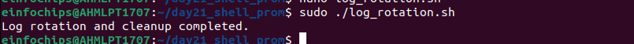

### 3. Advanced Shell Scripting

**Task:** Refactor scripts to include loops, conditions, functions, and robust error handling.

**Deliverable:**
- **Refactored Scripts:**
  - Use functions to handle repeated tasks (e.g., logging, error checking).
  - Implement error handling to manage missing files, permission issues, and invalid commands.

```bash
#!/bin/bash

# Configuration
LOG_DIR="/var/log"
ARCHIVE_DIR="/var/log/archive"
MAX_LOG_AGE=30 # days
LOG_SIZE_LIMIT=10000000 # bytes (10 MB)
ERROR_LOG="/var/log/log_management_error.log"
INFO_LOG="/var/log/log_management.log"

# Ensure archive directory exists
mkdir -p "$ARCHIVE_DIR"

# Function to rotate and compress logs
rotate_logs() {
    echo "Starting log rotation..." >> "$INFO_LOG"
    for log_file in "$LOG_DIR"/*.log; do
        if [ -f "$log_file" ]; then
            # Check log size
            if [ $(stat -c%s "$log_file") -gt $LOG_SIZE_LIMIT ]; then
                timestamp=$(date +'%Y%m%d%H%M%S')
                mv "$log_file" "$ARCHIVE_DIR/$(basename "$log_file")-$timestamp"
                gzip "$ARCHIVE_DIR/$(basename "$log_file")-$timestamp"
                echo "Log file $(basename "$log_file") rotated and compressed." >> "$INFO_LOG"
            fi
        fi
    done
}

# Function to delete old logs
delete_old_logs() {
    echo "Starting deletion of old logs..." >> "$INFO_LOG"
    find "$ARCHIVE_DIR" -type f -mtime +$MAX_LOG_AGE -exec rm {} \;
    echo "Old logs deleted." >> "$INFO_LOG"
}

# Function to show archived logs
show_archived_logs() {
    echo "Listing archived logs:"
    ls -lh "$ARCHIVE_DIR"
}

# Function to check if directories exist
check_directories() {
    if [ ! -d "$LOG_DIR" ]; then
        echo "Error: Log directory $LOG_DIR does not exist." >&2
        exit 1
    fi

    if [ ! -d "$ARCHIVE_DIR" ]; then
        echo "Error: Archive directory $ARCHIVE_DIR does not exist." >&2
        exit 1
    fi
}

# Main script execution
{
    check_directories
    rotate_logs
    delete_old_logs
    show_archived_logs
} || {
    echo "An error occurred during log management." >> "$ERROR_LOG"
    exit 1
}
```

### 4. Log Checking and Troubleshooting

**Task:** Develop a script to analyze logs for common issues and provide troubleshooting steps.

**Deliverable:**
- **Script:**
  - **`log_checker.sh`:** Parses system and application logs for errors and provides troubleshooting guidance.

- **Features:**
  - Check logs for specific error patterns.
  - Output common issues and suggested fixes.

```bash
#!/bin/bash

# log_checker.sh
LOGFILE="/var/log/syslog"
ERROR_LOG="/var/log/error_analysis.log"

grep -i "error" $LOGFILE | while read -r line; do
    echo "Found Error: $line" >> $ERROR_LOG
    # Simple pattern matching for troubleshooting
    if echo "$line" | grep -q "out of memory"; then
        echo "Troubleshooting: Check memory usage and consider increasing swap space." >> $ERROR_LOG
    fi
done
```
As there were no errors the terminal was blank and had to exit.

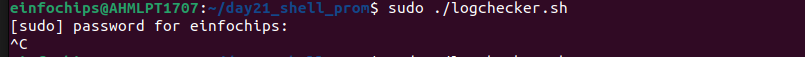

### 5. Installation and Setup of Prometheus and Node Exporter

**Task:** Install and configure Prometheus and Node Exporter.

**Deliverable:**
- **Documentation:**
  - Step-by-step guide for installing Prometheus and Node Exporter.
  - Configuration files and instructions for setting up Node Exporter to collect system metrics.

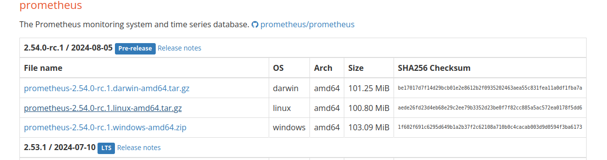

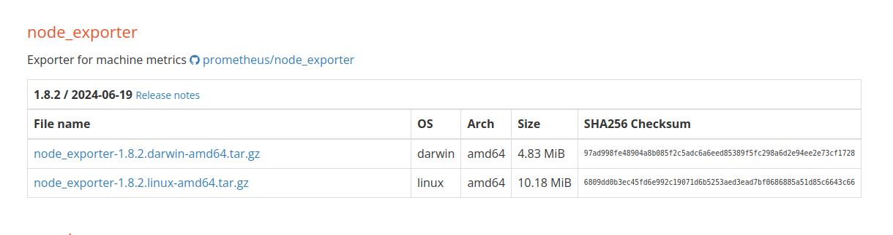

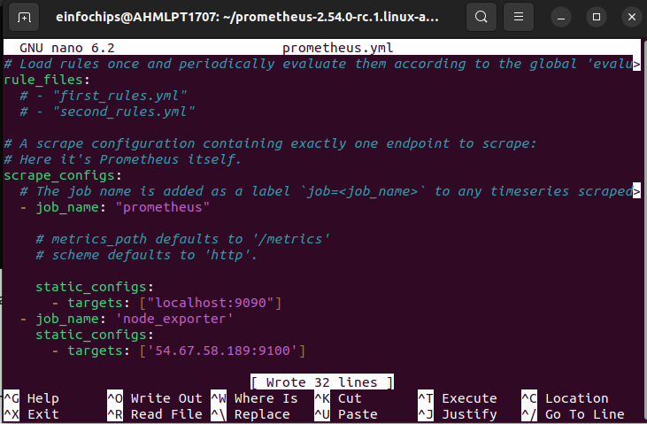

To run the prometheus.yml use the following command 

```
./prometheus --config.file=/etc/prometheus/prometheus.yml
```

Ensure the prometheus is running on http://localhost:9090
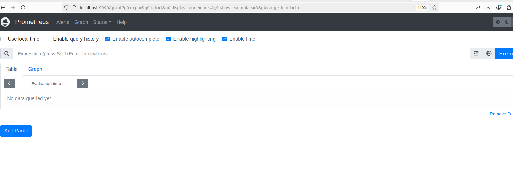

Installing NodeExport on the worker node using wget.
```
wget https://github.com/prometheus/node_exporter/releases/download/v1.8.2/node_exporter-1.8.2linux-amd64.tar.gz
```
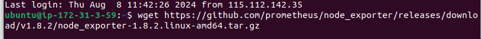

```
tar xvf node_exporter-1.8.2.linux-amd64.tar.gz

```
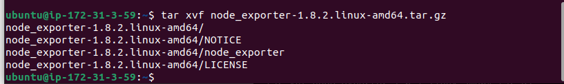

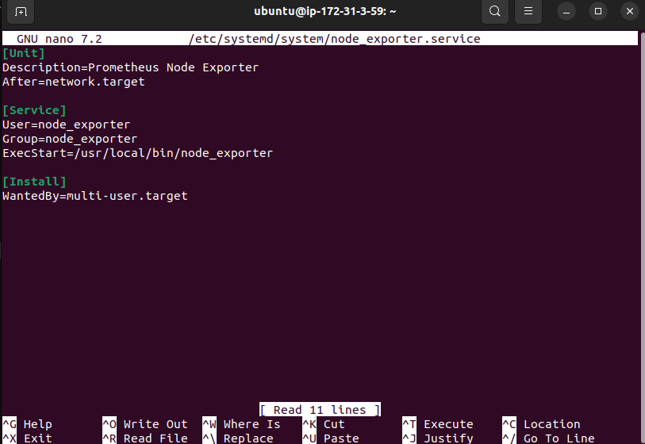
Manually Run Node Exporter

To check if Node Exporter runs correctly outside of the systemd service, manually execute it:
```
/usr/local/bin/node_exporter
```
Verify the Setup

Check Prometheus Targets:
Open a browser and go to http://localhost:9090. Navigate to **Status -> Targets**. Ensure that the node_exporter job is listed and its status is **UP**. This confirms that Prometheus is successfully scraping metrics from Node Exporter.

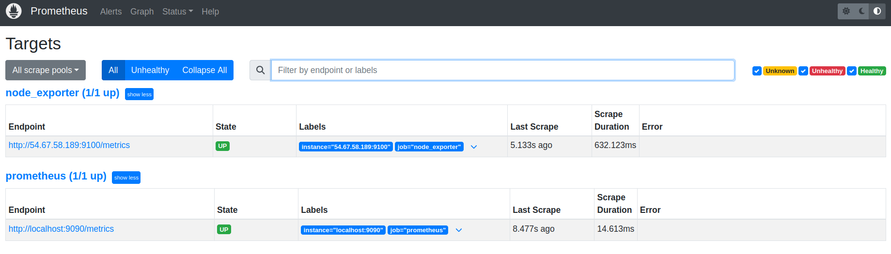


### 6. Prometheus Query Language (PromQL) Basic Queries

**Task:** Create PromQL queries to monitor key system metrics.
Accessing the Prometheus Web UI

Open Prometheus Web UI:
Open your web browser and navigate to the Prometheus web interface. The default URL is http://localhost:9090.

Using the Prometheus Web UI to Enter PromQL Queries

Navigate to the **"Graph"** Tab:
Once you're on the Prometheus web UI, you’ll see several tabs like Status, Targets, Graph, etc.
 Click on the **Graph** tab. This tab allows you to enter and visualize PromQL queries.
**Deliverable:**
- **Queries:**
  - **CPU Usage:** `rate(node_cpu_seconds_total{mode="user"}[5m])`


  - **Memory Usage:** `node_memory_MemAvailable_bytes / node_memory_MemTotal_bytes`

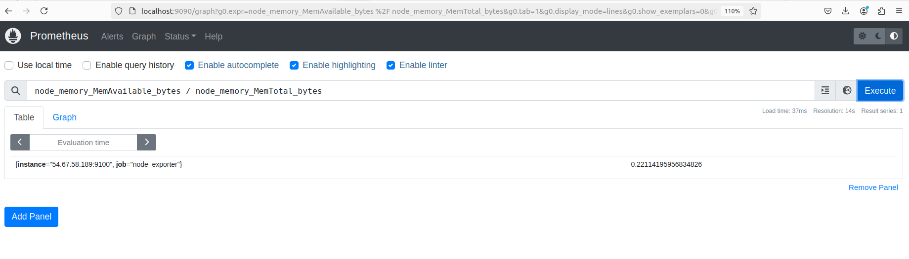

  - **Disk I/O:** `rate(node_disk_io_time_seconds_total[5m])`

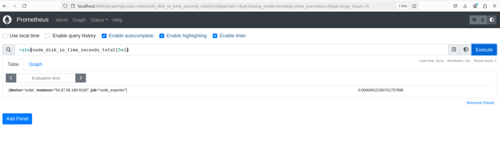

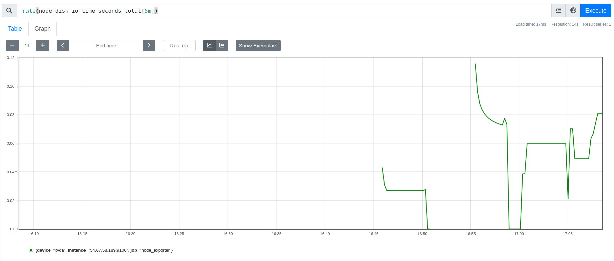