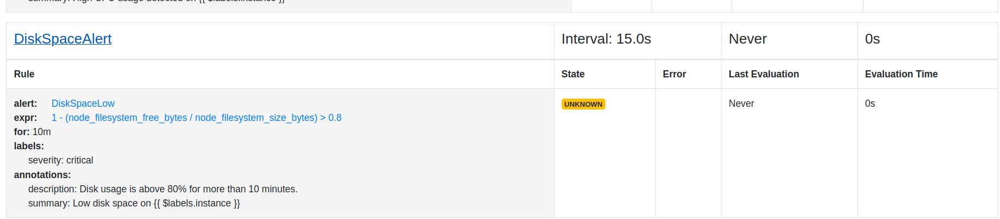

Project 01
Project Breakdown

Configuring Jobs and Targets

Task: Set up a Prometheus server to monitor multiple services running on different nodes.

Install and run Prometheus:
```
wget https://github.com/prometheus/prometheus/releases/download/v2.53.1/prometheus-2.53.1.linux-amd64.tar.gz

tar -xvf prometheus-2.53.1.linux-amd64.tar.gz

cd prometheus-2.53.1.linux-amd64/

./prometheus 

```
2.Using Exporters (Node Exporter)

Task: Use Node Exporter to monitor system-level metrics like CPU, memory, disk usage, and network statistics.

Install Node-Exporter:


```
wget https://github.com/prometheus/node_exporter/releases/download/v1.8.2/node_exporter-1.8.2.linux-amd64.tar.gz
```

To unzip the node exporter file
```
tar xvf node_exporter-1.8.2.linux-amd64.tar.gz
```


To start node exporter 
```
node_exporter
```

Verify whether the node exporter is running properly by going to **<ip_address>:9100**


To install mysqld_exporter on the node 

```
wget https://github.com/prometheus/mysqld_exporter/releases/download/v0.15.1/mysqld_exporter-0.15.1.linux-amd64.tar.gz
```
To unzip the mysqld_exporter

```
tar xvfz mysqld_exporter-0.15.1.linux-amd64.tar.gz
```


Move the binary to /usr/local/bin:

```bash

sudo mv mysqld_exporter-0.14.0.linux-amd64/mysqld_exporter /usr/local/bin/
```
Create a systemd service file for MySQL Exporter:

```bash

sudo nano /etc/systemd/system/mysqld_exporter.service
```
Add the following content to the file:

```
[Unit]
Description=MySQL Exporter
After=network.target

[Service]
User=mysql_exporter
Group=mysql_exporter
ExecStart=/usr/local/bin/mysqld_exporter --config.my-cnf /etc/mysql_exporter/my.cnf

[Install]
WantedBy=multi-user.target
```


3.Hands-on Exercise: Setting Up Exporters

Task: Configure at least two different types of exporters (e.g., Node Exporter and MySQL Exporter) and integrate them with Prometheus.

Add the Node-Exporter job in prometheus.yml file:
```
- job_name: "node"
  static_configs:
    - targets: ["<instance-ip>:9100"]
```
Reaload Prometheus:
```
kill -HUP $(pgrep prometheus)

```
Install mysql on the worker node 

```
sudo apt update
sudo apt install mysql-server
```

To create username and password 

```
sudo mysql_secure_installation
```

Log in to MySQL

Log in to the MySQL server as the root user:

```
sudo mysql -u root -p
```
You’ll be prompted to enter the root password you set earlier.
Create a New User for the Exporter

Once logged in, create a new user specifically for the MySQL Exporter:

```sql

CREATE USER 'exporter_user'@'localhost' IDENTIFIED BY 'exporter_password';
```
Replace 'exporter_user' with your desired username and 'exporter_password' with a strong password.
Grant Permissions

Grant the necessary permissions to the new user:

```sql

GRANT SELECT ON *.* TO 'exporter_user'@'localhost';
```
This command allows the exporter_user to execute SELECT queries on all databases, which is required for exporting metrics.
Apply the Changes

Flush the privileges to make sure that the new permissions are applied:

```
FLUSH PRIVILEGES;
```
Exit MySQL

Exit the MySQL command-line interface:

```sql

EXIT;
```

Create Configuration File

Create a configuration file that contains the MySQL user credentials:

```bash

sudo mkdir /etc/mysql_exporter
sudo nano /etc/mysql_exporter/my.cnf
```
Add the following content to my.cnf, replacing exporter_user and exporter_password with the credentials you created:
```
[client]
user=<username>
password=exporter_password
```

Set File Permissions

Ensure that the configuration file has the correct permissions:

```bash

sudo chown root:root /etc/mysql_exporter/my.cnf
sudo chmod 600 /etc/mysql_exporter/my.cnf
```

Start and Enable MySQL Exporter Service

Reload systemd to recognize the new service, then start and enable it:

```bash

sudo systemctl daemon-reload
sudo systemctl start mysqld_exporter
sudo systemctl enable mysqld_exporter
```

Verify the mysql exporter is running 

```
/usr/local/bin/mysqld_exporter --config.my-cnf /etc/mysql_exporter/my.cnf
```
Changes in prometheus.yml file present on local machine.

```
    static_configs:
      - targets: ["localhost:9090"]
  - job_name: 'node_exporter'
    static_configs:
      - targets: ['13.52.99.76:9100']
  - job_name: 'mysql_exporter'
      - targets: ['13.52.99.76:9104']

```


**4. Introduction to PromQL**

Task: Learn and implement basic PromQL queries.

Steps:

Access Prometheus web UI at http://<prometheus_server>:9090.

Run basic queries:
Average CPU usage: 

```
avg(rate(node_cpu_seconds_total[5m])) by (instance)
```


Memory consumption: 
```
node_memory_MemAvailable_bytes / node_memory_MemTotal_bytes
```


Disk I/O: 
```
rate(node_disk_io_time_seconds_total[5m])
```


5. Basic Queries (Selectors, Functions, Operators)

Task: Create PromQL queries using selectors, functions, and operators.

Steps:

Use selectors to filter data: 
```
node_cpu_seconds_total{mode="idle"}
```


Apply functions:
Rate of CPU usage: 
```
rate(node_cpu_seconds_total[1m])
```


Increase in disk space: 
```
increase(node_filesystem_size_bytes[1h])
```


Apply operators:
Calculate 95th percentile: 
```
histogram_quantile(0.95, rate(http_request_duration_seconds_bucket[5m]))
```


6. Advanced Queries and Aggregations

Task: Perform advanced data aggregation using PromQL.

Steps:

Total memory usage:

```promql

sum(node_memory_MemTotal_bytes - node_memory_MemAvailable_bytes)
```


Maximum disk space usage:

```promql

max(node_filesystem_size_bytes - node_filesystem_free_bytes)
```


7. Configuring Alertmanager

Task: Set up Alertmanager to handle alerts.

Steps:

Install Alertmanager through the website https://prometheus.io/download/

Task: Set up Alertmanager to handle alerts generated by Prometheus.
```
wget https://github.com/prometheus/alertmanager/releases/download/v0.27.0/alertmanager-0.27.0.linux-amd64.tar.gz
```
```
tar -xvf alertmanager-0.27.0.linux-amd64.tar.gz
```
```
cd alertmanager-0.27.0.linux-amd64/
```
```
./alertmanager
```


Add AlertManager in prometheus.yml file:

```alerting:
    alertmanagers:
      - static_configs:
          - targets:
              - alertmanager:9093
```
Writing Alerting Rules

Task: Write custom alerting rules in Prometheus to trigger alerts based on specific conditions.

rules/rule.yml:

```
---
groups:
- name: NodeAlert
  rules:
    - alert: NodeExporterDown
      expr: up{job="node_exporter"}==0

- name: CPUAlert
  rules:
    - alert: HighCpuUsage
      expr: sum(rate(node_cpu_seconds_total{mode!="idle"}[5m])) by (instance) > 0.9
      for: 5m
      labels:
        severity: critical
      annotations:
        summary: "High CPU usage detected on {{ $labels.instance }}"
        description: "CPU usage is above 90% for more than 5 minutes."

- name: DiskSpaceAlert
  rules:
    - alert: DiskSpaceLow
      expr: 1 - (node_filesystem_free_bytes / node_filesystem_size_bytes) > 0.8
      for: 10m
      labels:
        severity: critical
      annotations:
        summary: "Low disk space on {{ $labels.instance }}"
        description: "Disk usage is above 80% for more than 10 minutes."
```


Add rules file in prometheus.yml file:
```
rule_files:
  - "rules/rules.yml"
```





9. Setting Up Notification Channels (Email, Slack, etc.)

Task: Integrate Alertmanager with multiple notification channels like Email and Slack.

alertmanager.yml:
```
route:
receiver: 'admin'
routes:
    - match:
        severity: 'critical'
      receiver: 'critical_alerts'
      continue: true

    - receiver: 'admin'

receivers:
- name: 'critical_alerts'
  email_configs:
    - to: 'example@gmail.com'
      from: 'sender@gmail.com'
      smarthost: 'smtp.example.com:587'
      auth_username: 'sender@gmail.com'
      auth_identity: 'sender@gmail.com'
      auth_password: '<password>'

- name: 'admin'
  slack_configs:
    - api_url: '<slack-webhook-url>'
      channel: '#<channel_name>'
```
10. Hands-on Exercise: Creating Alerts

 Task: Test the entire alerting pipeline by creating and triggering custom alerts.


