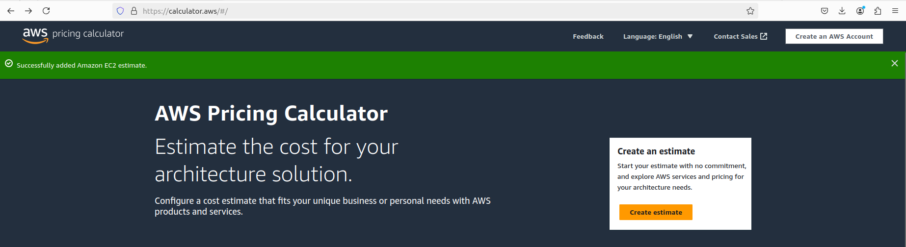
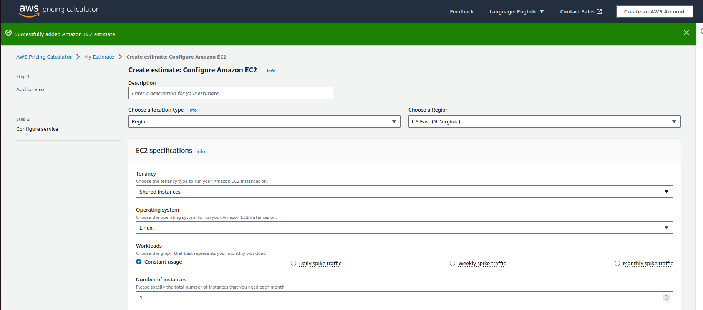
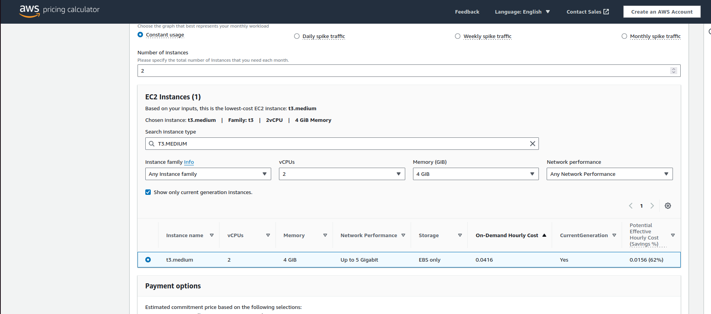
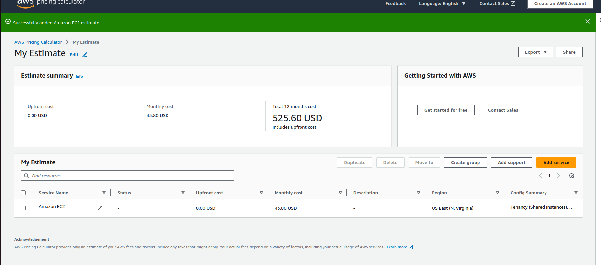
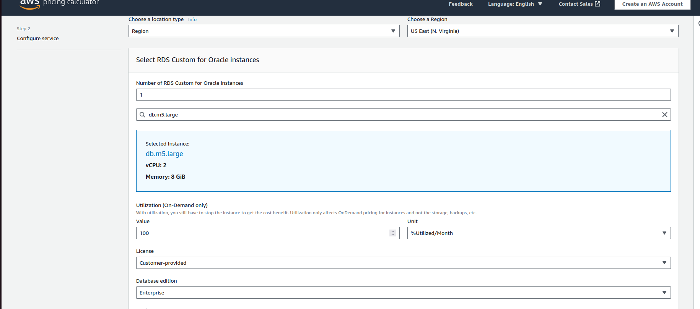
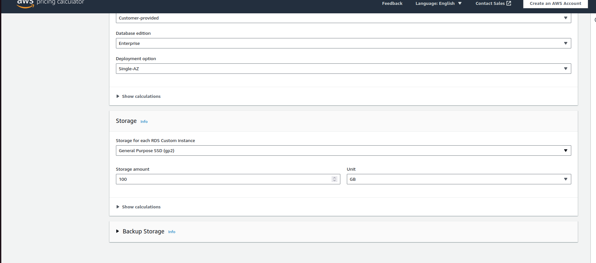
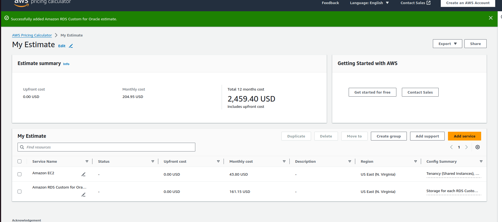

## NAVIGATE TO https://calculator.aws/#/

### 1. Define the Architecture

#### Components Required:
1. **Application Load Balancer (ALB)**: Distributes incoming traffic across multiple EC2 instances to ensure even load distribution and high availability.
2. **EC2 Instances**: Serve as the application servers handling the business logic and user requests.
3. **RDS Instance**: Acts as the database tier to store and manage application data.

#### Expected Traffic:
- **Concurrent Users**: Up to 100,000 users.

#### Choosing Appropriate EC2 and RDS Configurations:

1. **EC2 Instance Types**:
   - For a scalable solution, we'll need to balance between performance and cost. **t3.medium** instances provide a good starting point for a moderate load. For higher concurrency, consider larger instance types or additional instances.
   - **Example Selection**: Start with **t3.medium** instances (2 vCPUs, 4 GiB RAM). 
   

 

2. **RDS Configuration**:
   - **db.m5.large** instance is a good start (2 vCPUs, 8 GiB RAM). Adjust based on database performance requirements.
   - **Storage**: Consider using General Purpose (SSD) for moderate I/O performance and cost-efficiency. 

### 2. Select AWS Services

#### Application Load Balancer (ALB):
- **Cost Considerations**: Based on the number of requests and data processed.

#### EC2 Instances:
- **Type**: **t3.medium**
- **Number**: Start with an estimated number based on load testing. For high availability, consider at least 2 instances.

#### RDS Instance:
- **Type**: **db.m5.large**
- **Storage**: Start with 100 GiB of General Purpose (SSD).

### 3. Estimate Costs Using AWS Pricing Calculator

Navigate to the AWS Pricing Calculator and add the components:

#### Application Load Balancer:
- **Monthly Cost**: Includes the fixed hourly rate and per GB processed.

#### EC2 Instances:
1. **t3.medium**:
   - **On-Demand Pricing**: Check current pricing on the AWS Pricing Calculator.
   - **Example Cost**: As of the latest data, it's approximately $0.0376 per hour.

2. **Number of Instances**: Start with 2 instances.

#### RDS Instance:
1. **db.m5.large**:
   - **On-Demand Pricing**: Check current pricing on the AWS Pricing Calculator.
   - **Example Cost**: As of the latest data, it's approximately $0.096 per hour.

2. **Storage**:
   - **100 GiB General Purpose (SSD)**: Cost based on the per GiB rate.

### 4. Document and Analyze the Estimate

**Estimated Monthly Cost Calculation**:

1. **Application Load Balancer**:
   - **Example**: If ALB costs $0.0225 per hour and 1 TB of data processing costs $0.008 per GB, calculate based on expected traffic.

2. **EC2 Instances**:
   - 2 **t3.medium** instances running 24/7.
   - Monthly cost per instance: $0.0376/hour × 24 hours × 30 days = $27.04.
   - For 2 instances: $27.04 × 2 = $54.08.

3. **RDS Instance**:
   - Instance cost: $0.096/hour × 24 hours × 30 days = $69.12.
   - Storage cost: 100 GiB × $0.10/GiB = $10.00.

**Total Estimated Monthly Cost** (Example):

- **ALB**: $20.00 (approximation based on traffic and data processing)
- **EC2 Instances**: $54.08
- **RDS Instance**: $69.12 (instance) + $10.00 (storage) = $79.12

**Total**: $20.00 (ALB) + $54.08 (EC2) + $79.12 (RDS) = **$153.20**

