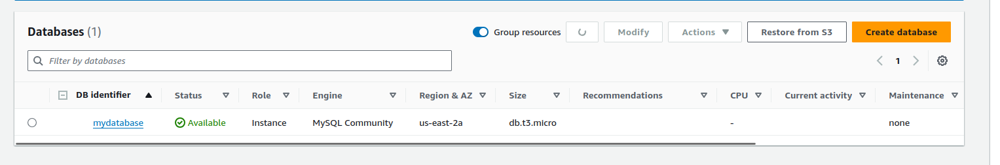

### 1. CloudFormation Template

The CloudFormation template will define the resources needed for your multi-tier application. Below is a sample YAML template that meets all the specified requirements.

```yaml
AWSTemplateFormatVersion: '2010-09-09'
Description: Deploy a multi-tier application with EC2 (Ubuntu), RDS, S3, and VPC without IAM roles in us-east-2

Parameters:
  VpcCIDR:
    Description: CIDR block for the VPC
    Type: String
    Default: "10.0.0.0/16"

  PublicSubnetCIDR1:
    Description: CIDR block for the first public subnet
    Type: String
    Default: "10.0.1.0/24"

  PublicSubnetCIDR2:
    Description: CIDR block for the second public subnet
    Type: String
    Default: "10.0.3.0/24"

  PrivateSubnetCIDR1:
    Description: CIDR block for the first private subnet
    Type: String
    Default: "10.0.2.0/24"

  PrivateSubnetCIDR2:
    Description: CIDR block for the second private subnet
    Type: String
    Default: "10.0.4.0/24"

  InstanceType:
    Description: EC2 instance type
    Type: String
    Default: t2.micro

  DBInstanceType:
    Description: RDS instance type
    Type: String
    Default: db.t3.micro

  AllowedIP:
    Description: IP range allowed for SSH access (CIDR notation)
    Type: String
    Default: "203.0.113.0/24"

  DBUsername:
    Description: The master username for the RDS instance
    Type: String
    NoEcho: true

  DBPassword:
    Description: The master password for the RDS instance
    Type: String
    NoEcho: true

Resources:
  # VPC
  MyVPC:
    Type: AWS::EC2::VPC
    Properties:
      CidrBlock: !Ref VpcCIDR
      Tags:
        - Key: Name
          Value: MyVPC

  # Public Subnet 1
  PublicSubnet1:
    Type: AWS::EC2::Subnet
    Properties:
      VpcId: !Ref MyVPC
      CidrBlock: !Ref PublicSubnetCIDR1
      AvailabilityZone: !Select [0, !GetAZs 'us-east-2']
      MapPublicIpOnLaunch: true
      Tags:
        - Key: Name
          Value: PublicSubnet1

  # Public Subnet 2
  PublicSubnet2:
    Type: AWS::EC2::Subnet
    Properties:
      VpcId: !Ref MyVPC
      CidrBlock: !Ref PublicSubnetCIDR2
      AvailabilityZone: !Select [1, !GetAZs 'us-east-2']
      MapPublicIpOnLaunch: true
      Tags:
        - Key: Name
          Value: PublicSubnet2

  # Private Subnet 1
  PrivateSubnet1:
    Type: AWS::EC2::Subnet
    Properties:
      VpcId: !Ref MyVPC
      CidrBlock: !Ref PrivateSubnetCIDR1
      AvailabilityZone: !Select [0, !GetAZs 'us-east-2']
      Tags:
        - Key: Name
          Value: PrivateSubnet1

  # Private Subnet 2
  PrivateSubnet2:
    Type: AWS::EC2::Subnet
    Properties:
      VpcId: !Ref MyVPC
      CidrBlock: !Ref PrivateSubnetCIDR2
      AvailabilityZone: !Select [1, !GetAZs 'us-east-2']
      Tags:
        - Key: Name
          Value: PrivateSubnet2

  # Internet Gateway
  MyInternetGateway:
    Type: AWS::EC2::InternetGateway
    Properties:
      Tags:
        - Key: Name
          Value: MyInternetGateway

  # Attach Internet Gateway to VPC
  VPCGatewayAttachment:
    Type: AWS::EC2::VPCGatewayAttachment
    Properties:
      VpcId: !Ref MyVPC
      InternetGatewayId: !Ref MyInternetGateway

  # Security Group for EC2
  EC2SecurityGroup:
    Type: AWS::EC2::SecurityGroup
    Properties:
      VpcId: !Ref MyVPC
      GroupDescription: Allow SSH and HTTP access
      SecurityGroupIngress:
        - IpProtocol: tcp
          FromPort: 22
          ToPort: 22
          CidrIp: !Ref AllowedIP
        - IpProtocol: tcp
          FromPort: 80
          ToPort: 80
          CidrIp: 0.0.0.0/0

  # Security Group for RDS
  RDSecurityGroup:
    Type: AWS::EC2::SecurityGroup
    Properties:
      VpcId: !Ref MyVPC
      GroupDescription: Allow MySQL access from EC2 only
      SecurityGroupIngress:
        - IpProtocol: tcp
          FromPort: 3306
          ToPort: 3306
          SourceSecurityGroupId: !Ref EC2SecurityGroup

  # EC2 Instance
  MyEC2Instance:
    Type: AWS::EC2::Instance
    Properties:
      InstanceType: !Ref InstanceType
      ImageId: ami-0c55b159cbfafe1f0  # Replace with the latest Ubuntu AMI ID for us-east-2
      SubnetId: !Ref PublicSubnet1
      SecurityGroupIds:
        - !Ref EC2SecurityGroup
      UserData:
        Fn::Base64: !Sub |
          #!/bin/bash
          apt-get update
          apt-get install -y awscli
          # Example of fetching a file from S3 bucket (replace 'my-application-bucket' with actual bucket name)
          aws s3 cp s3://my-application-bucket/config-file /path/to/config-file

  # S3 Bucket
  MyS3Bucket:
    Type: AWS::S3::Bucket
    Properties:
      BucketName: my-application-bucket-yashm-0101

  # RDS MySQL DB Instance
  MyRDSDBInstance:
    Type: AWS::RDS::DBInstance
    Properties:
      DBInstanceClass: !Ref DBInstanceType
      Engine: MySQL
      EngineVersion: 8.0.35
      MasterUsername: !Ref DBUsername
      MasterUserPassword: !Ref DBPassword
      DBInstanceIdentifier: mydatabase
      AllocatedStorage: 20
      VPCSecurityGroups:
        - !Ref RDSecurityGroup
      DBSubnetGroupName: !Ref DBSubnetGroup

  # RDS DB Subnet Group
  DBSubnetGroup:
    Type: AWS::RDS::DBSubnetGroup
    Properties:
      DBSubnetGroupDescription: Subnet group for RDS
      SubnetIds:
        - !Ref PrivateSubnet1
        - !Ref PrivateSubnet2

Outputs:
  EC2InstancePublicIP:
    Description: Public IP of the EC2 instance
    Value: !GetAtt MyEC2Instance.PublicIp

  S3BucketName:
    Description: Name of the S3 bucket
    Value: !Ref MyS3Bucket

  RDSInstanceEndpoint:
    Description: Endpoint of the RDS instance
    Value: !GetAtt MyRDSDBInstance.Endpoint.Address
```

### 2. Deployment Steps

1. **Create the CloudFormation Stack**:
   - Go to the AWS Management Console.
   - Navigate to CloudFormation.

   
   
   - Create a new stack and upload the template file.

   
   
   

    


   - Provide the necessary parameters (e.g., IP range for SSH access, DB credentials).

2. **Verify the Deployment**:
   - **EC2 Instance**:
     - Connect to the EC2 instance using SSH (from the specified IP range).
     - Verify that it can access the S3 bucket and connect to the RDS instance.

     
   - **S3 Bucket**:
     - Ensure the EC2 instance has access by checking IAM policies.

     
   - **RDS Instance**:
     - Confirm that the EC2 instance can connect to the RDS instance using MySQL client tools.

3. **Testing**:
   - **EC2 to RDS**: Check connectivity by connecting to the RDS instance from the EC2 instance.
   - **EC2 to S3**: Test uploading and downloading files from the S3 bucket using the EC2 instance.

4. **Documentation**:
   - Document the design decisions and the CloudFormation template.
   - Include screenshots of the successful deployment and testing results.

5. **Cleanup**:
   - Delete the CloudFormation stack to ensure all resources are terminated and no charges will continue to accrue.

### 3. Cleanup Confirmation

To confirm cleanup:
- Ensure the CloudFormation stack is deleted.
- Verify that no residual resources (EC2 instances, RDS instances, S3 buckets) are left running in the AWS Console.





