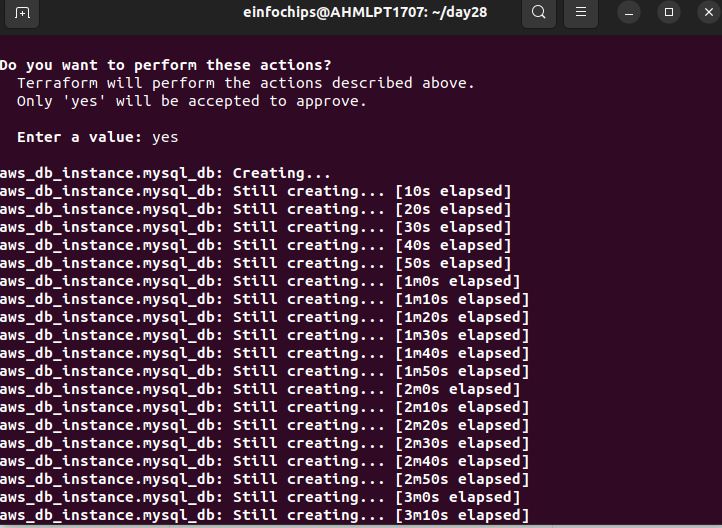
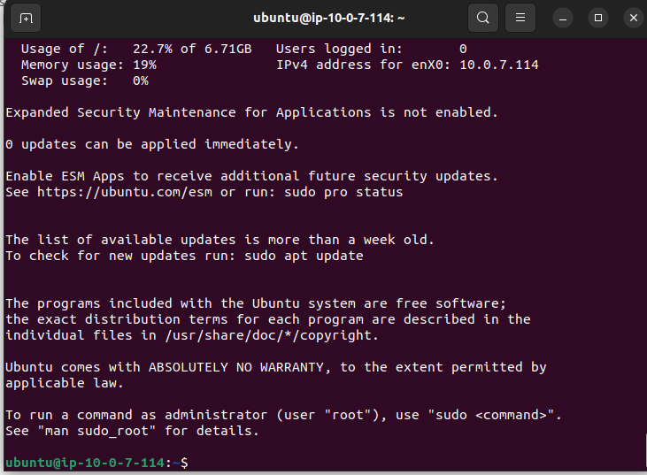
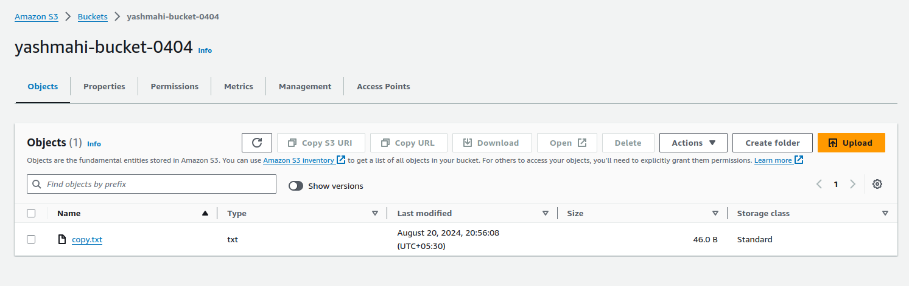

Certainly! Here's a comprehensive guide to deploying a multi-tier architecture application on AWS using Terraform. I’ll walk you through each step, including installation, configuration, and execution.

### 1. Install Terraform

If you don't have Terraform installed, follow these steps:

#### Install Terraform on Ubuntu

1. **Update the package list:**

    ```bash
    sudo apt-get update
    ```

2. **Install the `wget` package (if not already installed):**

    ```bash
    sudo apt-get install -y wget
    ```

3. **Download the latest Terraform binary:**
    # https://developer.hashicorp.com/terraform/install#linux

    ```bash
    wget -O- https://apt.releases.hashicorp.com/gpg | sudo gpg --dearmor -o /usr/share/keyrings/hashicorp-archive-keyring.gpg
    echo "deb [signed-by=/usr/share/keyrings/hashicorp-archive-keyring.gpg] https://apt.releases.hashicorp.com $(lsb_release -cs) main" | sudo tee /etc/apt/sources.list.d/hashicorp.list
    sudo apt update && sudo apt install terraform
    ```

4. **Verify the installation:**

    ```bash
    terraform version
    ```
 


### 2. Configure AWS Credentials

You'll need to set your AWS access key ID and secret access key. Use environment variables for this purpose:

```bash
export AWS_ACCESS_KEY_ID="your_access_key_id"
export AWS_SECRET_ACCESS_KEY="your_secret_access_key"
```

Replace `"your_access_key_id"` and `"your_secret_access_key"` with your actual AWS credentials.


#### 3.1. Create a Directory for Terraform Configuration

```bash
mkdir my-terraform-project
cd my-terraform-project
```

#### 3.2. Create `main.tf`

```hcl
provider "aws" {
  region = var.aws_region
}

# Data source for existing Internet Gateway
data "aws_internet_gateway" "existing" {
  filter {
    name   = "attachment.vpc-id"
    values = [var.existing_vpc_id]
  }
}

# Data source for existing Key Pair
data "aws_key_pair" "existing" {
  key_name = var.key_name
}

# Create Subnets
resource "aws_subnet" "public_1" {
  vpc_id                  = var.existing_vpc_id
  cidr_block              = "10.0.7.0/24"
  availability_zone       = "us-west-2a"
  map_public_ip_on_launch = true
  tags = {
    Name = "YashM-Public-1"
  }
}

resource "aws_subnet" "public_2" {
  vpc_id                  = var.existing_vpc_id
  cidr_block              = "10.0.8.0/24"
  availability_zone       = "us-west-2b"
  map_public_ip_on_launch = true
  tags = {
    Name = "YashM-Public-2"
  }
}

# Create Route Table
resource "aws_route_table" "public" {
  vpc_id = var.existing_vpc_id

  route {
    cidr_block = "0.0.0.0/0"
    gateway_id = data.aws_internet_gateway.existing.id
  }

  tags = {
    Name = "YashM-Public-Route-Table"
  }
}

# Associate Route Tables with Subnets
resource "aws_route_table_association" "public_1" {
  subnet_id      = aws_subnet.public_1.id
  route_table_id = aws_route_table.public.id
}

resource "aws_route_table_association" "public_2" {
  subnet_id      = aws_subnet.public_2.id
  route_table_id = aws_route_table.public.id
}

# Create Security Groups
resource "aws_security_group" "ec2_sg" {
  vpc_id = var.existing_vpc_id

  ingress {
    from_port   = 22
    to_port     = 22
    protocol    = "tcp"
    cidr_blocks = ["0.0.0.0/0"]
  }

  ingress {
    from_port   = 80
    to_port     = 80
    protocol    = "tcp"
    cidr_blocks = ["0.0.0.0/0"]
  }

  egress {
    from_port   = 0
    to_port     = 0
    protocol    = "-1"
    cidr_blocks = ["0.0.0.0/0"]
  }
}

resource "aws_security_group" "rds_sg" {
  vpc_id = var.existing_vpc_id

  ingress {
    from_port   = 3306
    to_port     = 3306
    protocol    = "tcp"
    security_groups = [aws_security_group.ec2_sg.id]
  }

  egress {
    from_port   = 0
    to_port     = 0
    protocol    = "-1"
    cidr_blocks = ["0.0.0.0/0"]
  }
}

# Create EC2 Instance
resource "aws_instance" "app_server" {
  ami           = var.ami_id
  instance_type = var.instance_type
  subnet_id     = aws_subnet.public_1.id
  vpc_security_group_ids = [aws_security_group.ec2_sg.id]
  key_name      = data.aws_key_pair.existing.key_name

  tags = {
    Name = "YashM-Inst-01"
  }
}

# Create RDS Instance
resource "aws_db_instance" "mysql_db" {
  allocated_storage    = 20
  storage_type         = "gp2"
  engine               = "mysql"
  engine_version       = "8.0"
  instance_class       = var.db_instance_class
  db_name              = var.db_name
  username             = var.db_username
  password             = var.db_password
  publicly_accessible  = true
  vpc_security_group_ids = [aws_security_group.rds_sg.id]
  db_subnet_group_name = aws_db_subnet_group.main.name
  tags = {
    Name = "YashM-DB-01"
  }
}

# Create S3 Bucket
resource "aws_s3_bucket" "my_bucket" {
  bucket = var.bucket_name
}


resource "aws_s3_bucket_versioning" "my_bucket_versioning" {
  bucket = aws_s3_bucket.my_bucket.id

  versioning_configuration {
    status = "Enabled"  # Enable versioning
  }
}

# Create DB Subnet Group
resource "aws_db_subnet_group" "main" {
  name       = "main"
  subnet_ids = [aws_subnet.public_1.id, aws_subnet.public_2.id]
  tags = {
    Name = "YashM-DB-Subnet-Group"
  }
}

output "ec2_public_ip" {
  value = aws_instance.app_server.public_ip
}

output "rds_endpoint" {
  value = aws_db_instance.mysql_db.endpoint
}

output "s3_bucket_name" {
  value = aws_s3_bucket.my_bucket.bucket
}


```

#### 3.3. Create `variables.tf`

```hcl
variable "existing_vpc_id" {
  description = "The ID of the existing VPC"
  type        = string
  default     = "vpc-028be68f6a49a5a7c"
}

variable "existing_igw_id" {
  description = "The ID of the existing Internet Gateway"
  type        = string
  default     = "igw-09e8ebb5b3a4e49c9"
}

variable "key_name" {
  description = "The name of the existing SSH key pair"
  type        = string
  default     = "yashm-28"  # Replace with your default key pair name
}

variable "aws_region" {
  description = "AWS region for deployment"
  default     = "us-west-2"
}

variable "ami_id" {
  description = "AMI ID for the EC2 instance"
  default     = "ami-0aff18ec83b712f05"  # Replace with Ubuntu AMI for your region specified
}

variable "instance_type" {
  description = "Instance type for the EC2 instance"
  default     = "t2.micro"
}

variable "db_instance_class" {
  description = "Instance class for the RDS MySQL database"
  default     = "db.t3.micro"
}

variable "db_name" {
  description = "Name of the MySQL database"
  default     = "yashm04"
}

variable "db_username" {
  description = "Username for the MySQL database"
  default     = "root"
}

variable "db_password" {
  description = "Password for the MySQL database"
  default     = "password"  # Choose a strong password
}

variable "bucket_name" {
  description = "Name of the S3 bucket"
  default     = "yashmahi-bucket-0404"
}

```


### 4. Deploy Infrastructure

#### 4.1. Initialize Terraform

```bash
terraform init
```


#### 4.2. Review the Plan

```bash
terraform plan
```


#### 4.3. Apply the Configuration

```bash
terraform apply
```
You will be prompted to confirm. Type `yes` and press Enter.





EC2 Instance:


S3 bucket:


Public Subnet 1:


Public Subnet 2:


RDS:

### 5. Manage Changes

#### 5.1. Modify Configuration

For example, to update an EC2 instance tag, modify `main.tf`:

```hcl
resource "aws_instance" "app_server" {
  # ... existing configuration
  tags = {
    Name = "AppServer-Updated"
  }
}
```

#### 5.2. Review the Change Set

```bash
terraform plan
```

#### 5.3. Apply the Change Set

```bash
terraform apply
```

### 6. Testing and Validation

- **Access EC2 Instance:**

    ```bash
    ssh -i "your-key.pem" ec2-user@<EC2_PUBLIC_IP>
    ```


- **Connect to RDS from EC2 Instance:**

    
    ```bash
    mysql -h <RDS_ENDPOINT> -u admin -p
    ```
   ```
    sudo apt-get update
    sudo apt install mysql-client-core-8.0
   ```


- **Verify S3 Bucket Access:**

    From the EC2 instance, you can use the AWS CLI to interact with the S3 bucket if installed.
To interact with an S3 bucket from an EC2 instance using the AWS CLI, follow these steps:

### 1. **Install AWS CLI**

If the AWS CLI isn't already installed on your EC2 instance, you can install it with the following commands:


**On Ubuntu or Debian:**
```bash
sudo apt-get update
sudo apt-get install awscli -y
```

### 2. **Configure AWS CLI**

**Manually configure AWS CLI:**
```bash
aws configure
```
You will be prompted to enter:

- **AWS Access Key ID**
- **AWS Secret Access Key**
- **Default region name** (e.g., `us-west-2`)
- **Default output format** (e.g., `json`)

### 3. **Interact with S3**

Here are some common AWS CLI commands to interact with your S3 bucket:

**List buckets:**
```bash
aws s3 ls
```

**List objects in a specific bucket:**
```bash
aws s3 ls s3://your-bucket-name
```


**Upload a file to S3:**
```bash
aws s3 cp local-file.txt s3://your-bucket-name/
```




### 7. Terminate Resources

To tear down all the resources:

```bash
terraform destroy
```

Confirm with `yes` when prompted.

This setup directly includes all necessary values within the `variables.tf` file, making it straightforward to configure and deploy your infrastructure.