## **Terraform Infrastructure Setup with AWS**


### **Directory Structure**

```
terraform/
│
├── main.tf
├── variables.tf
└── modules/
    └── app/
        ├── main.tf
        ├── variables.tf
        └── outputs.tf
```

### **1. Root Configuration**

#### **`main.tf`**

This file sets up the Terraform provider and calls the `app` module.

```hcl
terraform {
  backend "s3" {
    bucket         = "yashm-application-bucket"   # Replace with your S3 bucket name
    key            = "terraform/state.tfstate"         # Path within the bucket
    region         = "us-west-2"                       # AWS region
    dynamodb_table = "yashm-terraform-lock-table"      # DynamoDB table for locking
  }
}

provider "aws" {
  region = "us-west-2"  # Replace with your AWS region
}

module "yashm_app" {
  source                = "./modules/app"
  region                = "us-west-2"  # Replace with your AWS region
  instance_type         = "t2.micro"
  bucket_name           = "yashm-application-bucket"  # Replace with a unique bucket name
  dynamodb_table_name   = "yashm-terraform-lock-table"  # Replace with a unique table name
  vpc_id                = "vpc-0bdf66d2ee59d250a"
  availability_zone     = "us-west-2a"
  ami_id                = "ami-0aff18ec83b712f05"  # Replace with the AMI ID for your region
}

output "instance_public_ip" {
  value = module.yashm_app.instance_public_ip
}

output "bucket_name" {
  value = module.yashm_app.bucket_name
}

output "dynamodb_table_name" {
  value = module.yashm_app.dynamodb_table_name
}

```

#### **`variables.tf`**

Define input variables for the root module.

```hcl
# variables.tf

variable "instance_type" {
  description = "Type of the EC2 instance"
  type        = string
  default     = "t2.micro"
}

variable "bucket_name" {
  description = "Name of the S3 bucket"
  type        = string
  default     = "yashm-bucket-29"
}

variable "region" {
  description = "AWS region"
  type        = string
  default     = "us-west-2"
}

```


### **2. Module Configuration**

#### **`modules/app/main.tf`**

This file defines the resources within the `app` module.

```hcl
provider "aws" {
  region = var.region
}

# Security Group
resource "aws_security_group" "yashm_sg" {
  name        = "yashm-app-sg"
  description = "Allow SSH and other necessary ports"
  vpc_id      = var.vpc_id  # Use the existing VPC ID

  ingress {
    from_port   = 22
    to_port     = 22
    protocol    = "tcp"
    cidr_blocks = ["0.0.0.0/0"]
  }

  tags = {
    Name = "yashm-app-sg"
  }
}

# Subnet
resource "aws_subnet" "yashm_subnet" {
  vpc_id            = var.vpc_id
  cidr_block        = "10.0.1.0/24"
  availability_zone = var.availability_zone  # Specify an availability zone within your region

  tags = {
    Name = "yashm-subnet"
  }
}

# EC2 Instance
resource "aws_instance" "yashm_app_instance" {
  ami           = var.ami_id
  instance_type = var.instance_type
  vpc_security_group_ids = [aws_security_group.yashm_sg.id]
  subnet_id     = aws_subnet.yashm_subnet.id
  tags = {
    Name = "yashm-app-instance"
  }
}

# S3 Bucket
resource "aws_s3_bucket" "yashm_app_bucket" {
  bucket = var.bucket_name
  acl    = "private"

  tags = {
    Name = "yashm-app-bucket"
  }
}

# DynamoDB Table for state locking
resource "aws_dynamodb_table" "yashm_terraform_lock" {
  name           = var.dynamodb_table_name
  read_capacity   = 1
  write_capacity  = 1
  hash_key        = "LockID"

  attribute {
    name = "LockID"
    type = "S"
  }

  tags = {
    Name = "yashm-terraform-lock-table"
  }
}
```

#### **`modules/app/variables.tf`**

Define input variables for the `app` module.

```hcl
variable "region" {
  description = "The AWS region to deploy resources in"
  type        = string
}

variable "instance_type" {
  description = "The type of the EC2 instance"
  type        = string
  default     = "t2.micro"
}

variable "bucket_name" {
  description = "The name of the S3 bucket"
  type        = string
}

variable "dynamodb_table_name" {
  description = "The name of the DynamoDB table for state locking"
  type        = string
}

variable "vpc_id" {
  description = "The VPC ID to launch the EC2 instance into"
  type        = string
}

variable "availability_zone" {
  description = "The availability zone for the subnet"
  type        = string
}

variable "ami_id" {
  description = "The AMI ID to use for the EC2 instance"
  type        = string
}
```

#### **`modules/app/outputs.tf`**

Define output variables for the `app` module.

```hcl
output "instance_public_ip" {
  description = "The public IP address of the EC2 instance"
  value       = aws_instance.yashm_app_instance.public_ip
}

output "bucket_name" {
  description = "The name of the S3 bucket"
  value       = aws_s3_bucket.yashm_app_bucket.bucket
}

output "dynamodb_table_name" {
  description = "The name of the DynamoDB table"
  value       = aws_dynamodb_table.yashm_terraform_lock.name
}
```

### **3. Commands to Run**

1. **Initialize Terraform:**

   Initialize the Terraform configuration.

   ```bash
   terraform init
   ```

2. **Plan the Configuration:**

   Review the changes Terraform will make.

   ```bash
   terraform plan
   ```

3. **Apply the Configuration:**

   Apply the configuration to create the resources.

   ```bash
   terraform apply
   ```
   Confirm the apply operation when prompted using `yes`.
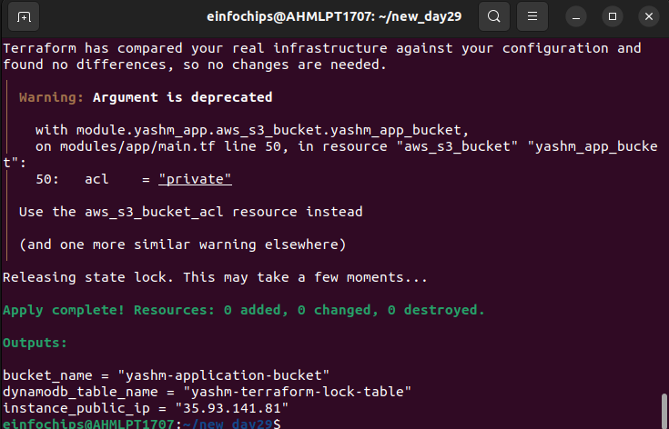

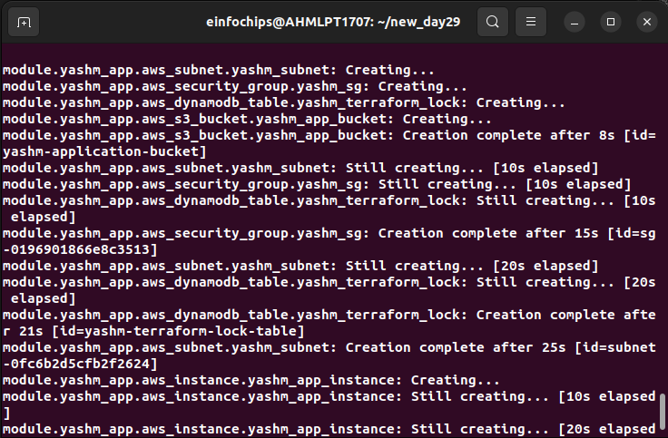

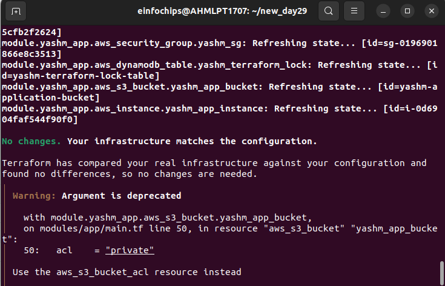

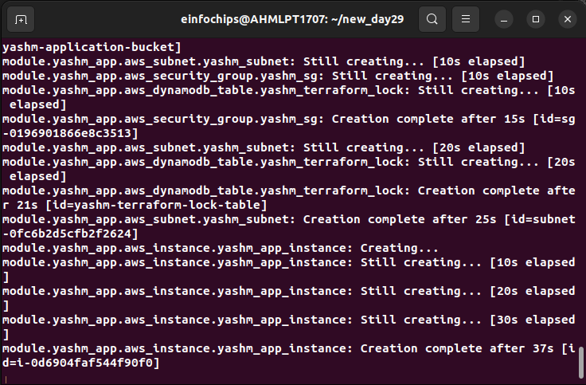

EC2:

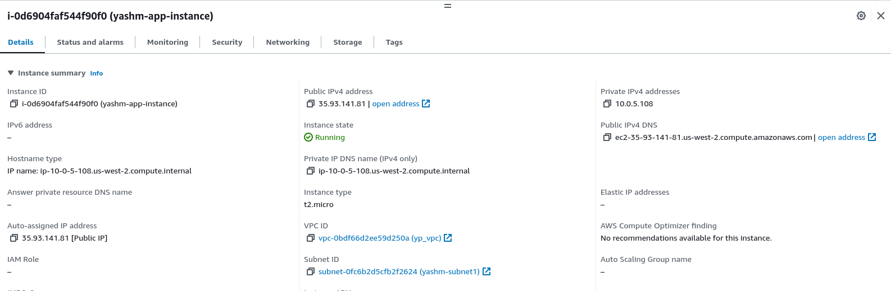

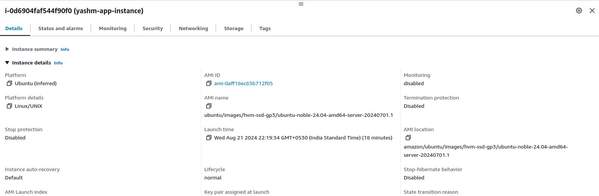

S3:
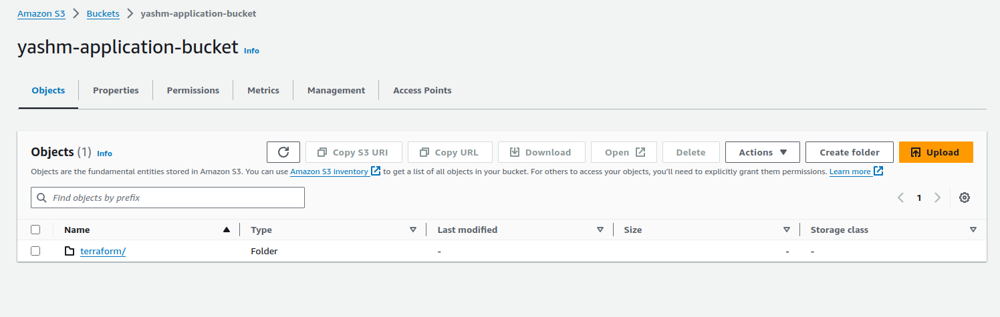

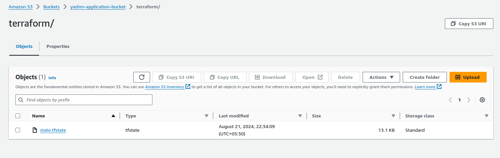

DynamoDB:

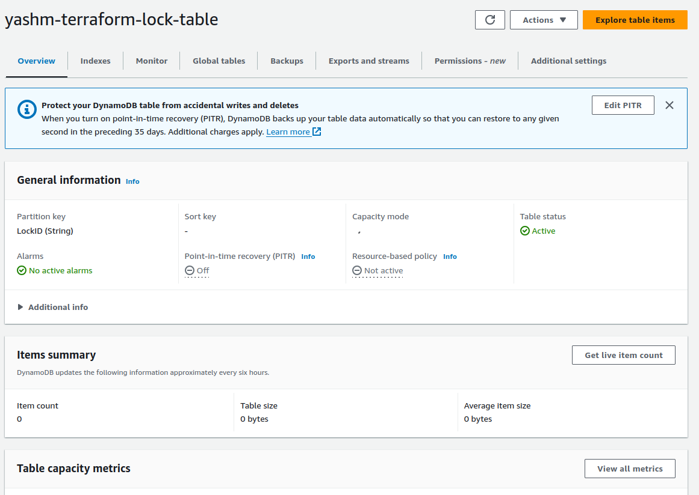

When applied using `terraform apply` at same time from other terminal.

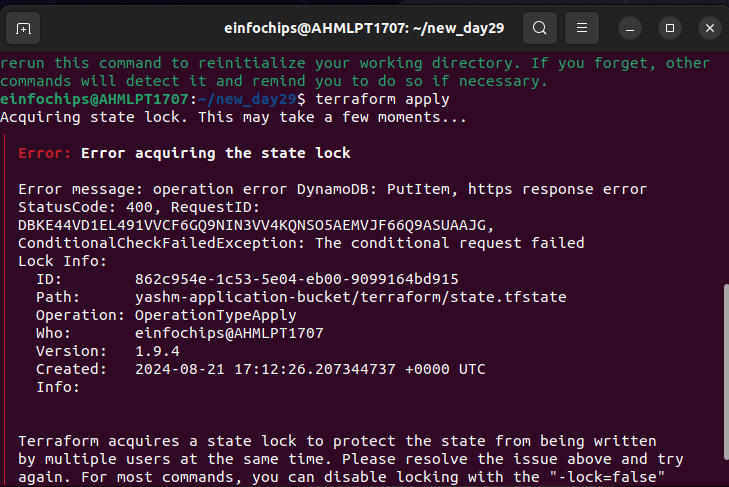

4. **Reinitialize Backend (if needed):**

   Reinitialize the backend if the state configuration or backend settings are changed.

   ```bash
   terraform init -migrate-state
   ```

5. **Deleting the resources:**

```hcl
 terraform destroy
```

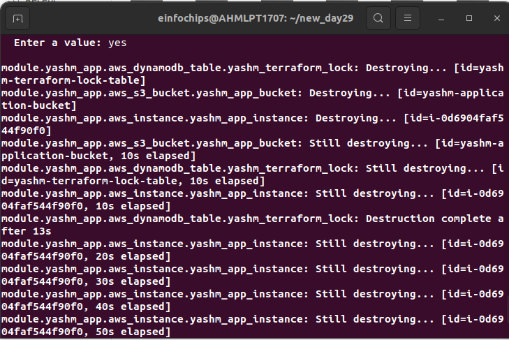

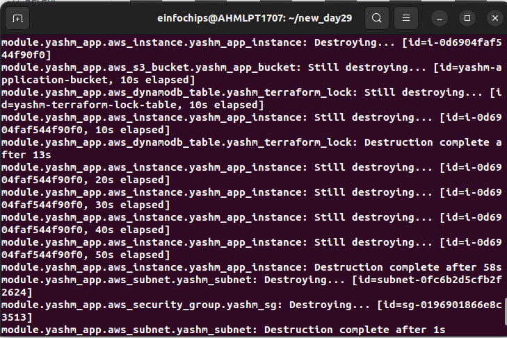

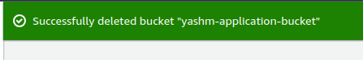