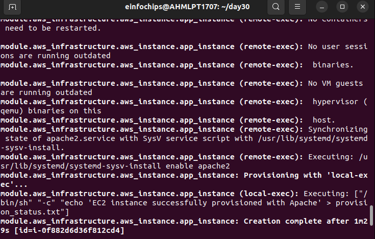

## "Advanced Terraform with Provisioners, Modules, and Workspaces" 

### **1. Project Structure**

Your project directory should look like this:

```
/terraform-advanced-project
  ├── main.tf
  ├── variables.tf
  ├── outputs.tf
  ├── terraform.tfvars
  ├── modules
  │   └── aws_infrastructure
  │       ├── main.tf
  │       ├── variables.tf
  │       └── outputs.tf
  ├── provisioners
  │   ├── install_apache.sh
  └── README.md
```

### **2. Module Development**

Create a reusable module for deploying the EC2 instance and S3 bucket.

#### **Module: `modules/aws_infrastructure/main.tf`**

```hcl
resource "aws_vpc" "yashm_vpc" {
  cidr_block = "10.0.0.0/16"
  tags = {
    Name = "yashm-vpc"
  }
}

resource "aws_internet_gateway" "yashm_igw" {
  vpc_id = aws_vpc.yashm_vpc.id

  tags = {
    Name = "yashm-igw"
  }
}

resource "aws_route_table" "yashm_route_table" {
  vpc_id = aws_vpc.yashm_vpc.id

  route {
    cidr_block = "0.0.0.0/0"
    gateway_id = aws_internet_gateway.yashm_igw.id
  }

  tags = {
    Name = "yashm-route-table"
  }
}

resource "aws_route_table_association" "yashm_route_table_association" {
  subnet_id      = aws_subnet.yashm_subnet.id
  route_table_id = aws_route_table.yashm_route_table.id
}

resource "aws_subnet" "yashm_subnet" {
  cidr_block = "10.0.1.0/24"
  vpc_id     = aws_vpc.yashm_vpc.id
  availability_zone = "us-west-2a"
  map_public_ip_on_launch = true  # Ensure this is set to true
  tags = {
    Name = "yashm-subnet"
  }
}

resource "aws_security_group" "yashm_sg" {
  name        = "yashm-sg"
  description = "Security group for yashm instance"
  vpc_id      = aws_vpc.yashm_vpc.id

  ingress {
    from_port   = 22
    to_port     = 22
    protocol    = "tcp"
    cidr_blocks = ["0.0.0.0/0"]  # Allows SSH from anywhere
  }


  ingress {
    from_port   = 80
    to_port     = 80
    protocol    = "tcp"
    cidr_blocks = ["0.0.0.0/0"]
  }

  egress {
    from_port   = 0
    to_port     = 0
    protocol    = "-1"
    cidr_blocks = ["0.0.0.0/0"]
  }
}

resource "aws_instance" "app_instance" {
  ami           = var.ami_id
  instance_type = var.instance_type
  key_name      = var.key_pair_name
  vpc_security_group_ids = [aws_security_group.yashm_sg.id]
  subnet_id     = aws_subnet.yashm_subnet.id
  associate_public_ip_address = true  # Ensure this is set to true
  connection {
      type        = "ssh"
      user        = "ubuntu"
      private_key = file("~/.ssh/example.pem")
      host        = self.public_ip
    }
  tags = {
    Name = "${var.name}-instance"
  }

  provisioner "remote-exec" {
    inline = [
      "sudo apt update -y",
      "sudo apt install -y apache2",
      "sudo systemctl start apache2",
      "sudo systemctl enable apache2"
    ]

  }

  provisioner "local-exec" {
    command = "echo 'EC2 instance successfully provisioned with Apache' > provision_status.txt"
  }
}

resource "aws_s3_bucket" "app_bucket" {
  bucket = var.bucket_name

  tags = {
    Name = "${var.name}-bucket"
  }
}

output "instance_public_ip" {
  value = aws_instance.app_instance.public_ip
}

output "bucket_arn" {
  value = aws_s3_bucket.app_bucket.arn
}

```

#### **Module: `modules/aws_infrastructure/variables.tf`**

```hcl
# modules/aws_infrastructure/variables.tf

variable "instance_type" {
  description = "EC2 instance type"
  type        = string
  default     = "t2.micro"
}

variable "ami_id" {
  description = "AMI ID for EC2"
  type        = string
}

variable "key_pair_name" {
  description = "Key pair name for SSH"
  type        = string
  default     = "example.pem"
}

variable "bucket_name" {
  description = "S3 bucket name"
  type        = string
  default     = "yashm-bucket"
}

variable "private_key" {
  description = "Path to SSH private key"
  type        = string
  default     = "./example"
}

variable "name" {
  description = "Name prefix for resources"
  type        = string
  default     = "yashm"
}
```


### **3. Main Terraform Configuration**

#### **Root: `main.tf`**

```hcl
terraform {
  backend "s3" {
    bucket         = "yashm-bucket-name"           # Your S3 bucket for state
    key            = "terraform/state"             # Path within the bucket
    region         = "us-west-2"                    # AWS region
    dynamodb_table = "yashm-terraform-lock"         # DynamoDB table for state locking
  }
}

provider "aws" {
  region = "us-west-2"  # Replace with your preferred region
}

module "aws_infrastructure" {
  source           = "./modules/aws_infrastructure"
  instance_type    = var.instance_type
  ami_id            = var.ami_id
  key_pair_name     = "example"
  bucket_name       = var.bucket_name
  private_key  = "${path.root}/example"  # Path to your private key file
  name              = var.name
}

output "instance_public_ip" {
  value = module.aws_infrastructure.instance_public_ip
}

output "bucket_arn" {
  value = module.aws_infrastructure.bucket_arn
}

```

#### **Root: `variables.tf`**

```hcl
variable "instance_type" {
  description = "EC2 instance type"
  type        = string
  default     = "t2.micro"
}

variable "ami_id" {
  description = "AMI ID for EC2"
  type        = string
}

variable "key_pair_name" {
  description = "Key pair name for SSH"
  type        = string
  default     = "example.pem"

}

variable "bucket_name" {
  description = "S3 bucket name"
  type        = string
  default     = "yashm-bucket"
}

variable "private_key" {
  description = "Path to SSH private key"
  type        = string
  default     = "./example"
}

variable "name" {
  description = "Name prefix for resources"
  type        = string
}

```

#### **Root: `terraform.tfvars`**

```hcl
instance_type    = "t2.micro"
ami_id            = "ami-0aff18ec83b712f05"  # Replace with your AMI ID
key_pair_name     = "example"    # Replace with your key pair name
bucket_name       = "yashm-bucket-name"  # Replace with a unique bucket name
private_key_path  = "./example"  # Replace with the path to your private key
name              = "yashm"

```

###  **Root: `dynamodb.tf`
```hcl
#provider "aws" {
#  region = "us-west-2"  # Replace with your preferred region
#}       #uncomment this block if any error is thrown.
resource "aws_dynamodb_table" "yashm_state_lock" {
  name           = "yashm-terraform-lock"
  hash_key       = "LockID"
  billing_mode   = "PAY_PER_REQUEST"
  attribute {
    name = "LockID"
    type = "S"
  }
  tags = {
    Name = "yashm-terraform-lock"
  }
}
```
### **4. Provisioners (not mandatory as we have defined providers in main.tf)** 

Create a script for the `remote-exec` provisioner.

#### **Provisioner Script: `provisioners/install_apache.sh`**

```bash
#!/bin/bash
sudo apt update -y
sudo apt install -y httpd
sudo systemctl start httpd
sudo systemctl enable httpd
```

### **5. Terraform Workspaces**


Step 1: Set Up AWS CLI Profiles
First, configure your AWS CLI with different profiles for each environment. Each profile should have access to a different AWS account or environment.
```

aws configure --profile staging
```


```
aws configure --profile dev
```


Manage separate environments using workspaces.

1. **Create Workspaces**

   ```bash

   terraform workspace new prod
   terraform workspace new dev
   ```

  
  

  

2. **Switch Workspaces**
   As the last created workspace was `staging` so now we will be in the staging workspace.
   
   Apply the configuration on `staging`:

   ```bash
   terraform init
   ```

   


   ```bash
   terraform apply
   ```

  

    If you face the below error 

    
    
    Execute this command to solve the above error
    ```
    cp example.pem ~/.ssh/
    ```
    **(For generation of .pem file refer to the end of the document)**


   
    
    EC2:
   
    
    Successfull ssh through local machine 
    
    ```
    ssh -i /path/to/file.pem ubuntu@<public_ip>
    ```

    

   VPC:
    
   
   Subnet and internet-gateway for the above VPC:
    
   
   S3:

   

   ### Since S3 bucket cannot be created again with the same name we may need to comment out the code in main.tf in modules and in root directory as well as necessary OR can change the name of the S3 BUCKET after changing the environment.
 
   
   Switch to `dev` workspace and apply the configuration:

   ```bash
   terraform workspace select dev
   terraform apply
   ```
   

   

   
   
### **6. Validation and Testing**

1. **Verify Apache Installation**

   After deployment, access the public IP of the EC2 instance in a web browser to check if Apache is running.
   
   

2. **Review Provisioner Logs**

   Check the `provision_status.txt` file on your local machine to confirm that the local-exec provisioner ran successfully.
  
  
### **7. Cleanup**

1. **Destroy Resources**

   ```bash
   terraform workspace select prod
   terraform destroy

   terraform workspace select staging
   terraform destroy
   ```

2. **Remove Workspaces**

   ```bash
   terraform workspace delete dev
   terraform workspace delete prod
   ```


## To generate .pem file for instance 
  
```
provider "aws" {
  region  = "us-west-2"
}


resource "tls_private_key" "example" {
  algorithm = "RSA"
  rsa_bits  = 2048
}

resource "aws_key_pair" "example" {
  key_name   = "example"
  public_key = tls_private_key.example.public_key_openssh
}

output "private_key_pem" {
  value       = tls_private_key.example.private_key_pem
  description = "Private key in PEM format"
  sensitive = true

}

```

Then execute this command in the terminal

```
terraform output private_key_pem > example.pem

```