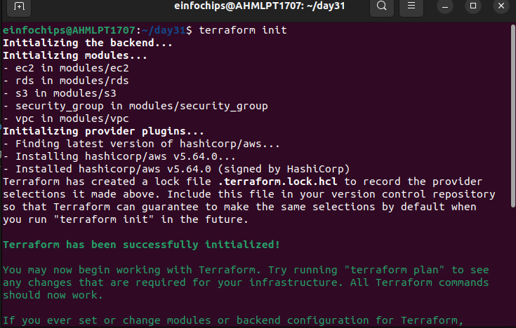
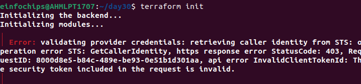
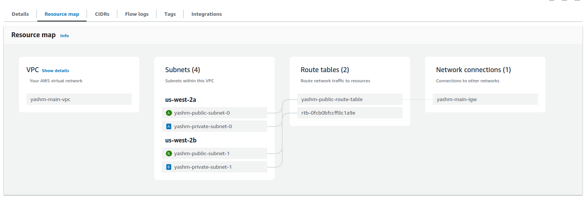

### Project Structure

- `main.tf`
- `variables.tf`
- `terraform.tfvars`
- `dev.tfvars`
- `prod.tfvars`
- `modules/`
  - `vpc/`
    - `main.tf`
    - `variables.tf`
    - `outputs.tf`
  - `ec2/`
    - `main.tf`
    - `variables.tf`
    - `outputs.tf`
  - `rds/`
    - `main.tf`
    - `variables.tf`
    - `outputs.tf`
  - `s3/`
    - `main.tf`
    - `variables.tf`
    - `outputs.tf`
  - `iam/`
    - `main.tf`
    - `variables.tf`
    - `outputs.tf`
  - `security_group/`
    - `main.tf`
    - `variables.tf`
    - `outputs.tf`

### Root Configuration Files

**`main.tf`**

```hcl
provider "aws" {
  region = "us-west-2"
  profile = var.aws_profile
}

terraform {
  backend "s3" {
    bucket         = "yashm-bucket"
    key            = "terraform/state.tfstate"
    region         = "us-west-2"
    dynamodb_table = "yashm_terraform_lock-table"
    #profile        = "prod"
    encrypt        = true
  }
}

module "vpc" {
  source = "./modules/vpc"
  cidr_block = var.vpc_cidr
  public_subnet_cidrs = var.public_subnet_cidrs
  private_subnet_cidrs = var.private_subnet_cidrs
  availability_zones = var.availability_zones
}

module "ec2" {
  source = "./modules/ec2"
  ami_id = var.ami_id
  instance_type = var.instance_type
  instance_count = 2
  public_subnet_ids = module.vpc.public_subnet_ids
  key_name = "example"
  security_group_id = module.security_group.sg_id
}

module "rds" {
  source = "./modules/rds"
  db_username = var.db_username
  db_password = var.db_password
  private_subnet_ids = module.vpc.private_subnet_ids
  vpc_id = module.vpc.vpc_id
}

#module "s3" {
#  source = "./modules/s3"
#  bucket_prefix = var.s3_bucket_prefix
#}

module "security_group" {
  source = "./modules/security_group"
  vpc_id = module.vpc.vpc_id
}


#resource "aws_dynamodb_table" "yashm_terraform_lock" {
#  name           = "yashm_terraform_lock-table"
#  read_capacity   = 5
#  write_capacity  = 5
#  hash_key        = "LockID"
#
#  attribute {
#    name = "LockID"
#    type = "S"
#  }

#  tags = {
#    Name = "yashm-terraform-lock-table"
#  }
#}
```

**`variables.tf`**

```hcl
variable "vpc_cidr" {
  description = "CIDR block for the VPC"
  default     = "10.0.0.0/16"
}

variable "public_subnet_cidrs" {
  description = "CIDR blocks for public subnets"
  default     = ["10.0.1.0/24", "10.0.2.0/24"]
}

variable "private_subnet_cidrs" {
  description = "CIDR blocks for private subnets"
  default     = ["10.0.3.0/24", "10.0.4.0/24"]
}

variable "availability_zones" {
  description = "List of availability zones"
  default     = ["us-west-2a", "us-west-2b"]
}

variable "instance_type" {
  description = "EC2 instance type"
  default     = "t2.micro"
}

variable "ami_id" {
  description = "AMI ID for EC2 instances"
  default     = "ami-0aff18ec83b712f05"
}

variable "db_username" {
  description = "Database username"
}

variable "db_password" {
  description = "Database password"
  sensitive   = true
}

variable "s3_bucket_prefix" {
  description = "Prefix for the S3 bucket name"
}

variable "aws_profile" {
  type        = string
  description = "The AWS CLI profile to use for this workspace"
}
```

**`terraform.tfvars`**

```hcl
vpc_cidr          = "10.0.0.0/16"
public_subnet_cidrs = ["10.0.1.0/24", "10.0.2.0/24"]
private_subnet_cidrs = ["10.0.3.0/24", "10.0.4.0/24"]
availability_zones = ["us-west-2a", "us-west-2b"]
instance_type     = "t2.micro"
ami_id            = "ami-0aff18ec83b712f05"
db_username       = "admin"
db_password       = "password"
s3_bucket_prefix  = "yashm-terraform-bucket"
```

**`dev.tfvars`**

```hcl
vpc_cidr          = "10.0.0.0/16"
public_subnet_cidrs = ["10.0.1.0/24", "10.0.2.0/24"]
private_subnet_cidrs = ["10.0.3.0/24", "10.0.4.0/24"]
availability_zones = ["us-west-2a", "us-west-2b"]
instance_type     = "t2.micro"
ami_id            = "ami-0aff18ec83b712f05"
db_username       = "devuser"
db_password       = "devpassword"
s3_bucket_prefix  = "yashm-dev-bucket"
```

**`prod.tfvars`**

```hcl
vpc_cidr          = "10.1.0.0/16"
public_subnet_cidrs = ["10.1.1.0/24", "10.1.2.0/24"]
private_subnet_cidrs = ["10.1.3.0/24", "10.1.4.0/24"]
availability_zones = ["us-west-2a", "us-west-2b"]
instance_type     = "t3.micro"
ami_id            = "ami-0aff18ec83b712f05"
db_username       = "produser"
db_password       = "prodpassword"
s3_bucket_prefix  = "yashm-prod-bucket"
```

### VPC Module

**`modules/vpc/main.tf`**

```hcl
resource "aws_vpc" "yashm_vpc" {
  cidr_block = var.cidr_block
  enable_dns_support = true
  enable_dns_hostnames = true
  tags = {
    Name = "yashm-main-vpc"
  }
}

resource "aws_subnet" "yashm_public" {
  count = length(var.public_subnet_cidrs)
  vpc_id = aws_vpc.yashm_vpc.id
  cidr_block = element(var.public_subnet_cidrs, count.index)
  availability_zone = element(var.availability_zones, count.index)
  map_public_ip_on_launch = true
  tags = {
    Name = "yashm-public-subnet-${count.index}"
  }
}

resource "aws_subnet" "yashm_private" {
  count = length(var.private_subnet_cidrs)
  vpc_id = aws_vpc.yashm_vpc.id
  cidr_block = element(var.private_subnet_cidrs, count.index)
  availability_zone = element(var.availability_zones, count.index)
  tags = {
    Name = "yashm-private-subnet-${count.index}"
  }
}

resource "aws_internet_gateway" "yashm_igw" {
  vpc_id = aws_vpc.yashm_vpc.id
  tags = {
    Name = "yashm-main-igw"
  }
}

resource "aws_route_table" "yashm_public" {
  vpc_id = aws_vpc.yashm_vpc.id
  route {
    cidr_block = "0.0.0.0/0"
    gateway_id = aws_internet_gateway.yashm_igw.id
  }
  tags = {
    Name = "yashm-public-route-table"
  }
}

resource "aws_route_table_association" "yashm_public" {
  count = length(aws_subnet.yashm_public)
  subnet_id = element(aws_subnet.yashm_public.*.id, count.index)
  route_table_id = aws_route_table.yashm_public.id
}
```

**`modules/vpc/variables.tf`**

```hcl
variable "cidr_block" {
  description = "The CIDR block for the VPC"
  type        = string
}

variable "public_subnet_cidrs" {
  description = "List of CIDR blocks for public subnets"
  type        = list(string)
}

variable "private_subnet_cidrs" {
  description

 = "List of CIDR blocks for private subnets"
  type        = list(string)
}

variable "availability_zones" {
  description = "List of availability zones"
  type        = list(string)
}
```

**`modules/vpc/outputs.tf`**

```hcl
output "vpc_id" {
  value = aws_vpc.yashm_vpc.id
}

output "public_subnet_ids" {
  value = aws_subnet.yashm_public[*].id
}

output "private_subnet_ids" {
  value = aws_subnet.yashm_private[*].id
}
```

### Security Group Module

**`modules/security_group/main.tf`**

```hcl
resource "aws_security_group" "yashm_sg" {
  vpc_id = var.vpc_id

  egress {
    from_port   = 0
    to_port     = 0
    protocol    = "-1"
    cidr_blocks = ["0.0.0.0/0"]
  }

  ingress {
    from_port   = 22
    to_port     = 22
    protocol    = "tcp"
    cidr_blocks = ["0.0.0.0/0"]
  }

  tags = {
    Name = "yashm-sg"
  }
}
```

**`modules/security_group/variables.tf`**

```hcl
variable "vpc_id" {
  description = "VPC ID where the security group will be created"
  type        = string
}
```

**`modules/security_group/outputs.tf`**

```hcl
output "sg_id" {
  value = aws_security_group.yashm_sg.id
}
```

### EC2 Module

**`modules/ec2/main.tf`**

```hcl
resource "aws_instance" "yashm_app" {
  count                    = var.instance_count
  ami                      = var.ami_id
  instance_type            = var.instance_type
  subnet_id                = element(var.public_subnet_ids, count.index)
  key_name                 = var.key_name
  associate_public_ip_address = true
  security_groups          = [var.security_group_id]

  tags = {
    Name = "yashm-app-instance-${count.index}"
  }
}
```

**`modules/ec2/variables.tf`**

```hcl
variable "ami_id" {
  description = "AMI ID for EC2 instances"
  type        = string
}

variable "instance_type" {
  description = "EC2 instance type"
  type        = string
}

variable "instance_count" {
  description = "Number of EC2 instances"
  type        = number
}

variable "public_subnet_ids" {
  description = "List of public subnet IDs"
  type        = list(string)
}

variable "key_name" {
  description = "Name of the SSH key pair"
  type        = string
}

variable "security_group_id" {
  description = "Security Group ID for EC2 instances"
  type        = string
}
```

**`modules/ec2/outputs.tf`**

```hcl
output "instance_ids" {
  value = aws_instance.yashm_app[*].id
}
```

### RDS Module

**`modules/rds/main.tf`**

```hcl
resource "aws_db_instance" "yashm_db" {
  allocated_storage    = 20
  storage_type         = "gp2"
  engine               = "mysql"
  engine_version       = "8.0"
  instance_class       = "db.t2.micro"
  name                 = "yashmdb"
  username             = var.db_username
  password             = var.db_password
  vpc_security_group_ids = [aws_security_group.yashm_db_sg.id]
  db_subnet_group_name = aws_db_subnet_group.yashm_db_subnet_group.name
  skip_final_snapshot  = true

  tags = {
    Name = "yashm-db-instance"
  }
}

resource "aws_db_subnet_group" "yashm_db_subnet_group" {
  name       = "yashm-db-subnet-group"
  subnet_ids = var.private_subnet_ids
  tags = {
    Name = "yashm-db-subnet-group"
  }
}

resource "aws_security_group" "yashm_db_sg" {
  vpc_id = var.vpc_id

  egress {
    from_port   = 0
    to_port     = 0
    protocol    = "-1"
    cidr_blocks = ["0.0.0.0/0"]
  }

  ingress {
    from_port   = 3306
    to_port     = 3306
    protocol    = "tcp"
    cidr_blocks = ["10.0.0.0/16"]
  }

  tags = {
    Name = "yashm-db-sg"
  }
}
```

**`modules/rds/variables.tf`**

```hcl
variable "db_username" {
  description = "Database username"
  type        = string
}

variable "db_password" {
  description = "Database password"
  type        = string
}

variable "private_subnet_ids" {
  description = "List of private subnet IDs"
  type        = list(string)
}

variable "vpc_id" {
  description = "ID of the VPC"
  type        = string
}
```

**`modules/rds/outputs.tf`**

```hcl
output "db_instance_endpoint" {
  value = aws_db_instance.yashm_db.endpoint
}
```

### S3 Module

**`modules/s3/main.tf`**

```hcl
resource "aws_s3_bucket" "yashm_bucket" {
  bucket_prefix = var.bucket_prefix
  versioning {
    enabled = true
  }

  tags = {
    Name = "yashm-s3-bucket"
  }
}
```

**`modules/s3/variables.tf`**

```hcl
variable "bucket_prefix" {
  description = "Prefix for the S3 bucket name"
  type        = string
}
```

**`modules/s3/outputs.tf`**

```hcl
output "bucket_name" {
  value = aws_s3_bucket.yashm_bucket.bucket
}
```

### IAM Module

**`modules/iam/main.tf`**

```hcl
resource "aws_iam_role" "yashm_ec2_role" {
  name = "yashm-ec2-role"

  assume_role_policy = jsonencode({
    Version = "2012-10-17"
    Statement = [
      {
        Action    = "sts:AssumeRole"
        Effect    = "Allow"
        Principal = {
          Service = "ec2.amazonaws.com"
        }
      }
    ]
  })

  tags = {
    Name = "yashm-ec2-role"
  }
}

resource "aws_iam_role_policy_attachment" "yashm_ec2_policy_attachment" {
  role       = aws_iam_role.yashm_ec2_role.name
  policy_arn  = "arn:aws:iam::aws:policy/AmazonEC2ReadOnlyAccess"
}
```

**`modules/iam/variables.tf`**

```hcl
# No variables needed for this simple IAM setup
```

**`modules/iam/outputs.tf`**

```hcl
output "iam_role_arn" {
  value = aws_iam_role.yashm_ec2_role.arn
}
```
### For creation of S3 bucket and DynamoDB is used different folder with the following code

main.tf

```hcl
provider "aws" {
  region = "us-west-2"
  
}

resource "aws_s3_bucket" "yashm_bucket" {
  bucket ="yashm-bucket"
  versioning {
    enabled = true
  }

  tags = {
    Name = "yashm-s3-bucket"

  }
}

resource "aws_dynamodb_table" "yashm_terraform_lock" {
  name           = "yashm_terraform_lock-table"
  read_capacity   = 5
  write_capacity  = 5
  hash_key        = "LockID"

  attribute {
    name = "LockID"
    type = "S"
  }

  tags = {
    Name = "yashm-terraform-lock-table"
  }
}
```
### Execution Steps

1. **Initialize Terraform and Set Up Remote State:**

   ```bash
   terraform init
   ```
  
2. **Create and Configure the DynamoDB Table and S3 Bucket for Remote State:**

   Create these resources manually or with a Terraform configuration if necessary. For example, use the AWS Console or AWS CLI to create the DynamoDB table (`yashm-terraform-locks`) and S3 bucket (`yashm-terraform-state-bucket`).

3. **Create Terraform Workspaces:**

   ```bash
   terraform workspace new dev
   terraform workspace new prod
   ```
   

4. **Apply Configuration for Development Environment:**

   ```bash
   terraform workspace select dev
   terraform apply -var-file=dev.tfvars -var="aws_profile=dev"
   ``` 

   

   


   If facing the issue of invalidclienttoken issue after once the `terraform apply -var="aws_profile=<profile_name>` has been done then to get the credentials again use the below command.
   
   Error:
    
   
   Solution:

   ```
   export AWS_PROFILE=<profile_name>
   ```

5. **Apply Configuration for Production Environment:**

   ```bash
   terraform workspace select prod
   terraform apply -var-file=prod.tfvars -var="aws_profile=prod"
   ```
  
  
  
  
  
  
  
    
EC2:
    

     

     


VPC:




RDS:


S3:
     
    


DynamoDB table:


Resources :


### Implement Lifecycle Rules

   Add lifecycle rules to your resources. For example, add prevent_destroy to the RDS module:

    modules/rds/main.tf
```
hcl

resource "aws_db_instance" "default" {
  identifier              = "mydbinstance"
  instance_class          = "db.t2.micro"
  engine                  = "mysql"
  engine_version          = "5.7"
  allocated_storage       = 20
  name                    = "mydb"
  username                = var.db_username
  password                = var.db_password
  parameter_group_name    = "default.mysql5.7"
  skip_final_snapshot     = false

  lifecycle {
    prevent_destroy = true
  }
}
```

### Cleanup

    Destroy the infrastructure:

   ```bash
    terraform destroy -var-file=dev.tfvars
    terraform destroy -var-file=prod.tfvars
   ```

Verify that protected resources (e.g., RDS) are not deleted.


6. **Verify the Deployment:**

   - Check the EC2 instances.
   - Connect via SSH using the private key: `ssh -i ~/.ssh/example.pem ec2-user@<instance-public-ip>`.
   - Verify other resources as needed.

7. **Destroy the Infrastructure (when done):**
    
   ```bash
   terraform workspace select dev
   terraform destroy -var-file=dev.tfvars
   

   terraform workspace select prod
   terraform destroy -var-file=prod.tfvars
   ```


