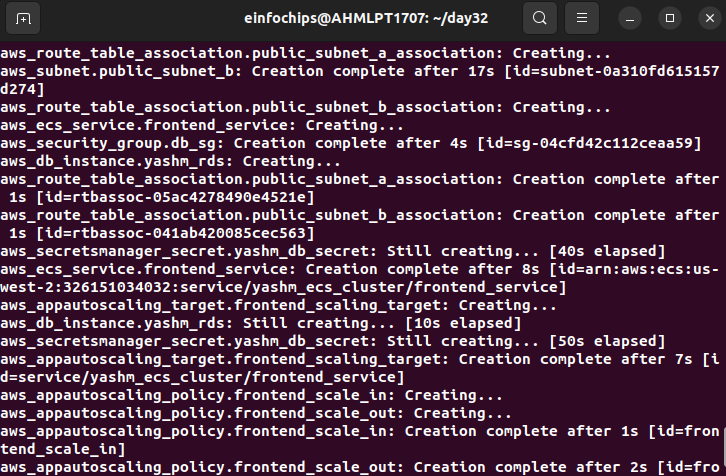

### 1. Setup Terraform Configuration

#### 1.1. Providers and Variables

Create a file `main.tf` to define the AWS provider and necessary variables.

```hcl
provider "aws" {
  region = "us-west-2"
}

variable "ami_id" {
  default = "ami-0aff18ec83b712f05"
}

variable "db_password" {
  type      = string
  sensitive = true
}
```

#### 1.2. VPC Networking

Create a file `vpc.tf` to set up the VPC, subnets.

```hcl
# VPC
resource "aws_vpc" "yashm_vpc" {
  cidr_block = "10.0.0.0/16"
  enable_dns_support = true
  enable_dns_hostnames = true
  tags = {
    Name = "yashm_vpc"
  }
}

# Public Subnets
resource "aws_subnet" "public_subnet_a" {
  vpc_id     = aws_vpc.yashm_vpc.id
  cidr_block = "10.0.1.0/24"
  availability_zone = "us-west-2a"
  map_public_ip_on_launch = true
  tags = {
    Name = "yashm_public_subnet_a"
  }
}

resource "aws_subnet" "public_subnet_b" {
  vpc_id     = aws_vpc.yashm_vpc.id
  cidr_block = "10.0.3.0/24"
  availability_zone = "us-west-2b"
  map_public_ip_on_launch = true
  tags = {
    Name = "yashm_public_subnet_b"
  }
}

# Private Subnets
resource "aws_subnet" "private_subnet_a" {
  vpc_id     = aws_vpc.yashm_vpc.id
  cidr_block = "10.0.2.0/24"
  availability_zone = "us-west-2a"
  tags = {
    Name = "yashm_private_subnet_a"
  }
}

resource "aws_subnet" "private_subnet_b" {
  vpc_id     = aws_vpc.yashm_vpc.id
  cidr_block = "10.0.4.0/24"
  availability_zone = "us-west-2b"
  tags = {
    Name = "yashm_private_subnet_b"
  }
}

# Internet Gateway
resource "aws_internet_gateway" "yashm_igw" {
  vpc_id = aws_vpc.yashm_vpc.id
  tags = {
    Name = "yashm_igw"
  }
}

# Route Table for Public Subnets
resource "aws_route_table" "public_rt" {
  vpc_id = aws_vpc.yashm_vpc.id

  route {
    cidr_block = "0.0.0.0/0"
    gateway_id = aws_internet_gateway.yashm_igw.id
  }

  tags = {
    Name = "public_rt"
  }
}

# Elastic IP for NAT Gateway
resource "aws_eip" "nat_eip" {
  tags = {
    Name = "nat-eip"
  }
}

# NAT Gateway
resource "aws_nat_gateway" "nat_gateway" {
  allocation_id = aws_eip.nat_eip.id
  subnet_id     = aws_subnet.public_subnet_a.id # NAT Gateway should be in a public subnet

  tags = {
    Name = "nat-gateway"
  }
}

# Route Table for Private Subnets
resource "aws_route_table" "private_rt" {
  vpc_id = aws_vpc.yashm_vpc.id

  route {
    cidr_block = "0.0.0.0/0"
    nat_gateway_id = aws_nat_gateway.nat_gateway.id
  }

  tags = {
    Name = "private_rt"
  }
}

# Associate Public Subnets with Route Table
resource "aws_route_table_association" "public_subnet_a_association" {
  subnet_id      = aws_subnet.public_subnet_a.id
  route_table_id = aws_route_table.public_rt.id
}

resource "aws_route_table_association" "public_subnet_b_association" {
  subnet_id      = aws_subnet.public_subnet_b.id
  route_table_id = aws_route_table.public_rt.id
}

# Associate Private Subnets with Route Table
resource "aws_route_table_association" "private_subnet_a_association" {
  subnet_id      = aws_subnet.private_subnet_a.id
  route_table_id = aws_route_table.private_rt.id
}

resource "aws_route_table_association" "private_subnet_b_association" {
  subnet_id      = aws_subnet.private_subnet_b.id
  route_table_id = aws_route_table.private_rt.id
}
```

### Security Groups 

`security_groups.tf`

```hcl
# Security Group for Frontend Service
resource "aws_security_group" "frontend_sg" {
  vpc_id = aws_vpc.yashm_vpc.id

  ingress {
    from_port   = 80
    to_port     = 80
    protocol    = "tcp"
    cidr_blocks = ["0.0.0.0/0"]
  }

  egress {
    from_port   = 0
    to_port     = 0
    protocol    = "-1"
    cidr_blocks = ["0.0.0.0/0"]
  }

  tags = {
    Name = "frontend_sg"
  }
}

# Security Group for Backend Service
resource "aws_security_group" "backend_sg" {
  vpc_id = aws_vpc.yashm_vpc.id

  ingress {
    from_port   = 5000
    to_port     = 5000
    protocol    = "tcp"
    security_groups = [aws_security_group.frontend_sg.id]
  }

  egress {
    from_port   = 0
    to_port     = 0
    protocol    = "-1"
    cidr_blocks = ["0.0.0.0/0"]
  }

  tags = {
    Name = "backend_sg"
  }
}

# Security Group for RDS
resource "aws_security_group" "db_sg" {
  vpc_id = aws_vpc.yashm_vpc.id

  ingress {
    from_port   = 3306
    to_port     = 3306
    protocol    = "tcp"
    security_groups = [aws_security_group.backend_sg.id]
  }

  egress {
    from_port   = 0
    to_port     = 0
    protocol    = "-1"
    cidr_blocks = ["0.0.0.0/0"]
  }

  tags = {
    Name = "db_sg"
  }
}
```

#### 1.3. RDS Instance

Create a file `rds.tf` to configure the RDS instance.

```hcl
resource "aws_db_subnet_group" "yashm_db_subnet_group" {
  name       = "yashm-db-subnet-group"
  subnet_ids = [aws_subnet.private_subnet_a.id, aws_subnet.private_subnet_b.id]
  tags = {
    Name = "yashm-db-subnet-group"
  }
}

resource "aws_db_instance" "yashm_rds" {
  identifier           = "yashm-rds"
  engine               = "mysql"
  instance_class       = "db.t3.micro"
  allocated_storage    = 20
  username             = "admin"
  password             = var.db_password
  db_subnet_group_name = aws_db_subnet_group.yashm_db_subnet_group.name
  vpc_security_group_ids = [aws_security_group.db_sg.id]
  skip_final_snapshot  = true

  tags = {
    Name = "yashm-rds"
  }
}

```

#### 1.4. ECS Cluster and Services

Create a file `ecs.tf` to set up the ECS Cluster, Task Definitions, and Services.

```hcl
resource "aws_ecs_cluster" "yashm_ecs_cluster" {
  name = "yashm_ecs_cluster"
}

resource "aws_ecs_task_definition" "frontend_task" {
  family                   = "frontend"
  network_mode             = "awsvpc"
  requires_compatibilities = ["FARGATE"]
  cpu                      = "256"
  memory                   = "512"

  container_definitions = jsonencode([{
    name      = "frontend"
    image     = "nginx:latest"
    cpu       = 256
    memory    = 512
    essential = true
    portMappings = [
      {
        containerPort = 80
        hostPort      = 80
      }
    ]
  }])
}

resource "aws_ecs_task_definition" "backend_task" {
  family                   = "backend"
  network_mode             = "awsvpc"
  requires_compatibilities = ["FARGATE"]
  cpu                      = "256"
  memory                   = "512"
  execution_role_arn       = aws_iam_role.ecs_task_execution_role.arn

  container_definitions = jsonencode([{
    name      = "backend"
    image     = "python:3.9-slim"
    cpu       = 256
    memory    = 512
    essential = true
    portMappings = [
      {
        containerPort = 5000
        hostPort      = 5000
      }
    ]
    environment = [
      {
        name  = "DATABASE_URL"
        value = "jdbc:mysql://${aws_db_instance.yashm_rds.endpoint}:${aws_db_instance.yashm_rds.port}/mydb"
      }
    ]
    secrets = [
      {
        name      = "DB_PASSWORD"
        valueFrom = aws_secretsmanager_secret.yashm_db_secret.arn
      }
    ]
  }])
}

resource "aws_ecs_service" "frontend_service" {
  name            = "frontend_service"
  cluster         = aws_ecs_cluster.yashm_ecs_cluster.id
  task_definition = aws_ecs_task_definition.frontend_task.arn
  desired_count   = 1
  launch_type     = "FARGATE"

  network_configuration {
    subnets          = [aws_subnet.public_subnet_a.id, aws_subnet.public_subnet_b.id]
    security_groups  = [aws_security_group.frontend_sg.id]
    assign_public_ip = true
  }
}

resource "aws_ecs_service" "backend_service" {
  name            = "backend_service"
  cluster         = aws_ecs_cluster.yashm_ecs_cluster.id
  task_definition = aws_ecs_task_definition.backend_task.arn
  desired_count   = 1
  launch_type     = "FARGATE"

  network_configuration {
    subnets          = [aws_subnet.private_subnet_a.id, aws_subnet.private_subnet_b.id]
    security_groups  = [aws_security_group.backend_sg.id]
    assign_public_ip = false
  }
}

```

#### 1.5. Secrets Management

Create a file `secrets.tf` to manage secrets.

```hcl
resource "aws_secretsmanager_secret" "yashm_db_secret" {
  name = "yashm_db_secret3"
}

resource "aws_secretsmanager_secret_version" "yashm_db_secret_version" {
  secret_id     = aws_secretsmanager_secret.yashm_db_secret.id
  secret_string = jsonencode({
    password = var.db_password
  })
}
```

#### 1.6. Auto-Scaling Policies

Create a file `autoscaling.tf` for auto-scaling policies.

```hcl
resource "aws_appautoscaling_target" "frontend_scaling_target" {
  max_capacity       = 2
  min_capacity       = 1
  resource_id        = "service/${aws_ecs_cluster.yashm_ecs_cluster.name}/${aws_ecs_service.frontend_service.name}"
  scalable_dimension = "ecs:service:DesiredCount"
  service_namespace  = "ecs"
}

resource "aws_appautoscaling_policy" "frontend_scale_out" {
  name               = "frontend_scale_out"
  policy_type        = "StepScaling"
  resource_id        = aws_appautoscaling_target.frontend_scaling_target.resource_id
  scalable_dimension = aws_appautoscaling_target.frontend_scaling_target.scalable_dimension
  service_namespace  = aws_appautoscaling_target.frontend_scaling_target.service_namespace

  step_scaling_policy_configuration {
    adjustment_type         = "ChangeInCapacity"
    cooldown                = 300
    metric_aggregation_type = "Maximum"

    step_adjustment {
      metric_interval_lower_bound = 0
      scaling_adjustment          = 1
    }
  }
}

resource "aws_appautoscaling_policy" "frontend_scale_in" {
  name               = "frontend_scale_in"
  policy_type        = "StepScaling"
  resource_id        = aws_appautoscaling_target.frontend_scaling_target.resource_id
  scalable_dimension = aws_appautoscaling_target.frontend_scaling_target.scalable_dimension
  service_namespace  = aws_appautoscaling_target.frontend_scaling_target.service_namespace

  step_scaling_policy_configuration {
    adjustment_type         = "ChangeInCapacity"
    cooldown                = 300
    metric_aggregation_type = "Maximum"

    step_adjustment {
      metric_interval_upper_bound = 0
      scaling_adjustment          = -1
    }
  }
}

```

`iam.tf`

```hcl
# IAM Role for ECS Task Execution
resource "aws_iam_role" "ecs_task_execution_role" {
  name = "ecsTaskExecutionRole"

  assume_role_policy = jsonencode({
    Version = "2012-10-17",
    Statement = [
      {
        Action    = "sts:AssumeRole",
        Effect    = "Allow",
        Principal = {
          Service = "ecs-tasks.amazonaws.com"
        }
      }
    ]
  })

  tags = {
    Name = "ecsTaskExecutionRole"
  }
}

# Attach the Amazon ECS Task Execution IAM Policy to the Role
resource "aws_iam_role_policy_attachment" "ecs_task_execution_policy" {
  role      = aws_iam_role.ecs_task_execution_role.name
  policy_arn = "arn:aws:iam::aws:policy/service-role/AmazonECSTaskExecutionRolePolicy"
}

# Additional Policy for Secrets Manager Access
resource "aws_iam_role_policy" "ecs_task_execution_secrets_policy" {
  name   = "ecsTaskExecutionSecretsPolicy"
  role   = aws_iam_role.ecs_task_execution_role.id
  policy = jsonencode({
    Version = "2012-10-17",
    Statement = [
      {
        Effect   = "Allow",
        Action   = [
          "secretsmanager:GetSecretValue"
        ],
        Resource = "arn:aws:secretsmanager:us-west-2:326151034032:secret:yashm_db_secret3-*"
      }
    ]
  })
}

# IAM Role for ECS Tasks (Optional, if tasks need additional permissions)
resource "aws_iam_role" "ecs_task_role" {
  name = "ecsTaskRole"

  assume_role_policy = jsonencode({
    Version = "2012-10-17",
    Statement = [
      {
        Action    = "sts:AssumeRole",
        Effect    = "Allow",
        Principal = {
          Service = "ecs-tasks.amazonaws.com"
        }
      }
    ]
  })

  tags = {
    Name = "ecsTaskRole"
  }
}

# Policy for ECS Tasks to Access RDS (Example)
resource "aws_iam_role_policy" "ecs_task_rds_policy" {
  name   = "ecsTaskRdsPolicy"
  role   = aws_iam_role.ecs_task_role.id
  policy = jsonencode({
    Version = "2012-10-17",
    Statement = [
      {
        Effect   = "Allow",
        Action   = [
          "rds:DescribeDBInstances",
          "rds:Connect"
        ],
        Resource = "*"
      }
    ]
  })
}
```

`outputs.tf`

output "vpc_id" {
  value = aws_vpc.yashm_vpc.id
}

output "public_subnet_ids" {
  value = [aws_subnet.public_subnet_a.id, aws_subnet.public_subnet_b.id]
}

output "private_subnet_ids" {
  value = [aws_subnet.private_subnet_a.id, aws_subnet.private_subnet_b.id]
}

output "rds_endpoint" {
  value = aws_db_instance.yashm_rds.endpoint
}

output "ecs_cluster_name" {
  value = aws_ecs_cluster.yashm_ecs_cluster.name
}


### 2. Deployment and Validation

1. **Initialize Terraform**

    ```bash
    terraform init
    ```

    

2. **Validate Configuration**

    ```bash
    terraform validate
    ```

    

3. **Apply Configuration**

    ```bash
    terraform apply
    ```

    

    

    

    

    
     
    

4. **Monitor and Validate**

    - Check the ECS services and tasks.
    - Validate the connectivity and functionality of the web application.


    Secrets:

    

    VPC with Route Table and Internet Gateway and Public&Private Subnets.

    

    Added NAT gateway to VPC:

    

    

    RDS:

    

    ECS:

    

    Frontend Security Group:

    

    Backend Security Group:

    

    Elastic IP:

    

    Frontend:

    

    

    Backend:

    

    

    
5. **Cleanup**

    ```bash
    terraform destroy
    ```
   
