### 1. **Launch AWS Instances**

#### **1.1. Create AWS EC2 Instances**

1. **Log in to AWS Management Console**: Go to [AWS Management Console](https://aws.amazon.com/console/).

2. **Navigate to EC2 Dashboard**: Select **EC2** from the services menu.

3. **Launch Instances**:
   - **Click** on **Launch Instance**.
   - **Choose an AMI**: Select an appropriate Ubuntu Server AMI (e.g., Ubuntu 22.04 LTS).
   - **Choose an Instance Type**: For testing, `t2.micro` or `t3.micro` are good options. For production, choose a type based on your requirements.
   - **Configure Instance**: Set the number of instances, network, and subnet as needed. Ensure you have at least one public IP for access.
   - **Add Storage**: Use default storage or adjust according to your needs.
   - **Add Tags**: Optionally, tag your instances (e.g., `Name=master-node` for the control plane and `Name=worker-node` for the worker).
   - **Configure Security Group**: Create a new security group or select an existing one. Open the necessary ports:
     - **SSH (22)**: For accessing the instances.
     - **Kubernetes (6443)**: For control plane communication.
     - **Calico/Pod Networking Ports**: Check Calico documentation if additional ports are needed.
   - **Review and Launch**: Review your settings and launch the instances. Select or create a key pair to SSH into the instances.


   Control Nde:

   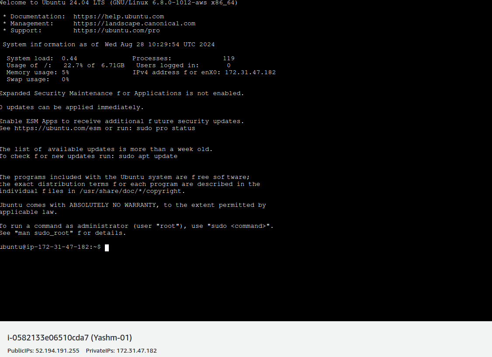

   Worker Node:

   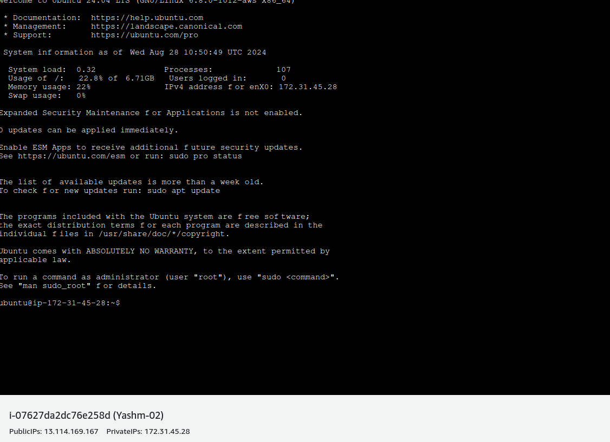

4. **Access Your Instances**: Once instances are running, connect to them using SSH:
   ```bash
   ssh -i /path/to/your-key.pem ubuntu@<public-ip-of-instance>
   ```

### 2. **Set Up the Kubernetes Cluster**

#### **2.1. Prepare the Control Plane Node**

## FOR ALL NODES
#### Step-1: disable swap
```bash
sudo swapoff -a
sudo sed -i '/swap/s/^/#/' /etc/fstab
```

#### Step-2: Create the .conf file to load the modules at bootup
```bash
cat <<EOF | sudo tee /etc/modules-load.d/k8s.conf
overlay
br_netfilter
EOF
```
```bash
sudo modprobe overlay
sudo modprobe br_netfilter
```

#### Step-3: sysctl params required by setup, params persist across reboots
```bash
cat <<EOF | sudo tee /etc/sysctl.d/k8s.conf
net.bridge.bridge-nf-call-iptables  = 1
net.bridge.bridge-nf-call-ip6tables = 1
net.ipv4.ip_forward                 = 1
EOF
```

#### Step-4: Apply sysctl params without reboot
```bash
sudo sysctl --system
```

#### Step-5: Update the package repository 
```bash
sudo apt-get update
```
#### Step-6: Install Containerd
```bash
sudo apt update -y ; sudo apt-get install containerd -y
sudo mkdir -p /etc/containerd
containerd config default | sudo tee /etc/containerd/config.toml 
sudo sed -i "s/SystemdCgroup = false/SystemdCgroup = true/g" /etc/containerd/config.toml 
sudo systemctl restart containerd
```

#### Step-7 Update the apt package index and install packages needed to use the Kubernetes apt repository:
```bash
sudo apt-get update
```
#### Step-8: apt-transport-https may be a dummy package; if so, you can skip that package
```bash
sudo apt-get install -y apt-transport-https ca-certificates curl gpg
```
#### Step-9: Download the public signing key for the Kubernetes package repositories. The same signing key is used for all repositories so you can disregard the version in the URL:
If the directory `/etc/apt/keyrings` does not exist, it should be created before the curl command, read the note below.
```bash
sudo mkdir -p -m 755 /etc/apt/keyrings
```
```bash
curl -fsSL https://pkgs.k8s.io/core:/stable:/v1.30/deb/Release.key | sudo gpg --dearmor -o /etc/apt/keyrings/kubernetes-apt-keyring.gpg
```
#### Step-10: This overwrites any existing configuration in /etc/apt/sources.list.d/kubernetes.list
```bash
echo 'deb [signed-by=/etc/apt/keyrings/kubernetes-apt-keyring.gpg] https://pkgs.k8s.io/core:/stable:/v1.30/deb/ /' | sudo tee /etc/apt/sources.list.d/kubernetes.list
```
#### Step-11: Update the apt package index, install kubelet, kubeadm and kubectl, and pin their version:
```bash
sudo apt-get update
sudo apt-get install -y kubelet kubeadm kubectl
sudo apt-mark hold kubelet kubeadm kubectl
```

#### (Optional) Enable the kubelet service before running kubeadm:
```bash
sudo systemctl enable --now kubelet
```

## ONLY FOR MASTER NODE

#### Initiate the Cluster
```bash
kubeadm init --pod-network-cidr 192.168.0.0/16
```


#### Your Kubernetes control-plane has initialized successfully!

#### To start using your cluster, you need to run the following as a regular user:
```bash
mkdir -p $HOME/.kube
sudo cp -i /etc/kubernetes/admin.conf $HOME/.kube/config
sudo chown $(id -u):$(id -g) $HOME/.kube/config
```

### Install the Calico Network Add-On
On the Control Plane Node, Install Calico Networking:
```bash
kubectl apply -f https://raw.githubusercontent.com/projectcalico/calico/v3.25.0/manifests/calico.yaml
```

#### (Optional) On the Control Plane Node, Create the Token and Copy the Join Command:
```bash
kubeadm token create --print-join-command
```

***NOTE:***

*If you are using Cloud setup, please configure inbound rules*

*Following are the port range for each Kubernetes components*

  

   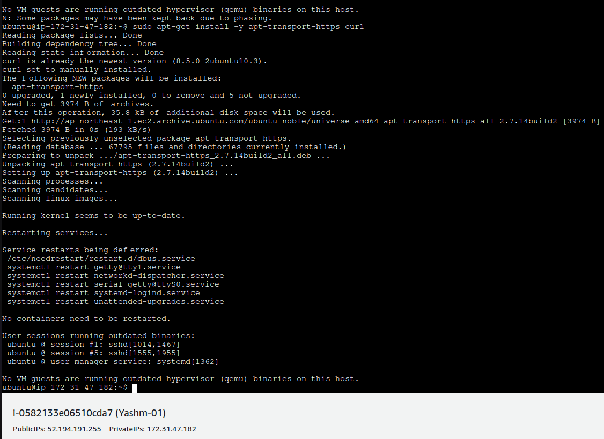


   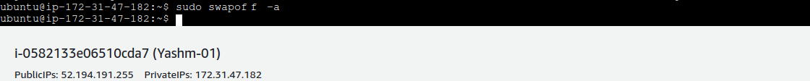

  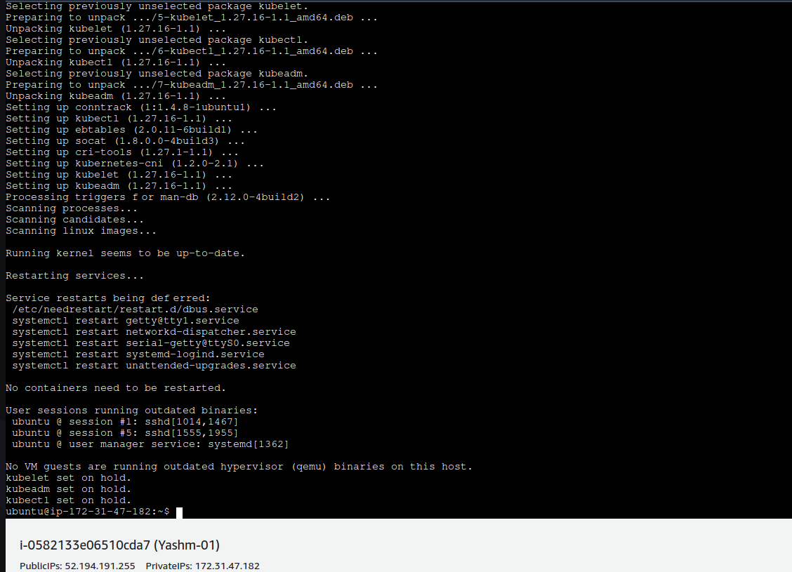


   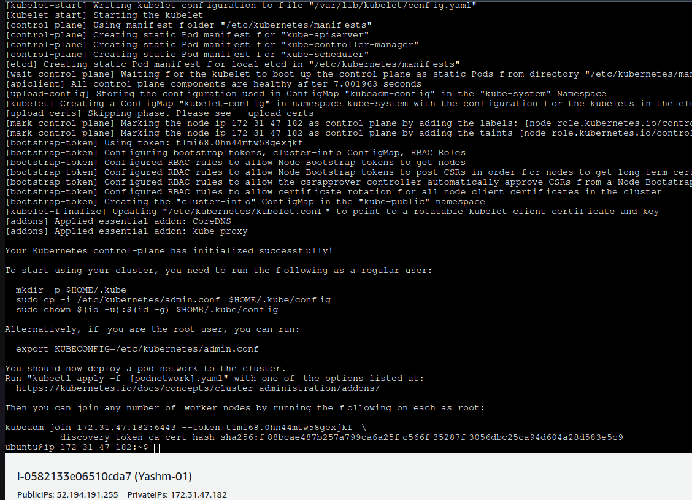

  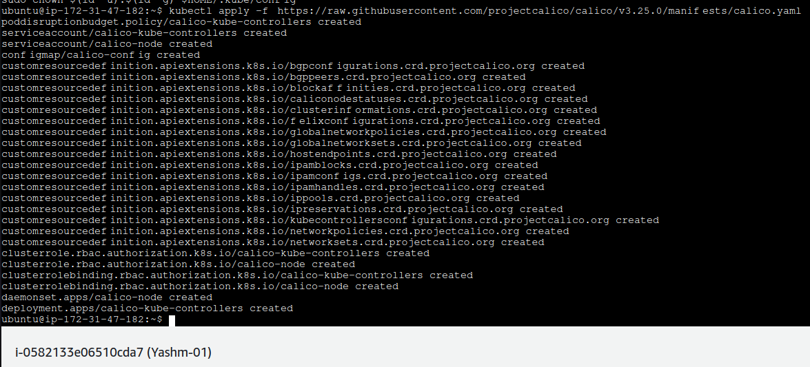

   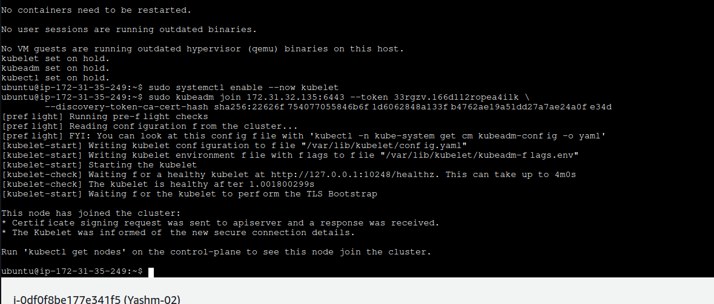

3. **Verify Cluster Status**:
   ```bash
   kubectl get nodes
   ```
  
  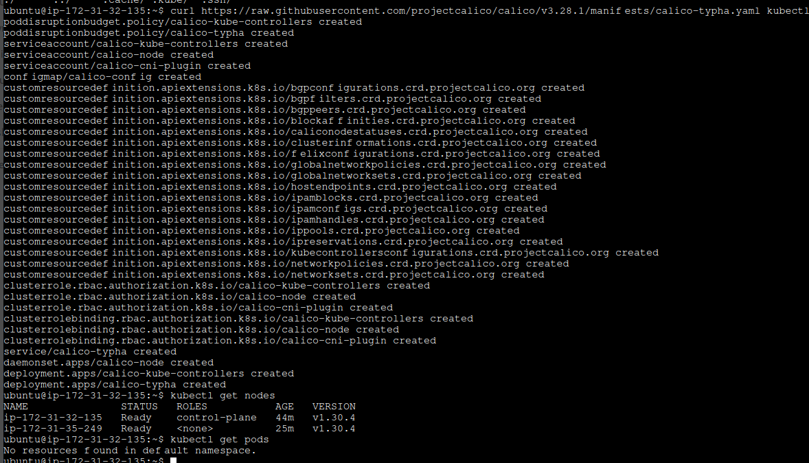
### 3. **Post-Installation**

- **Verify the Nodes**: Check that both the control plane and worker nodes are showing up in the Kubernetes cluster.
- **Deploy Applications**: Start deploying and managing applications on your new Kubernetes cluster.

By following these steps, you'll have a Kubernetes cluster running on AWS with a control plane node and a worker node. If you encounter issues, verify the configuration steps and check logs for troubleshooting.

## TASK 2:

INSTALLATION OF GRAFANA:


Step 1 — Installing Grafana

In this first step, you will install Grafana onto your Ubuntu 20.04 server. You can install Grafana either by downloading it directly from its official website or by going through an APT repository. Because an APT repository makes it easier to install and manage Grafana’s updates, you’ll use that method in this tutorial.

Download the Grafana GPG key with wget, then pipe the output to apt-key. This will add the key to your APT installation’s list of trusted keys, which will allow you to download and verify the GPG-signed Grafana package:

    wget -q -O - https://packages.grafana.com/gpg.key | sudo apt-key add -

In this command, the option -q turns off the status update message for wget, and -O outputs the file that you downloaded to the terminal. These two options ensure that only the contents of the downloaded file are pipelined to apt-key.

Next, add the Grafana repository to your APT sources:

    sudo add-apt-repository "deb https://packages.grafana.com/oss/deb stable main"

Refresh your APT cache to update your package lists:

    sudo apt update

You can now proceed with the installation:

    sudo apt install grafana

Once Grafana is installed, use systemctl to start the Grafana server:

    sudo systemctl start grafana-server

Next, verify that Grafana is running by checking the service’s status:

    sudo systemctl status grafana-server

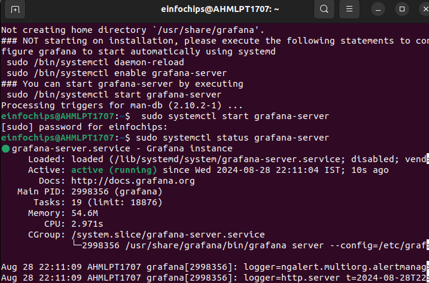

http://localhost:3000

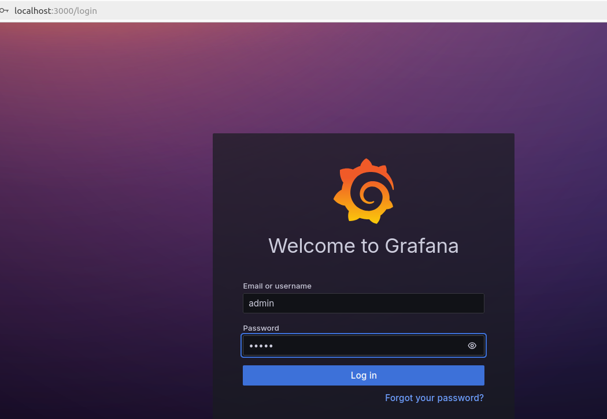

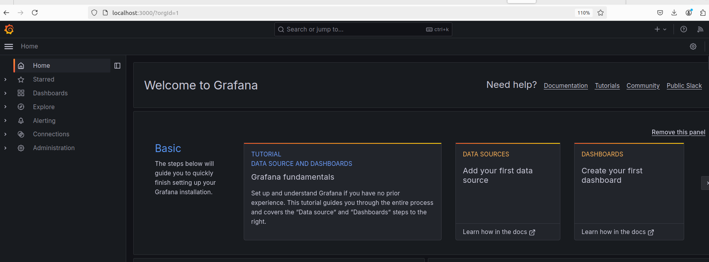


