Certainly! Here’s the revised Terraform configuration that uses the provided Internet Gateway ID (`igw-05b9f02a7f126cd9e`). 

### Updated Terraform Configuration

This configuration includes the creation of:
- Two public subnets
- Two private subnets
- An Internet Gateway (already created)
- Route Tables
- Security Groups
- EC2 Instances
- S3 Bucket

#### `main.tf`

```hcl
provider "aws" {
  region = "ap-northeast-1"
}

# VPC ID to use
variable "vpc_id" {
  default = "vpc-0bde6a85a0fd797ad"
}

# Internet Gateway ID
variable "internet_gateway_id" {
  default = "igw-0b25cf1d578eddecf"
}

# Create Public Subnets
resource "aws_subnet" "yashm_public_subnet_1" {
  vpc_id                  = var.vpc_id
  cidr_block              = "10.0.14.0/24"
  availability_zone       = "ap-northeast-1a"
  map_public_ip_on_launch = true
  tags = {
    Name = "yashm-public-subnet-1"
  }
}

resource "aws_subnet" "yashm_public_subnet_2" {
  vpc_id                  = var.vpc_id
  cidr_block              = "10.0.15.0/24"
  availability_zone       = "ap-northeast-1c"
  map_public_ip_on_launch = true
  tags = {
    Name = "yashm-public-subnet-2"
  }
}

# Create Private Subnets
resource "aws_subnet" "yashm_private_subnet_1" {
  vpc_id                  = var.vpc_id
  cidr_block              = "10.0.16.0/24"
  availability_zone       = "ap-northeast-1a"
  tags = {
    Name = "yashm-private-subnet-1"
  }
}

resource "aws_subnet" "yashm_private_subnet_2" {
  vpc_id                  = var.vpc_id
  cidr_block              = "10.0.17.0/24"
  availability_zone       = "ap-northeast-1c"
  tags = {
    Name = "yashm-private-subnet-2"
  }
}

# Create Route Tables
resource "aws_route_table" "yashm_public_route_table" {
  vpc_id = var.vpc_id

  route {
    cidr_block = "0.0.0.0/0"
    gateway_id = var.internet_gateway_id
  }

  tags = {
    Name = "yashm-public-route-table"
  }
}

resource "aws_route_table" "yashm_private_route_table" {
  vpc_id = var.vpc_id

  tags = {
    Name = "yashm-private-route-table"
  }
}

# Associate Route Tables with Subnets
resource "aws_route_table_association" "yashm_public_subnet_1_association" {
  subnet_id      = aws_subnet.yashm_public_subnet_1.id
  route_table_id = aws_route_table.yashm_public_route_table.id
}

resource "aws_route_table_association" "yashm_public_subnet_2_association" {
  subnet_id      = aws_subnet.yashm_public_subnet_2.id
  route_table_id = aws_route_table.yashm_public_route_table.id
}

resource "aws_route_table_association" "yashm_private_subnet_1_association" {
  subnet_id      = aws_subnet.yashm_private_subnet_1.id
  route_table_id = aws_route_table.yashm_private_route_table.id
}

resource "aws_route_table_association" "yashm_private_subnet_2_association" {
  subnet_id      = aws_subnet.yashm_private_subnet_2.id
  route_table_id = aws_route_table.yashm_private_route_table.id
}

# Create Security Group
resource "aws_security_group" "yashm_sg" {
  vpc_id = var.vpc_id

  ingress {
    from_port   = 22
    to_port     = 22
    protocol    = "tcp"
    cidr_blocks = ["0.0.0.0/0"]
  }

  ingress {
    from_port   = 80
    to_port     = 80
    protocol    = "tcp"
    cidr_blocks = ["0.0.0.0/0"]
  }

  ingress {
    from_port   = 443
    to_port     = 443
    protocol    = "tcp"
    cidr_blocks = ["0.0.0.0/0"]
  }

  egress {
    from_port   = 0
    to_port     = 0
    protocol    = "-1"
    cidr_blocks = ["0.0.0.0/0"]
  }
}

# Create EC2 Instances
resource "aws_instance" "yashm_master" {
  ami           = "ami-0cab37bd176bb80d3"  
  instance_type = "t2.medium"
  subnet_id     = aws_subnet.yashm_public_subnet_1.id
  vpc_security_group_ids = [aws_security_group.yashm_sg.id]
  key_name       = "yashm-28"

  tags = {
    Name = "yashm-master"
  }
}

resource "aws_instance" "yashm_worker" {
  count         = 2
  ami           = "ami-0cab37bd176bb80d3" 
  instance_type = "t2.micro"
  subnet_id     = aws_subnet.yashm_public_subnet_2.id
  vpc_security_group_ids = [aws_security_group.yashm_sg.id]
  key_name       = "yashm-28"

  tags = {
    Name = "yashm-worker-${count.index + 1}"
  }
}

# Create S3 Bucket for Static Assets
resource "aws_s3_bucket" "yashm_bucket" {
  bucket = "yashm-static-assets"
}

# Set S3 Bucket ACL
resource "aws_s3_bucket_acl" "yashm_bucket_acl" {
  bucket = aws_s3_bucket.yashm_bucket.id
  acl    = "public-read"
}

# Set S3 Bucket Policy
resource "aws_s3_bucket_policy" "yashm_bucket_policy" {
  bucket = aws_s3_bucket.yashm_bucket.id
  policy = data.aws_iam_policy_document.yashm_bucket_policy.json
}

data "aws_iam_policy_document" "yashm_bucket_policy" {
  statement {
    actions   = ["s3:GetObject"]
    resources = ["${aws_s3_bucket.yashm_bucket.arn}/*"]
    effect    = "Allow"
    principals {
      type        = "AWS"
      identifiers = ["*"]
    }
  }
}
```


### Instructions to Apply Configuration

1. **Initialize Terraform**

   ```bash
   terraform init
   ```

2. **Plan Changes**

   ```bash
   terraform plan
   ```

3. **Apply Changes**

   ```bash
   terraform apply
   ```

EC2:

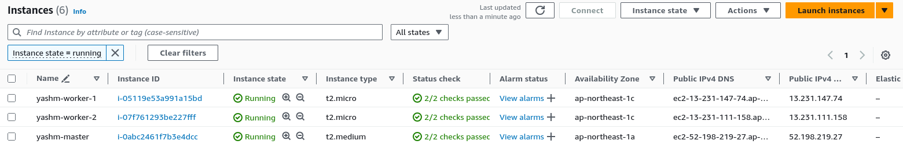

S3:
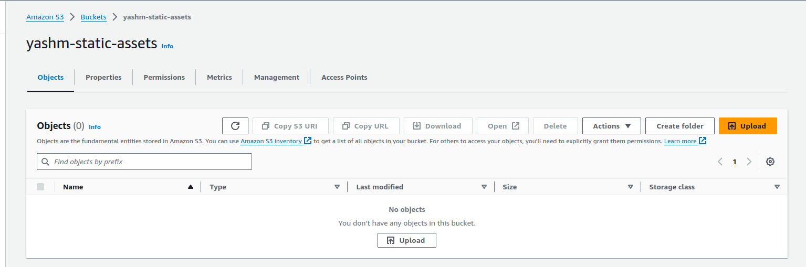

Public Route Table:

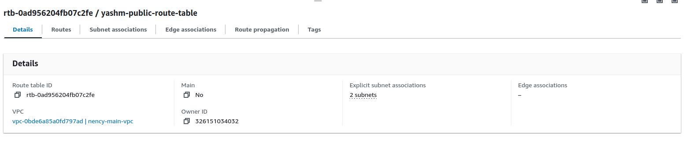

Private Route Table:

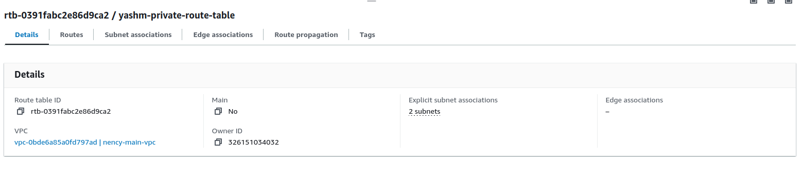

### Accessing EC2 Instances

1. **Find Public IPs**

   Obtain the public IP addresses of your EC2 instances from the AWS Management Console or by running:

   ```bash
   terraform output
   ```

2. **SSH into Instances**

   ```bash
   ssh -i your-ssh-key.pem ubuntu@<INSTANCE_PUBLIC_IP>
   ```

   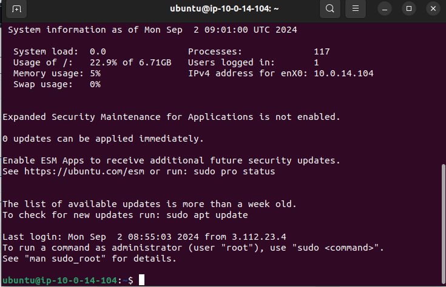

2. **Install Kubernetes:**

   ```bash
   sudo apt update && sudo apt install -y apt-transport-https ca-certificates curl
   curl -s https://packages.cloud.google.com/apt/doc/apt-key.gpg | sudo apt-key add -
   echo "deb https://apt.kubernetes.io/ kubernetes-xenial main" | sudo tee -a /etc/apt/sources.list.d/kubernetes.list
   sudo apt update


   sudo apt install -y kubelet kubeadm kubectl
   ```

3. **Initialize the Cluster:**

   ```bash
   sudo kubeadm init --pod-network-cidr=192.168.0.0/16
   ```

4. **Set Up Network Plugin:**

   ```bash
   kubectl apply -f https://docs.projectcalico.org/manifests/calico.yaml
   ```

5. **Join Worker Nodes:**

   Run the command given by `kubeadm init` on each worker node.

6. **Verify Cluster:**

   ```bash
   kubectl get nodes
   kubectl run --image=nginx nginx --port=80
   ```

   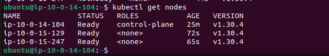

   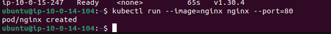

### 4. Modularize Infrastructure with Terraform

Create Terraform modules for:

- **Network Module:**

  Define VPC, subnets, and security groups.

- **Compute Module:**

  Define EC2 instances for Kubernetes nodes.

- **Storage Module:**

  Define S3 bucket.

**Example:**

**`modules/network/main.tf`**

```hcl
resource "aws_vpc" "this" {
  cidr_block = "10.0.0.0/16"
  tags = {
    Name = "my-vpc"
  }
}

# Define subnets and other network components...
```

**`modules/compute/main.tf`**

```hcl
resource "aws_instance" "k8s_master" {
  ami           = "ami-0c55b159cbfafe1f0"
  instance_type = "t2.medium"
  # Other configurations...
}

resource "aws_instance" "k8s_worker" {
  count         = 2
  ami           = "ami-0c55b159cbfafe1f0"
  instance_type = "t2.micro"
  # Other configurations...
}
```

**`modules/storage/main.tf`**

```hcl
resource "aws_s3_bucket" "static_assets" {
  bucket = "my-static-assets-bucket"
}
```

**`main.tf`**

```hcl
module "network" {
  source = "./modules/network"
}

module "compute" {
  source = "./modules/compute"
}

module "storage" {
  source = "./modules/storage"
}
```

### 5. Containerize the Application with Docker

**`Dockerfile`**

```Dockerfile
# Use a base image
FROM nginx:alpine

# Copy the index.html to the Nginx HTML directory
COPY index.html /usr/share/nginx/html/index.html

# Expose port 80
EXPOSE 80
```

**Commands:**

```bash
docker build -t my-ecommerce-app .
docker tag my-ecommerce-app <your-docker-repo>/my-ecommerce-app:latest
docker push <your-docker-repo>/my-ecommerce-app:latest
```
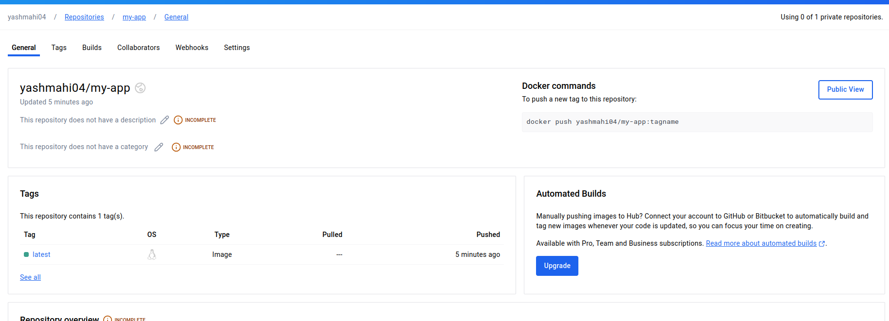

### 6. Configure Ansible for Application Deployment

**`playbook.yml`**

```yaml
- name: Configure Kubernetes nodes
  hosts: all
  become: yes
  tasks:
    - name: Install Docker
      apt:
        name: docker.io
        state: present
    - name: Install Kubernetes packages
      apt:
        name: "{{ item }}"
        state: present
      loop:
        - kubelet
        - kubeadm
        - kubectl
```

**Commands:**

```bash
ansible-playbook -i inventory playbook.yml
```

### 7. Set Up Jenkins for CI/CD

1. **Deploy Jenkins:**

   Use Helm to deploy Jenkins on Kubernetes.

   ```bash
   helm repo add jenkins https://charts.jenkins.io
   helm install jenkins jenkins/jenkins
   ```

  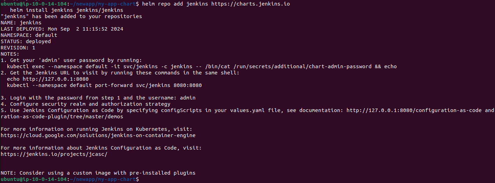

2. **Configure Pipeline:**

   Create a Jenkins pipeline script for CI/CD.

**`Jenkinsfile`**

```groovy
pipeline {
    agent any
    stages {
        stage('Checkout') {
            steps {
                git 'https://github.com/your-repo/your-app.git'
            }
        }
        stage('Build') {
            steps {
                script {
                    sh 'docker build -t <your-docker-repo>/my-ecommerce-app:latest .'
                }
            }
        }
        stage('Push') {
            steps {
                script {
                    sh 'docker push <your-docker-repo>/my-ecommerce-app:latest'
                }
            }
        }
        stage('Deploy') {
            steps {
                script {
                    sh 'helm upgrade --install my-app ./helm/my-app'
                }
            }
        }
    }
}
```

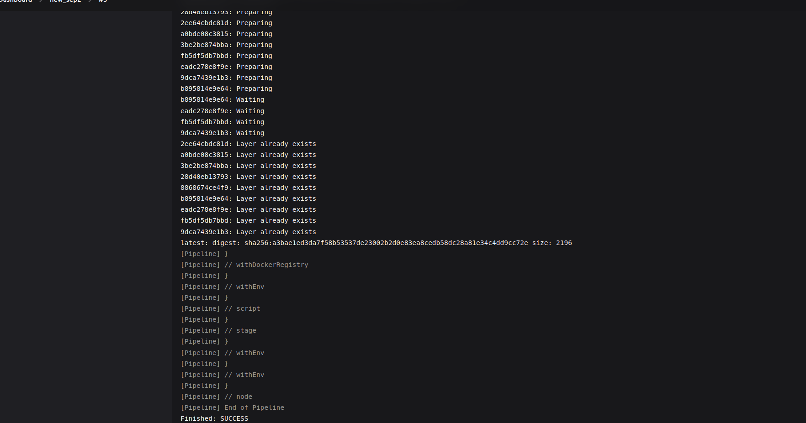

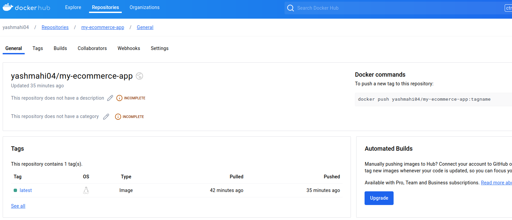

### 8. Deploy the Application with Helm

1. **Create Helm Charts:**

   Define Helm charts for your e-commerce application.

**`helm/my-app/values.yaml`**

```yaml
image:
  repository: <your-docker-repo>/my-ecommerce-app
  tag: latest

s3:
  bucket: "my-static-assets-bucket"
```

**`helm/my-app/templates/deployment.yaml`**

```yaml
apiVersion: apps/v1
kind: Deployment
metadata:
  name: my-app
spec:
  replicas: 2
  selector:
    matchLabels:
      app: my-app
  template:
    metadata:
      labels:
        app: my-app
    spec:
      containers:
        - name: my-app
          image: "{{ .Values.image.repository }}:{{ .Values.image.tag }}"
          ports:
            - containerPort: 80
```

2. **Install Helm Charts:**

   ```bash
   helm install my-app ./helm/my-app
   ```

   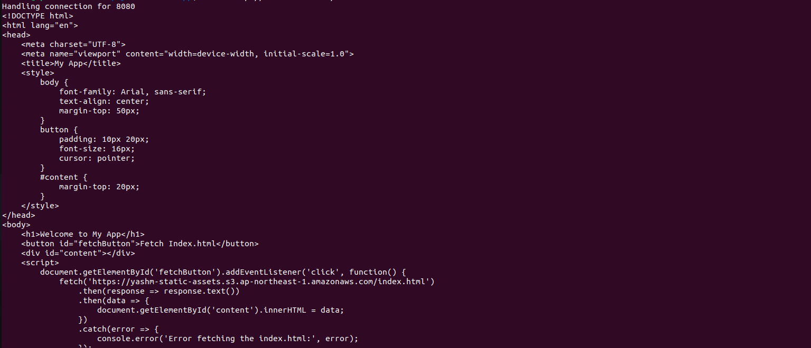

3. **Verify Deployment:**

   Ensure the application is running and fetching static files from S3.

   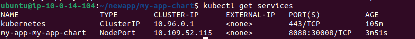

   

### 9. Clean Up Resources

Use Terraform to destroy all provisioned infrastructure:

```bash
terraform destroy
```